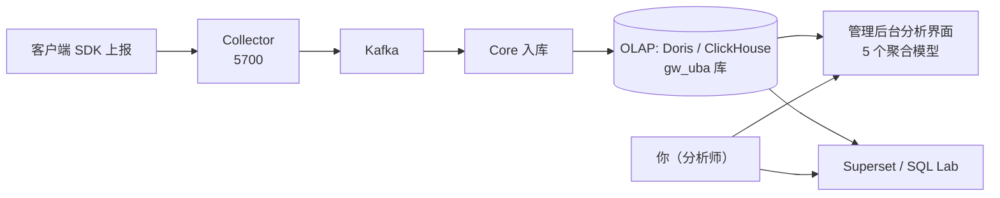

# 数据分析师上手指南

本指南面向数据分析师，带你理解 GoWind UBA 的数据从哪来、存在哪、怎么查、怎么分析。

> 不需要写 Go 代码。你需要会一点 SQL，并理解 UBA 的数据模型。

---

## 一、你的工作流概览

作为分析师，你在 UBA 上主要做两件事：

1. **用管理后台的分析界面**：开箱即用的 5 个分析模型（事件趋势、漏斗、留存、维度分组、活跃用户）+ 会话/路径/画像查询。
2. **用 Superset / 直连 OLAP 写 SQL**：做更灵活的自定义分析、报表、仪表板。



---

## 二、数据从哪来：建应用、取凭据

数据采集的第一步是在管理后台创建「UBA 应用」，拿到 `appId` + `appSecret`，研发同学据此接入 SDK 上报事件。

1. **登录管理后台**（Admin 前端，开发环境 `http://localhost:5600`）。
2. 进入 **应用管理**（菜单：「数据采集 / 应用管理」），新建应用。
3. 填写应用名称、类型、支持平台，保存。
4. 系统生成三组凭据：
   - `appId`：应用唯一标识（业务用，如 `game_001`）
   - `appKey`：应用 Key
   - `appSecret`：**上报鉴权密钥，妥善保管**
5. 将应用状态置为 `ON`（启用）。

> `tenantId`（租户 ID）由服务端按 `appId` 权威识别，**无需**客户端上报，天然多租户隔离。

---

## 三、数据存在哪：OLAP 表与字段地图

UBA 的分析数据存在 OLAP 引擎的 `gw_uba` 库（默认 Doris）。核心表如下：

### 事实表

| 表 | 内容 | 关键字段 |
|----|------|---------|
| **`events_fact`** | 行为事件明细（核心） | `event_id`、`user_id`、`device_id`、`event_name`、`event_category`、`event_time/event_ts`、`platform`、`channel`、`country`、`amount`、`properties`(map)、`metrics`(map) |
| **`sessions_fact`** | 会话级汇总 | `session_id`、`user_id`、`start_time/end_time`、`duration_ms`、`event_count`、`is_bounce`、`entry_page/exit_page`、`total_amount` |
| **`risk_events`** | 风险事件 | `risk_type`、`risk_level`、`risk_score`、`rule_id/rule_name`、`status`、`occur_time` |
| **`path_features`** | 用户路径特征 | `first_event/last_event`、`first_3_events/last_3_events`(数组)、`is_converted`、`conversion_event` |

### 维度表

| 表 | 内容 | 关键字段 |
|----|------|---------|
| **`users_dim`** | 用户画像维度 | `user_id`、`register_time`、`register_channel`、`user_level/vip_level`、`total_events`、`total_pay_amount`、`country`、`risk_score` |
| **`objects_dim`** | 行为对象维度 | `object_id/object_type/object_name`、`category_path`、`price` |
| **`id_mapping`** | 跨端 ID 映射 | `global_user_id`、`id_type/id_value`、`confidence` |
| **`user_tags`** | 用户标签关联 | `user_id`、`tag_id/tag_value`、`confidence`、`source` |

### 事件字段命名规则

- 全 **camelCase**（与后端 proto 契约对齐，protojson 编码）。
- `properties` / `context` 是 `map<string,string>`，`metrics` 是 `map<string,double>`——业务自定义属性都放这里。
- 时间字段：`event_time`（Timestamp）、`event_ts`（毫秒 int64）、`event_date`（日期，分区键）。

> 完整字段定义见 [后端 API 契约 · BehaviorEvent](./backend-api.md) 与 `backend/sql/{doris,clickhouse}/1_base_tables.sql`。

---

## 四、开箱即用的 5 个分析模型

管理后台「数据分析」菜单下有 5 个对应后端 `AnalyticsService` 的聚合分析：

| 模型 | 后端接口 | 回答什么问题 |
|------|---------|------------|
| **事件趋势** | `EventTrend` | 最近一段时间某事件的量级与趋势？ |
| **漏斗分析** | `Funnel` | 用户从步骤 A 到 B 的转化与流失？ |
| **留存分析** | `Retention` | 新用户在第 N 天的留存率？ |
| **维度分组** | `GroupBy` | 按渠道/平台/版本分组的指标对比？ |
| **活跃用户** | `ActiveUsers` | DAU / WAU / MAU？ |

另有**会话、事件路径、用户行为画像**三个事实表查询界面（基于已落库的事实记录）。

> 各模型详解：[事件趋势](./analyst-event-trend.md)、[漏斗](./analyst-funnel.md)、[留存](./analyst-retention.md)、[OLAP 查询手册](./analyst-olap-cookbook.md)。

---

## 五、管理后台 vs Superset：怎么选？

| 场景 | 用管理后台 | 用 Superset |
|------|:---------:|:----------:|
| 查 5 个标准模型 | ✅ | — |
| 自定义 SQL / 多表关联 | — | ✅ |
| 拖拽建仪表板、定时报表 | — | ✅ |
| 风险/标签配置管理 | ✅ | — |
| 团队共享 BI 报表 | — | ✅ |

两者互补：管理后台做配置和标准分析，Superset 做深度 BI。Superset 部署见 [Superset 部署](./deploy-superset.md)。

---

## 六、⚠️ 重要：当前的数据落库现状

> **务必知晓**：截至当前版本，Collector 已正确把上报数据写入 Kafka，但 **Core 内的 Kafka 消费入库逻辑尚未实现**。这意味着：
>
> - 上报数据当前会**停留在 Kafka**，不会自动进入 `events_fact`。
> - 你在分析界面或 Superset 里**可能查不到新数据**。
>
> 在研发补齐消费链路前，你可以：
> 1. 与研发确认是否已临时改为同步写入（直接调 `BatchCreate`）；
> 2. 用 `sql/{doris,clickhouse}/demo-data.sql` 灌入演示数据练习；
> 3. 直接往 OLAP 手工 INSERT 测试数据。

详见 [系统架构 · Kafka 消费现状](./architecture.md)。

---

## 七、第一个分析：连上 Doris 看一眼数据

如果你有 Doris 访问权限（FE 的 9030 端口，MySQL 协议）：

```bash
mysql -h localhost -P 9030 -u root -D gw_uba
```

```sql
-- 看看 events_fact 有多少数据
SELECT count() FROM events_fact;

-- 最近 7 天各渠道的事件量
SELECT channel, event_date, count() AS events
FROM events_fact
WHERE event_date >= DATE_SUB(CURDATE(), INTERVAL 7 DAY)
GROUP BY channel, event_date
ORDER BY event_date, events DESC;
```

> Doris 用 MySQL 方言；ClickHouse 方言略有不同（见 [OLAP 查询手册](./analyst-olap-cookbook.md)）。

---

## 八、下一步

- [事件趋势分析](./analyst-event-trend.md)
- [漏斗分析](./analyst-funnel.md)
- [留存分析](./analyst-retention.md)
- [OLAP 查询手册（双引擎 SQL、白名单维度）](./analyst-olap-cookbook.md)
- [Superset 部署](./deploy-superset.md)

---

## 九、相关文档

- [产品介绍](./intro.md)
- [系统架构](./architecture.md)
- [后端 API 契约](./backend-api.md)
