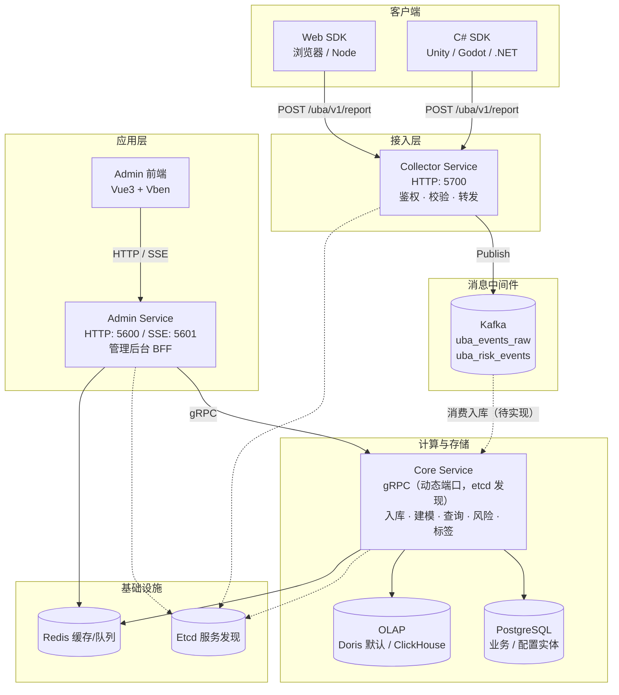

# UBA 系统架构

本文档描述 GoWind UBA 的整体架构、三大服务职责、数据流转、存储分层与关键设计模式。建议二次开发者与运维人员在动手前通读本页。

---

## 一、总体架构

UBA 是基于 **go-kratos** 微服务框架的用户行为分析平台，采用「采集 → 入队 → 计算/存储 → 查询/展示」的经典流式数仓架构，由三个微服务组成：



---

## 二、三大服务职责

### 1. Collector Service（埋点采集 BFF）

| 项 | 说明 |
|----|------|
| 目录 | `backend/app/collector/service/` |
| 服务监听端口 | HTTP **5700** |
| 职责 | 接收 SDK 上报、应用鉴权（appId + appSecret）、字段校验与补全、转发至 Kafka |
| 入口 | `POST /uba/v1/report`（批量事件，混合行为/风险） |
| 输出 | Publish 到 Kafka topic：`uba_events_raw`（行为）/ `uba_risk_events`（风险） |
| 特点 | **无状态**，可水平扩展；本身不落库，只负责「接收 + 转发」 |

### 2. Core Service（核心业务服务）

| 项 | 说明 |
|----|------|
| 目录 | `backend/app/core/service/` |
| 服务监听端口 | gRPC **动态端口**（`0.0.0.0:0`，启动时注册到 etcd，不固定） |
| 职责 | 事件入库、分析建模、风险检测、标签管理、用户画像、数据同步 |
| 数据源 | PostgreSQL（业务实体，走 Ent ORM）+ OLAP 引擎（分析数据） |
| 对外协议 | gRPC（供 admin/collector 调用） |
| 特点 | 承载所有「重」业务逻辑；通过编译期常量 `data.UseClickHouse` 在 ClickHouse / Doris 间二选一 |

### 3. Admin Service（管理后台 BFF）

| 项 | 说明 |
|----|------|
| 目录 | `backend/app/admin/service/` |
| 服务监听端口 | HTTP **5600** / SSE **5601** |
| 职责 | 管理后台的 HTTP 网关，转发请求至 Core，聚合权限/菜单/配置 |
| 模式 | **薄转发层**：实现 `adminV1.XxxHTTPServer`，持有 `ubaV1.XxxClient`，方法体直接转发 |
| 特色 | SSE 推送（站内消息实时通知）、Swagger 文档、CORS |

> 三个服务均通过 **etcd** 注册与发现，跨服务调用走 gRPC。

---

## 三、数据流转

### 事件上报链路（写）

```
SDK 上报
  └─> Collector（5700）
        ├─ 1. appId/appSecret 鉴权（应用级，请求体内）
        ├─ 2. 字段校验 + 补全（eventId/eventTime/deviceId 等）
        ├─ 3. tenantId 权威覆盖（按 appId 识别租户）
        └─ 4. Publish → Kafka topic
              ├─ uba_events_raw   （行为事件）
              └─ uba_risk_events  （风险事件）
```

### ⚠️ Kafka 消费端现状（重要，请务必阅读）

> **诚实披露**：截至当前版本，`uba_events_raw` / `uba_risk_events` 的 **Kafka 消费入库逻辑尚未在 Core 服务内实现**。
>
> - Collector 已正确 `Publish` 到 Kafka；
> - Core 提供了 `BehaviorEventService.BatchCreate` 等入库入口（能力具备）；
> - 但 **连接两者的消费者（subscriber）在 Core 代码中缺失**。
>
> **这意味着上报数据目前会停留在 Kafka，不会自动落库**。生产化前需二选一补齐：
> 1. **在 Core 内实现 broker subscriber**（订阅 `uba_events_raw` → 调 `BatchCreate` 入 OLAP），参考 kratos broker 用法；或
> 2. **引入独立消费者**（如 Flink job / 独立 worker）消费 Kafka 落库。
>
> 在补齐前，可临时让 Collector 改为直接 gRPC 调 Core 的 `BatchCreate`（同步写入）做联调。
> 另外，Doris 部署提供了 `sql/doris/02_kafka_tables.sql` 的 **Routine Load** 作业定义（参考用，需与消费方案统一规划）。

### 查询链路（读）

```
Admin 前端
  └─> Admin Service（5600，HTTP）
        └─> gRPC 转发 ─> Core Service
              ├─ 业务实体 ─> PostgreSQL（Ent ORM）
              └─ 分析聚合 ─> OLAP（原生 SQL GROUP BY / 分页）
```

---

## 四、数据存储分层

| 存储 | 用途 | 访问方式 |
|------|------|---------|
| **PostgreSQL** | 业务/配置实体（应用、用户、角色、权限、字典、菜单、事件 Schema、风险规则、标签定义等） | Ent ORM，表结构由 schema 注解生成（无手写 schema.sql） |
| **OLAP（Doris 默认 / ClickHouse）** | 分析数据（`events_fact` / `sessions_fact` / `risk_events` / `users_dim` 等事实表） | 原生 SQL + repo 封装 |
| **Redis** | 缓存、异步任务队列（Asynq） | kratos cache + asynq |
| **Kafka** | 事件流缓冲（collector → core 的解耦管道） | kratos broker |
| **MinIO** | 对象存储（文件上传） | S3 兼容 |

### OLAP 双引擎设计

- ClickHouse 与 Doris **二选一**，由编译期常量切换：

  ```go
  // backend/app/core/service/internal/data/data.go
  // UseClickHouse 是否使用ClickHouse作为数据存储，否则使用Doris。
  const UseClickHouse bool = false   // 当前默认 false → 使用 Doris
  ```

- **同一份业务模型**，字段、分区、索引、主键定义在两种引擎间保持一致（schema 在 `internal/data/{clickhouse,doris}/schema/` 镜像定义）。
- repo 层按引擎分支：`if data.UseClickHouse { ckRepo } else { dorisRepo }`。
- 切换引擎需修改该常量并重新编译，**不是运行时配置**。

---

## 五、关键设计模式

### 1. 接口契约优先（Protobuf）

所有服务接口由 `.proto` 定义，经 **buf** 生成多端代码：

- Go：`protoc-gen-go` + `protoc-gen-go-grpc`（gRPC stub）+ `protoc-gen-go-http`（kratos REST）
- TypeScript：`protoc-gen-typescript-http`（admin 前端客户端，**仅 admin proto 作为输入**）
- OpenAPI：`protoc-gen-openapi`（Swagger 文档）

> 详见 [代码生成管线](./tutorial-codegen.md)。

### 2. 三层服务架构（admin 转发模式）

新增一个 admin 对外能力时，典型分层：

```
admin/service/v1/i_xxx.proto        # HTTP 网关接口（带 google.api.http 注解）
uba/service/v1/xxx.proto            # 领域消息 + gRPC 服务契约
core/service/internal/service/      # 业务实现（实现 uba gRPC server）
admin/service/internal/service/     # 转发实现（实现 admin HTTP server → 调 uba client）
```

admin 层是**纯转发**，不含业务逻辑；业务逻辑集中在 Core。

### 3. Ent + go-crud 数据层

业务实体（PostgreSQL）走 Ent ORM，配合 `go-crud` 的 `Repository` 泛型封装，统一处理分页（`PagingRequest`）、过滤（`FilterExpr`）、排序、FieldMask。OLAP 数据走原生 SQL repo。

### 4. 服务发现 + 动态端口

Core 服务 gRPC 监听 `0.0.0.0:0`（随机端口），启动时注册到 etcd；admin/collector 通过 etcd 发现 core 并建立 gRPC 连接。这让 Core 可多实例部署、滚动更新。

---

## 六、安全与多租户

| 维度 | 机制 |
|------|------|
| 管理后台认证 | JWT（Core 的 `authenticator.yaml`，HS256，双 profile：admin / collector） |
| SDK 上报鉴权 | appId + appSecret（应用级，请求体内，非 Header） |
| 权限引擎 | Casbin / OPA，菜单/接口/数据三级权限 |
| 多租户隔离 | `tenantId` 字段贯穿；SDK 不上报，服务端按 appId 权威识别并覆盖 |
| 传输 | CORS 配置；生产建议加 TLS |

> ⚠️ 默认口令/密钥（JWT key `some_api_key`、AES key、各中间件密码 `*Abcd123456`）均为开发默认值，**生产部署前必须轮换**。详见 [配置详解 · 安全清单](./deploy-config.md)。

---

## 七、相关文档

- [后端模块总览](./backend-modules.md)
- [后端 API 契约](./backend-api.md)
- [前端架构](./frontend-architecture.md)
- [安装指南](./installation.md)
- [配置详解](./deploy-config.md)
