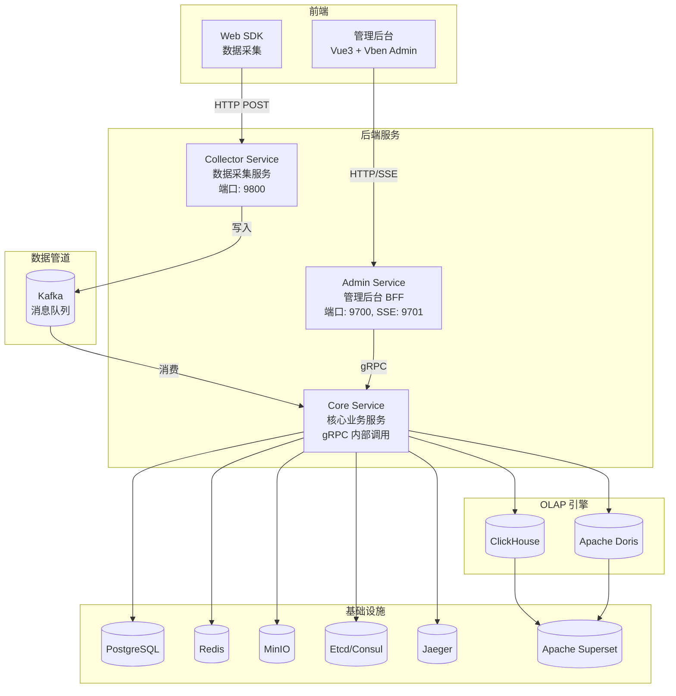
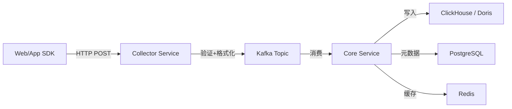
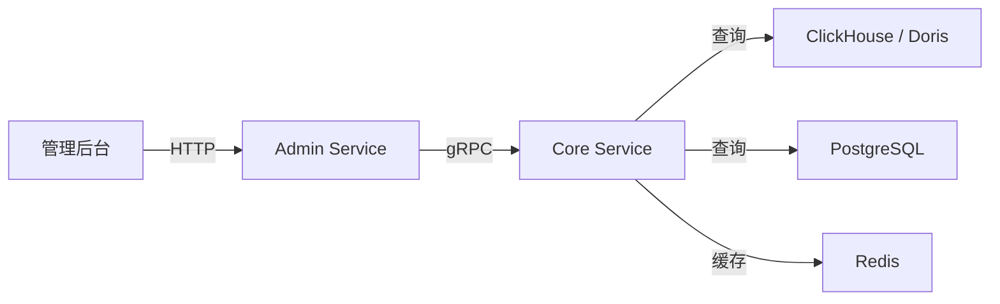
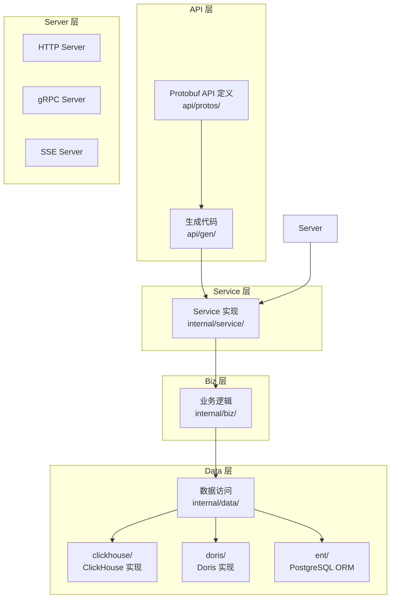

# UBA 后端架构总览

GoWind UBA 后端采用 **三服务微服务架构**，基于 go-kratos v2 框架构建，使用 Wire 编译时依赖注入、Ent ORM 和 Protobuf API First 开发模式。

## 一、三服务架构



## 二、服务职责划分

| 服务 | 目录 | 端口 | 职责 |
|------|------|------|------|
| **Collector Service** | `app/collector/service/` | REST: 9800 | 接收 SDK 上报数据，验证后写入 Kafka |
| **Admin Service** | `app/admin/service/` | REST: 9700, SSE: 9701 | 管理后台 BFF，HTTP API + SSE 实时推送 |
| **Core Service** | `app/core/service/` | gRPC（内部） | 核心业务逻辑 + 数据层，消费 Kafka，读写 OLAP |

> Collector Service 作为数据入口，接收 SDK 事件并写入 Kafka；Core Service 消费 Kafka 数据进行业务处理和 OLAP 入库；Admin Service 作为 BFF 层，通过 gRPC 调用 Core Service 为前端提供 HTTP API。

## 三、数据流架构

### 3.1 事件数据流



### 3.2 查询数据流



## 四、分层架构

每个服务内部遵循 kratos 推荐的分层架构：



### 各层职责

| 层 | 目录 | 职责 |
|----|------|------|
| **Server** | `internal/server/` | HTTP/gRPC/SSE 服务器初始化、中间件注册 |
| **Service** | `internal/service/` | API 接口实现，请求/响应转换 |
| **Biz** | `internal/biz/` | 核心业务逻辑，领域实体定义 |
| **Data** | `internal/data/` | 数据访问层，ClickHouse/Doris/PostgreSQL |

## 五、双 OLAP 引擎

GoWind UBA 支持切换 ClickHouse 或 Apache Doris 作为底层 OLAP 引擎：

```go
// app/core/service/internal/data/data.go
const UseClickHouse bool = false  // true=ClickHouse, false=Doris
```

### 引擎对比

| 对比项 | ClickHouse | Apache Doris |
|--------|-----------|--------------|
| 写入方式 | 批量 INSERT | Stream Load API |
| 查询协议 | Native TCP | MySQL 协议 |
| 压缩 | LZ4 压缩 | 列式压缩 |
| 适用场景 | 超大规模数据分析 | 实时分析 + BI 报表 |
| Superset 集成 | 原生支持 | MySQL 驱动 / pydoris |

### 实现结构

```
internal/data/
├── clickhouse/              # ClickHouse 实现
│   ├── events_fact_repo.go
│   ├── sessions_fact_repo.go
│   ├── users_dim_repo.go
│   ├── objects_dim_repo.go
│   ├── id_mapping_repo.go
│   ├── risk_events_repo.go
│   ├── path_features_repo.go
│   └── user_tags_repo.go
├── doris/                   # Doris 实现
│   ├── events_fact_repo.go
│   ├── sessions_fact_repo.go
│   ├── users_dim_repo.go
│   ├── objects_dim_repo.go
│   ├── id_mapping_repo.go
│   ├── risk_events_repo.go
│   ├── path_features_repo.go
│   └── user_tags_repo.go
└── ent/                     # PostgreSQL ORM（元数据）
```

## 六、数据模型

### 6.1 事实表（Fact Tables）

| 表名 | 说明 | 存储引擎 |
|------|------|---------|
| `events_fact` | 行为事件事实表 | ClickHouse / Doris |
| `sessions_fact` | 会话事实表 | ClickHouse / Doris |

### 6.2 维度表（Dimension Tables）

| 表名 | 说明 | 存储引擎 |
|------|------|---------|
| `users_dim` | 用户维度表 | ClickHouse / Doris |
| `objects_dim` | 对象维度表 | ClickHouse / Doris |
| `id_mapping` | ID 映射表 | ClickHouse / Doris |

### 6.3 分析表

| 表名 | 说明 |
|------|------|
| `event_path` | 用户路径分析 |
| `risk_events` | 风险事件 |
| `user_tags` | 用户标签 |

### 6.4 元数据（PostgreSQL）

用户、角色、权限、租户、字典、应用配置等管理数据存储在 PostgreSQL 中，通过 Ent ORM 访问。

## 七、基础设施依赖

| 组件 | 用途 | 端口 |
|------|------|------|
| PostgreSQL | 元数据存储 | 5432 |
| Redis | 缓存 + Asynq 任务队列 | 6379 |
| Kafka | 事件消息管道 | 9092 |
| ClickHouse / Doris | OLAP 分析引擎 | 8123/9000 (CH) 或 9030/8030 (Doris) |
| MinIO | 对象存储（S3 兼容） | 9000/9001 |
| Etcd / Consul | 服务注册与发现 | 2379 |
| Jaeger | 分布式链路追踪 | 4317/16686 |
| Apache Superset | BI 可视化 | 8088 |

## 八、技术栈总览

### 后端

| 层次 | 技术 | 说明 |
|------|------|------|
| 语言 | [Go 1.25+](https://go.dev/) | 高性能编译型语言 |
| 框架 | [go-kratos](https://go-kratos.dev/) v2 | B 站开源微服务框架 |
| 依赖注入 | [Wire](https://github.com/google/wire) | 编译时依赖注入 |
| ORM | [Ent](https://entgo.io/) | Go 实体框架（PostgreSQL） |
| OLAP | [ClickHouse](https://clickhouse.com/) / [Apache Doris](https://doris.apache.org/) | 双引擎可切换 |
| 消息队列 | [Kafka](https://kafka.apache.org/) | 事件数据管道 |
| 缓存 | [Redis](https://redis.io/) | 内存数据库 + 任务队列 |
| 对象存储 | [MinIO](https://min.io/) | S3 兼容对象存储 |
| 服务注册 | [Etcd](https://etcd.io/) / Consul | 服务发现 |
| 链路追踪 | [Jaeger](https://www.jaegertracing.io/) | 分布式可观测 |
| API 定义 | [Protobuf](https://protobuf.dev/) + [buf.build](https://buf.build/) | 接口契约优先 |
| 任务调度 | [Asynq](https://github.com/hibiken/asynq) | 基于 Redis 的异步任务 |
| 权限引擎 | [Casbin](https://casbin.org/) / OPA | 策略驱动鉴权 |
| BI 可视化 | [Apache Superset](https://superset.apache.org/) | 开源 BI 平台 |

### 前端

| 技术 | 说明 |
|------|------|
| [Vue 3](https://vuejs.org/) + TypeScript | 渐进式前端框架 |
| [Ant Design Vue](https://antdv.com/) | 企业级 UI 组件库 |
| [Vben Admin](https://doc.vben.pro/) | 后台管理框架 |
| [ECharts](https://echarts.apache.org/) | 数据可视化图表库 |
| Vite | 快速热更新 |

## 九、相关文档

- [UBA 安装指南](./installation.md)
- [UBA Protobuf API 定义](./backend-api.md)
- [UBA 后端模块总览](./backend-modules.md)
- [UBA 配置与部署指南](./backend-config-deploy.md)
- [UBA 后端扩展机制](./backend-extension.md)
