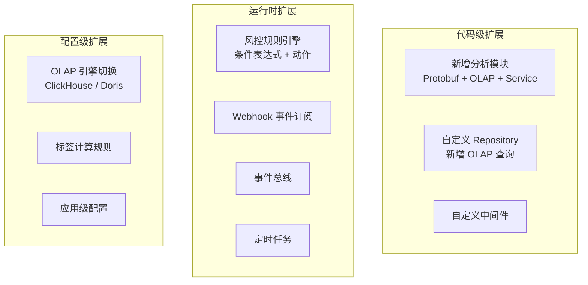
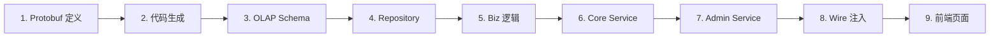
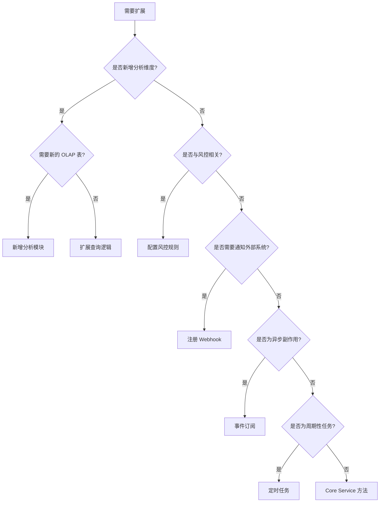

# UBA 后端扩展机制

GoWind UBA 提供多种后端扩展方式，支持自定义分析模型、数据处理管道和风控规则。

## 一、扩展方式总览



## 二、扩展方式对比

| 方式 | 开发成本 | 运行时灵活 | 性能 | 适用场景 |
|------|---------|-----------|------|---------|
| 新增分析模块 | 高 | 否（需编译） | 最优 | 全新分析维度 |
| 风控规则 | 低 | 是 | 高 | 实时风控策略 |
| Webhook | 低 | 是 | 中 | 外部系统通知 |
| 事件订阅 | 低 | 是 | 高 | 异步副作用处理 |
| 定时任务 | 低 | 是 | 高 | 周期性数据聚合 |
| OLAP 引擎切换 | 中 | 否（需编译） | 最优 | 引擎迁移 |
| 标签规则 | 低 | 是 | 高 | 用户分群 |

## 三、新增分析模块

完整的模块新增流程：



### 3.1 定义 Protobuf

```protobuf
// uba/service/v1/cohort_analysis.proto
message CohortAnalysis {
  optional uint32 id = 1;
  optional string name = 2;
  optional string cohort_type = 3;
  optional string date = 4;
  optional uint32 cohort_size = 5;
  optional uint32 retained_count = 6;
  optional double retention_rate = 7;
}
```

### 3.2 创建 OLAP 表

```sql
-- ClickHouse
CREATE TABLE gw_uba.cohort_analysis (
  id UInt32,
  name String,
  cohort_type String,
  date Date,
  cohort_size UInt32,
  retained_count UInt32,
  retention_rate Float64
) ENGINE = MergeTree()
ORDER BY (date, cohort_type);

-- Doris
CREATE TABLE gw_uba.cohort_analysis (
  id INT,
  name VARCHAR(255),
  cohort_type VARCHAR(100),
  date DATE,
  cohort_size INT,
  retained_count INT,
  retention_rate DOUBLE
) ENGINE=OLAP
DUPLICATE KEY(id, date)
DISTRIBUTED BY HASH(id) BUCKETS 10;
```

### 3.3 实现 Repository

```go
// internal/data/clickhouse/cohort_repo.go
type CohortRepo struct {
    db *clickhouse.Conn
}

func (r *CohortRepo) List(ctx context.Context, req *ubaV1.ListCohortRequest) ([]*ubaV1.CohortAnalysis, int64, error) {
    query := `SELECT id, name, cohort_type, date, cohort_size, retained_count, retention_rate
              FROM cohort_analysis WHERE date BETWEEN ? AND ? ORDER BY date DESC`
    rows, err := r.db.Query(ctx, query, req.DateFrom, req.DateTo)
    // ...
    return results, total, nil
}
```

## 四、风控规则扩展

详见 [风控检测引擎实战](./tutorial-risk-detection.md)。

### 4.1 规则配置

```json
{
  "name": "高频登录失败检测",
  "description": "同一设备 5 分钟内登录失败超过 10 次",
  "conditions": {
    "event_name": "login",
    "op_result": "failed",
    "window": "5m",
    "threshold": 10,
    "group_by": ["device_id"]
  },
  "actions": ["BLOCK_DEVICE", "NOTIFY_ADMIN"],
  "priority": 80,
  "risk_score": 75
}
```

### 4.2 动态动作

| 动作 | 说明 |
|------|------|
| BLOCK_USER | 封禁用户 |
| BLOCK_DEVICE | 封禁设备 |
| REQUIRE_MFA | 要求二次认证 |
| LIMIT_RATE | 限制频率 |
| NOTIFY_ADMIN | 通知管理员 |

## 五、Webhook 扩展

详见 [Webhook 告警实战](./tutorial-webhook-alert.md)。

### 5.1 注册 Webhook

```http
POST /admin/v1/webhooks
{
  "app_id": "app_001",
  "url": "https://your-system.com/api/uba-alert",
  "event_types": ["risk.high", "risk.critical"],
  "secret": "your-webhook-secret",
  "retry_count": 3
}
```

### 5.2 事件投递

系统会自动向注册的 Webhook URL 发送 POST 请求，携带 HMAC 签名验证。

## 六、事件总线扩展

详见 [事件总线架构](./tutorial-eventbus-architecture.md)。

```go
// 订阅事件
bus.Subscribe("behavior_event.received", func(ctx context.Context, event interface{}) {
    e := event.(*eventbus.BehaviorEventReceived)
    // 自定义处理：更新用户画像、触发标签计算等
})
```

## 七、定时任务扩展

```go
// app/core/service/internal/server/asynq_server.go
func RegisterScheduledTasks(scheduler *asynq.Scheduler) {
    // 每日凌晨计算留存
    scheduler.Register("0 2 * * *", asynq.NewTask(
        task.TypeComputeRetention,
        jsonMustMarshal(task.ComputeRetentionPayload{
            Date: time.Now().AddDate(0, 0, -1),
        }),
    ))

    // 每小时更新用户标签
    scheduler.Register("0 * * * *", asynq.NewTask(
        task.TypeRefreshUserTags,
        nil,
    ))
}
```

## 八、OLAP 引擎切换

```go
// app/core/service/internal/data/data.go
const UseClickHouse bool = false  // true=ClickHouse, false=Doris
```

每个 Repo 方法内部根据此常量选择实现：

```go
func (d *Data) NewEventsFactRepo() biz.EventsFactRepo {
    if UseClickHouse {
        return clickhouse.NewEventsFactRepo(d.chConn)
    }
    return doris.NewEventsFactRepo(d.dorisConn)
}
```

详见 [双 OLAP 引擎实战](./tutorial-olap-engine.md)。

## 九、扩展决策树



## 相关文档

- [UBA 后端架构总览](./backend-architecture.md)
- [UBA 后端模块总览](./backend-modules.md)
- [风控检测引擎实战](./tutorial-risk-detection.md)
- [Webhook 告警实战](./tutorial-webhook-alert.md)
