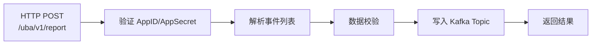

# UBA 后端模块总览

本文档梳理 GoWind UBA 后端各服务包含的功能模块及其职责。

## 一、Core Service 模块

Core Service 是核心业务服务，包含所有数据处理逻辑，通过 gRPC 供 Admin 和 Collector 调用。

### 1.1 UBA 数据模块

| 模块 | 目录 | 数据存储 | 说明 |
|------|------|---------|------|
| BehaviorEvent | `internal/data/.../events_fact_repo.go` | OLAP | 行为事件事实表，核心数据 |
| Session | `internal/data/.../sessions_fact_repo.go` | OLAP | 会话聚合数据 |
| EventPath | `internal/data/.../path_features_repo.go` | OLAP | 用户行为路径 |
| UserBehaviorProfile | `internal/data/.../users_dim_repo.go` | OLAP | 用户维度画像 |
| ObjectDim | `internal/data/.../objects_dim_repo.go` | OLAP | 对象维度 |
| IDMapping | `internal/data/.../id_mapping_repo.go` | OLAP | 跨平台 ID 映射 |
| UserTag | `internal/data/.../user_tags_repo.go` | OLAP | 用户标签数据 |
| RiskEvent | `internal/data/.../risk_events_repo.go` | OLAP | 风险事件 |

### 1.2 UBA 业务模块

| 模块 | 说明 |
|------|------|
| ApplicationService | 应用管理（AppID/AppKey/AppSecret 生成与管理） |
| RiskRuleService | 风控规则引擎（条件表达式、动作、版本管理） |
| WebhookService | Webhook 配置与投递（事件过滤、重试） |
| TagDefinitionService | 标签定义（类型、规则、允许值） |
| ReportService | 统一事件上报服务（批量、混合类型） |

### 1.3 平台管理模块

| 模块 | 说明 |
|------|------|
| AuthenticationService | 认证服务（登录、登出、Token 刷新） |
| UserService | 用户管理 |
| RoleService | 角色管理 |
| TenantService | 租户管理（多租户数据隔离） |
| OrgUnitService | 部门管理 |
| PositionService | 职位管理 |
| PermissionService | 权限管理 |
| MenuService | 菜单管理 |
| DictService | 字典管理 |
| TaskService | 任务调度（Asynq） |
| FileService | 文件存储管理 |
| LanguageService | 多语言管理 |
| InternalMessageService | 站内信 |

### 1.4 审计模块

| 模块 | 说明 |
|------|------|
| ApiAuditLogService | API 请求日志 |
| LoginAuditLogService | 登录日志 |
| OperationAuditLogService | 操作日志 |
| DataAccessAuditLogService | 数据访问日志 |
| PermissionAuditLogService | 权限变更日志 |
| PolicyEvaluationLogService | 策略评估日志 |

## 二、Admin Service 模块

Admin Service 作为 BFF 层，为前端提供 HTTP REST API + SSE 实时推送。

### 2.1 HTTP REST 服务

Admin Service 包含 41+ 个 Service 实现，与 Core Service 的 gRPC 接口一一对应，增加 HTTP 路由和请求转换。

### 2.2 SSE 实时推送

| 功能 | 说明 |
|------|------|
| 站内信推送 | 新消息实时推送 |
| 风险告警推送 | 高风险事件实时告警 |
| 任务状态推送 | 异步任务完成通知 |

SSE 端点：`http://localhost:9701/events`

## 三、Collector Service 模块

Collector Service 是轻量级数据采集服务，职责单一。

| 模块 | 说明 |
|------|------|
| ReportService | 接收 SDK 上报，验证 AppID/AppSecret，格式化后写入 Kafka |
| HealthCheck | 服务健康检查 |

### 数据处理流程



## 四、数据仓库分层

### 4.1 ClickHouse 实现

```
internal/data/clickhouse/
├── events_fact_repo.go       # 事件事实表
├── sessions_fact_repo.go     # 会话事实表
├── users_dim_repo.go         # 用户维度表
├── objects_dim_repo.go       # 对象维度表
├── id_mapping_repo.go        # ID 映射表
├── risk_events_repo.go       # 风险事件表
├── path_features_repo.go     # 路径特征表
└── user_tags_repo.go         # 用户标签表
```

### 4.2 Doris 实现

```
internal/data/doris/
├── events_fact_repo.go       # 事件事实表
├── sessions_fact_repo.go     # 会话事实表
├── users_dim_repo.go         # 用户维度表
├── objects_dim_repo.go       # 对象维度表
├── id_mapping_repo.go        # ID 映射表
├── risk_events_repo.go       # 风险事件表
├── path_features_repo.go     # 路径特征表
└── user_tags_repo.go         # 用户标签表
```

### 4.3 Ent ORM（PostgreSQL 元数据）

```
internal/data/ent/
├── schema/                   # Ent Schema 定义
│   ├── user.go
│   ├── role.go
│   ├── tenant.go
│   ├── application.go
│   ├── risk_rule.go
│   ├── webhook.go
│   └── ...
└── generate.go               # go:generate 指令
```

## 五、SQL Schema

### 5.1 ClickHouse Schema

```
backend/sql/clickhouse/
├── 01_create_database.sql        # 创建数据库
├── 02_create_events_fact.sql     # 事件事实表
├── 03_create_sessions_fact.sql   # 会话事实表
├── 04_create_users_dim.sql       # 用户维度表
├── 05_create_objects_dim.sql     # 对象维度表
├── 06_create_id_mapping.sql      # ID 映射表
├── 07_create_kafka_tables.sql    # Kafka 消费表
├── 08_create_mv.sql              # 物化视图
└── 09_create_risk_events.sql     # 风险事件表
```

### 5.2 Doris Schema

```
backend/sql/doris/
├── 01_create_database.sql
├── 02_create_events_fact.sql
├── 03_create_sessions_fact.sql
├── 04_create_users_dim.sql
├── 05_create_objects_dim.sql
├── 06_create_id_mapping.sql
├── 07_create_risk_events.sql
└── 08_create_user_tags.sql
```

## 六、公共包

```
backend/pkg/
├── auth/          # 认证（JWT + MFA）
├── crypto/        # 加密工具（AES-GCM + bcrypt）
├── eventbus/      # 事件总线
├── jwt/           # JWT 工具
├── middleware/     # HTTP 中间件
├── oss/           # 对象存储（MinIO/S3）
├── pagination/    # 分页工具
├── risk/          # 风控引擎
└── tracing/       # 链路追踪
```

## 相关文档

- [UBA 后端架构总览](./backend-architecture.md)
- [UBA Protobuf API 定义](./backend-api.md)
- [UBA 配置与部署指南](./backend-config-deploy.md)
- [UBA 后端扩展机制](./backend-extension.md)
