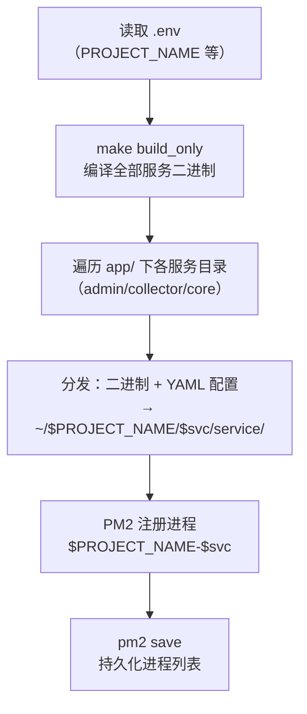

# UBA PM2 部署指南

本文档面向运维人员，介绍用 PM2 在裸机/虚拟机上部署 GoWind UBA 三服务的流程（`scripts/deploy/pm2_service.sh`）。适合无 Docker / 需要 PM2 进程托管的场景。

> 先读 [系统架构](./architecture.md) 与 [配置详解](./deploy-config.md)。PM2 模式下，中间件（PG/Redis/Kafka/Doris/Etcd/MinIO/Jaeger）需自行准备。

---

## 一、PM2 部署脚本概览

脚本：`backend/scripts/deploy/pm2_service.sh`

工作流程：



### 关键行为

- **读取 `.env`**（项目根，自动去除 CRLF 并 export），从中取 `PROJECT_NAME`（默认 `gwua`）。
- **编译**：`make build_only`（仅编译，不跑代码生成）。
- **安装根目录**：`~/$PROJECT_NAME/`（默认 `~/gwua/`）。
- **服务发现**：遍历 `app/` 一级子目录（即 `admin`、`collector`、`core`）。
- **分发**：把 `<svc>/service/bin/server` 拷到 `~/gwua/<svc>/service/bin/server`，把 `*.yaml` 配置拷到 `~/gwua/<svc>/service/configs/`。
- **PM2 注册**：进程名 `${PROJECT_NAME}-${svc}`，命名空间 `$PROJECT_NAME`，启动前先 `pm2 delete` 替换旧实例，最后 `pm2 save`。

---

## 二、进程命名

| 服务 | 进程名 | 命名空间 |
|------|--------|---------|
| Admin | `gwua-admin` | `gwua` |
| Collector | `gwua-collector` | `gwua` |
| Core | `gwua-core` | `gwua` |

> 不使用 `ecosystem.config.js`——PM2 完全由脚本内的 CLI 驱动（`--name`、`--namespace`、`--cwd`、`--output`、`--error`、`--update-env`）。每个进程有独立的 stdout/stderr 日志。

---

## 三、执行部署

```bash
cd backend

# 1. 准备 .env（项目根）
cat > .env <<'EOF'
PROJECT_NAME=gwua
# 其他环境变量按需补充
EOF

# 2. 一键 PM2 部署（脚本会先 make build_only）
make pm2-deploy
# 或直接：./scripts/deploy/pm2_service.sh
```

部署完成后查看：

```bash
pm2 list                    # 查看三个进程状态
pm2 logs gwua-core          # 查看 core 日志
pm2 monit                   # 实时监控
```

服务启动参数为 `-c <configs相对路径>`，即从 bin 目录加载 `../configs/*.yaml`。

---

## 四、前置依赖（自备中间件）

PM2 模式只托管三个应用服务，中间件需自行部署（裸机/独立容器均可）：

| 中间件 | 用途 | 默认地址 |
|--------|------|---------|
| PostgreSQL | 业务/配置实体 | `data.yaml` 的 database.dsn |
| Redis | 缓存 + Asynq 队列 | `redis:6379` |
| Kafka | 事件缓冲 | collector `data.yaml` 的 kafka.endpoints |
| Apache Doris（或 ClickHouse） | OLAP 分析引擎 | core `data.yaml` |
| Etcd | 服务发现 | `registry.yaml` |
| MinIO | 对象存储 | `oss.yaml` |
| Jaeger | 链路追踪（可选） | `trace.yaml` |

> 部署前确保各服务的 `data.yaml` / `registry.yaml` / `oss.yaml` 指向真实地址。

---

## 五、配置中心（etcd 导出）

项目支持把配置导出到 etcd（`make export`，底层用 `cfgexp`）：

```bash
cd backend
make export   # cfgexp --type=etcd --addr=localhost:2379 --proj=$PROJECT_NAME
```

配合 kratos 的配置热加载，可在不重启进程的情况下更新部分配置。

---

## 六、日常运维

```bash
pm2 restart gwua-core        # 重启单个服务
pm2 reload gwua-admin        # 零停机重载（若支持）
pm2 stop gwua-collector      # 停止
pm2 delete gwua-core         # 删除
pm2 save                     # 持久化进程列表（开机自启前提）
pm2 startup                  # 配置开机自启（按提示执行返回的命令）
```

### 日志位置

PM2 日志默认在 `~/.pm2/logs/`：

- `gwua-admin-out.log` / `gwua-admin-error.log`
- `gwua-collector-out.log` / `gwua-collector-error.log`
- `gwua-core-out.log` / `gwua-core-error.log`

---

## 七、更新发布

```bash
cd backend
git pull                     # 拉取最新代码
make build_only              # 重新编译
./scripts/deploy/pm2_service.sh   # 重新分发并重启（脚本会先 pm2 delete 再启动）
```

> 脚本部署是「替换式」：每次运行都会先 `pm2 delete` 旧实例再启动新实例，无蓝绿/灰度。需要灰度发布时建议改用 Docker 多实例 + etcd 发现。

---

## 八、相关文档

- [系统架构](./architecture.md)
- [Docker 部署](./deploy-docker.md)
- [配置详解](./deploy-config.md)
- [附录 · 端口对照表](./appendix.md)
