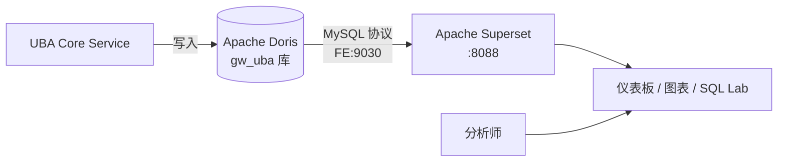

# UBA Superset BI 部署指南

本文档面向运维与数据分析师，介绍如何部署 Apache Superset 并对接 GoWind UBA 的 OLAP 引擎（默认 Doris），在事实表上构建可视化仪表板。

> 先读 [系统架构](./architecture.md)。UBA 与 Superset 是**松耦合**：Superset 作为独立 BI 容器，通过 MySQL 协议直连 Doris FE，查询 `gw_uba` 库的事实表。

---

## 一、部署架构



- UBA 把分析数据写入 Doris 的 `gw_uba` 库（`events_fact` / `sessions_fact` / `risk_events` / `users_dim` 等）。
- Superset 通过 `pydoris`（或 `pymysql`）驱动连 Doris FE 的 9030 端口，把这些表作为 Dataset 建模。

---

## 二、Docker 一键部署

Superset 已在 `docker-compose.yaml` 中预置（`apache/superset:latest`，端口 8088）。容器启动时会**自动完成初始化**：

1. 切换 apt 源到 Aliyun 镜像，安装编译依赖（`gcc python3-dev default-libmysqlclient-dev pkg-config`）。
2. 进入 Superset 真实 venv `/app/.venv`，安装 `pymysql` 与 **`pydoris`**（Doris 驱动）。
3. 执行 `superset db upgrade` → `superset fab create-admin`（admin/admin）→ `superset init`。
4. 启动 `run-server.sh`。

```bash
cd backend
./scripts/docker/full_deploy.sh   # 全栈部署（含 superset）
# 或只起依赖：./scripts/docker/libs_only.sh（libs compose 也含 superset）
```

访问：`http://localhost:8088/login/`，默认账号 `admin / admin`。

> ⚠️ 生产环境务必：改 admin 密码、替换 `SUPERSET_SECRET_KEY`、收敛访问来源。

---

## 三、连接 UBA 的 Doris

在 Superset UI → **Settings → Database Connectors → 添加 Apache Doris**，填入连接串（指向 Doris FE 查询端口 9030，库 `gw_uba`）：

| 驱动 | 连接串 |
|------|--------|
| Doris（`pydoris`，推荐） | `pydoris://root:@host.docker.internal:9030/internal.gw_uba` |
| MySQL（`pymysql`） | `mysql+pymysql://root:@host.docker.internal:9030/gw_uba` |

要点：

- Superset 跑在容器内，用 `host.docker.internal` 访问宿主机上的 Doris（或同一 compose 网络内用 `doris-fe:9030`）。
- 库名统一为 `gw_uba`（与 UBA Core `data.yaml` 的 `doris.database` 一致）。
- 连接时勾选「Allow SQL Lab data upload」等按需开启。

> 源参考：`backend/docs/deploy_superset.md`。

---

## 四、创建 Dataset 与仪表板

### 1. 添加 Dataset

在 Superset → **Data → Datasets** 添加 UBA 的事实/维度表作为数据集：

| 表 | 类型 | 用途 |
|----|------|------|
| `events_fact` | 事实表 | 事件明细，趋势/漏斗/分组分析 |
| `sessions_fact` | 事实表 | 会话分析、跳出率 |
| `risk_events` | 事实表 | 风险事件监控 |
| `users_dim` | 维度表 | 用户画像分布 |
| `objects_dim` | 维度表 | 行为对象分析 |
| `id_mapping` | 映射表 | 跨端 ID 关联 |
| `user_tags` | 关联表 | 用户标签分布 |

### 2. 配置字段元数据

对每个 Dataset，在 Columns 页标注字段类型、是否时间维度（如 `event_time` / `event_date`）、是否可聚合，便于图表正确识别。

### 3. 建图表与仪表板

基于 Dataset 建图表（折线趋势、漏斗步骤、留存热力图等），组合成仪表板。典型仪表板：

- **运营总览**：DAU/MAU 趋势、渠道分布（`channel`）、平台分布（`platform`）。
- **转化漏斗**：基于 `events_fact` 的 `event_name` 序列。
- **风险监控**：`risk_events` 的风险类型/等级分布与趋势。
- **用户画像**：`users_dim` 的地域/等级/VIP 分布。

> UBA 管理后台内置了 5 个分析聚合（事件趋势/漏斗/留存/分组/活跃用户），Superset 用于更灵活的自定义 BI 与报表。两者互补。

---

## 五、SQL Lab 直接查询

无需建 Dataset 也能直接查。在 Superset → **SQL Lab → SQL Editor** 选 Doris 连接，直接写 SQL：

```sql
-- 最近 7 天各渠道 DAU
SELECT channel, event_date, count(DISTINCT user_id) AS dau
FROM gw_uba.events_fact
WHERE event_date >= DATE_SUB(CURDATE(), INTERVAL 7 DAY)
GROUP BY channel, event_date
ORDER BY event_date, dau DESC;
```

> 双引擎 SQL 方言差异（Doris `DATE_FORMAT` vs ClickHouse `toStartOfHour`）见 [OLAP 查询手册](./analyst-olap-cookbook.md)。

---

## 六、常见问题

| 现象 | 排查方向 |
|------|---------|
| 连不上 Doris | 容器内用 `doris-fe:9030` 或宿主用 `host.docker.internal:9030`；确认 FE 已就绪（`http://localhost:8030`） |
| 驱动缺失 | `pydoris` 应已被容器初始化脚本安装；手动装：进容器 `/app/.venv/bin/pip install pydoris pymysql` |
| 查询无数据 | UBA 当前 Kafka 消费未实现，`events_fact` 可能没数据——见 [系统架构 · Kafka 现状](./architecture.md)；可先灌测试数据 |
| 仪表板加载慢 | 检查 Doris 分区/索引；对大表加时间过滤；调整 Superset 缓存（`CACHE_DEFAULT_TIMEOUT`） |

---

## 七、相关文档

- [系统架构](./architecture.md)
- [Docker 部署](./deploy-docker.md)
- [配置详解](./deploy-config.md)
- [OLAP 查询手册](./analyst-olap-cookbook.md)
- [数据分析师上手指南](./analyst-getting-started.md)
