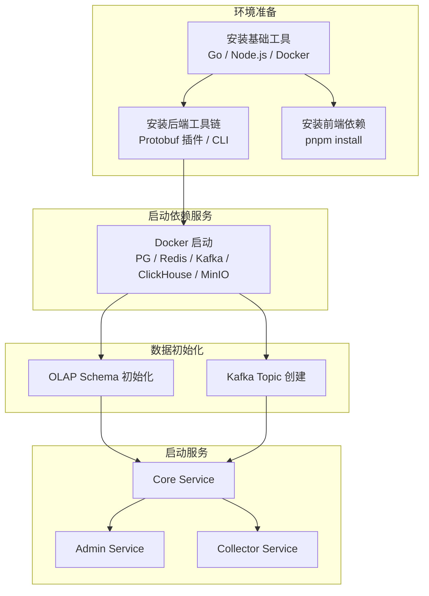

# GoWind UBA 安装指南

本文档详细介绍 GoWind UBA 的完整安装流程，涵盖开发环境（本地调试）和生产环境（线上部署）两种场景。GoWind UBA 采用三服务微服务架构，需要额外部署 Kafka 和 ClickHouse/Doris 等 OLAP 引擎。



## 一、环境准备

### 1. 基础依赖说明

| 环境类型 | 核心依赖 | 最低版本 | 用途说明 |
|------|------|------|------|
| 后端 | Go、Docker、Docker Compose | Go 1.25+ | 微服务编译、依赖服务管理 |
| 后端 | Buf、Protoc、Make | | API 代码生成、构建 |
| 前端 | Node.js、pnpm | Node.js 18+、pnpm 8+ | 前端工程构建、依赖安装 |

### 2. 项目目录结构

```
go-wind-uba/
├── backend/                        # 后端项目
│   ├── scripts/                    # 自动化脚本
│   │   ├── env/                    # 环境安装脚本
│   │   └── docker/                 # Docker 部署脚本
│   ├── app/
│   │   ├── admin/service/          # Admin 服务（HTTP + SSE）
│   │   ├── collector/service/      # Collector 服务（数据采集）
│   │   └── core/service/           # Core 服务（gRPC 核心）
│   ├── api/                        # Protobuf API 定义
│   ├── sql/                        # 数据库初始化脚本
│   │   ├── clickhouse/             # ClickHouse DDL
│   │   └── doris/                  # Doris DDL
│   ├── pkg/                        # 公共包
│   ├── Makefile                    # 后端构建命令
│   └── Dockerfile                  # Docker 镜像构建
├── frontend/
│   ├── admin/                      # 管理后台前端（Vue3 + Vben Admin）
│   └── sdk/
│       └── web/                    # Web 数据采集 SDK
└── README.md
```

## 二、开发环境安装（本地调试）

### 2.1 后端开发环境

#### 方式一：自动安装脚本（推荐）

##### Windows

```powershell
# 以管理员身份运行 PowerShell
cd go-wind-uba/backend

# 执行开发环境安装脚本
powershell -ExecutionPolicy Bypass -File scripts/env/install_windows_dev.ps1
```

##### macOS / Linux

```shell
cd go-wind-uba/backend

bash scripts/env/install_unix_dev.sh
```

#### 方式二：手动安装

##### 步骤 1：安装基础工具

**Windows（Scoop）**

```powershell
Set-ExecutionPolicy RemoteSigned -Scope CurrentUser
irm get.scoop.sh | iex

scoop bucket add extras
scoop install git go make nodejs
```

**macOS（Homebrew）**

```shell
brew install git go protobuf make node
```

**Ubuntu / Debian**

```shell
sudo apt-get update
sudo apt-get install -y git make protobuf-compiler
curl -fsSL https://deb.nodesource.com/setup_22.x | sudo bash -
sudo apt-get install -y nodejs
```

##### 步骤 2：安装 Docker

请参考 [Docker 官方文档](https://docs.docker.com/get-docker/) 安装 Docker Desktop（Windows/macOS）或 Docker Engine（Linux）。

##### 步骤 3：安装 Protobuf 插件

```shell
cd go-wind-uba/backend

# 一键安装
make plugin

# 或手动安装
go install google.golang.org/protobuf/cmd/protoc-gen-go@latest
go install google.golang.org/grpc/cmd/protoc-gen-go-grpc@latest
go install github.com/go-kratos/kratos/cmd/protoc-gen-go-http/v2@latest
go install github.com/go-kratos/kratos/cmd/protoc-gen-go-errors/v2@latest
go install github.com/google/gnostic/cmd/protoc-gen-openapi@latest
go install github.com/envoyproxy/protoc-gen-validate@latest
```

##### 步骤 4：安装 CLI 工具

```shell
cd go-wind-uba/backend

# 一键安装
make cli

# 或手动安装
go install github.com/go-kratos/kratos/cmd/kratos/v2@latest
go install github.com/bufbuild/buf/cmd/buf@latest
go install entgo.io/ent/cmd/ent@latest
go install github.com/tx7do/go-wind-toolkit/gowind/cmd/gow@latest
```

##### 步骤 5：配置 Go 代理（国内用户）

```shell
go env -w GOPROXY=https://goproxy.io,direct
go env -w GO111MODULE=on
```

#### 初始化项目

```shell
cd go-wind-uba/backend

# 安装 Go 依赖
go mod download

# 一键初始化（安装插件 + CLI 工具）
make init
```

### 2.2 前端开发环境

| 前端 | 目录 | UI 框架 | 开发端口 |
|------|------|------|------|
| 管理后台 | `frontend/admin/` | Ant Design Vue + Vben Admin | 5555 |
| Web SDK | `frontend/sdk/web/` | 原生 JavaScript | — |

#### 步骤 1：安装 pnpm

```shell
npm install -g pnpm
```

#### 步骤 2：切换国内镜像源（可选）

```shell
pnpm config set registry https://registry.npmmirror.com
```

#### 步骤 3：安装前端依赖

```shell
cd go-wind-uba/frontend/admin

pnpm install
```

### 2.3 启动依赖服务

UBA 的依赖服务比 Admin/CMS 更多，需要 Kafka 和 ClickHouse/Doris。

#### 使用 Docker Compose 启动

```shell
cd go-wind-uba/backend

# 启动全部依赖服务
docker compose -f scripts/docker/docker-compose.libs.yaml up -d
```

启动的服务：

| 服务 | 端口 | 说明 |
|------|------|------|
| PostgreSQL | 5432 | 元数据存储（默认库名：`gw_uba`） |
| Redis | 6379 | 缓存 / Asynq 任务队列 |
| Kafka | 9092 | 事件消息队列 |
| ClickHouse | 8123 / 9000 | OLAP 分析引擎（HTTP / Native） |
| MinIO | 9000 / 9001 | 对象存储 |
| Etcd | 2379 | 服务注册与发现 |
| Jaeger | 16686 / 4317 | 链路追踪（UI / OTLP gRPC） |

> 如果使用 Apache Doris 替代 ClickHouse，请单独部署 Doris 集群（FE: 9030/8030，BE: 8040）。

#### 配置 hosts

```ini
# Linux/macOS: /etc/hosts
# Windows: C:\Windows\System32\drivers\etc\hosts
127.0.0.1 postgres
127.0.0.1 redis
127.0.0.1 kafka
127.0.0.1 clickhouse
127.0.0.1 minio
127.0.0.1 etcd
127.0.0.1 jaeger
```

### 2.4 数据初始化

#### 步骤 1：OLAP Schema 初始化

**ClickHouse：**

```bash
cd go-wind-uba/backend/sql/clickhouse

# 依次执行建表脚本
clickhouse-client --multiquery < 01_create_database.sql
clickhouse-client --multiquery < 02_create_events_fact.sql
clickhouse-client --multiquery < 03_create_sessions_fact.sql
clickhouse-client --multiquery < 04_create_users_dim.sql
clickhouse-client --multiquery < 05_create_objects_dim.sql
clickhouse-client --multiquery < 06_create_id_mapping.sql
clickhouse-client --multiquery < 07_create_kafka_tables.sql
clickhouse-client --multiquery < 08_create_mv.sql
clickhouse-client --multiquery < 09_create_risk_events.sql
```

**Apache Doris：**

```bash
cd go-wind-uba/backend/sql/doris

# 通过 MySQL 协议连接 Doris FE
mysql -h localhost -P 9030 -u root < 01_create_database.sql
mysql -h localhost -P 9030 -u root < 02_create_events_fact.sql
mysql -h localhost -P 9030 -u root < 03_create_sessions_fact.sql
mysql -h localhost -P 9030 -u root < 04_create_users_dim.sql
mysql -h localhost -P 9030 -u root < 05_create_objects_dim.sql
mysql -h localhost -P 9030 -u root < 06_create_id_mapping.sql
mysql -h localhost -P 9030 -u root < 07_create_risk_events.sql
mysql -h localhost -P 9030 -u root < 08_create_user_tags.sql
```

#### 步骤 2：Kafka Topic 创建

```bash
# 创建事件 Topic
docker exec go-wind-uba-kafka kafka-topics.sh \
  --create --topic uba_events \
  --bootstrap-server localhost:9092 \
  --partitions 6 --replication-factor 1

# 创建风险事件 Topic
docker exec go-wind-uba-kafka kafka-topics.sh \
  --create --topic uba_risk_events \
  --bootstrap-server localhost:9092 \
  --partitions 3 --replication-factor 1

# 验证
docker exec go-wind-uba-kafka kafka-topics.sh \
  --list --bootstrap-server localhost:9092
```

#### 步骤 3：选择 OLAP 引擎

```go
// app/core/service/internal/data/data.go
// true = 使用 ClickHouse
// false = 使用 Apache Doris
const UseClickHouse bool = true
```

修改后需重新编译 Core Service。

#### 步骤 4：验证 OLAP 引擎连接

**ClickHouse：**

```bash
# 验证表创建
clickhouse-client --query "SHOW TABLES FROM gw_uba"
```

**Doris：**

```bash
mysql -h localhost -P 9030 -u root -e "SHOW TABLES FROM gw_uba"
```

### 2.5 启动开发服务

UBA 需要按顺序启动三个服务：先启动 Core Service，再启动 Admin 和 Collector。

#### 步骤 1：启动 Core Service

```shell
cd go-wind-uba/backend

# 使用 gow CLI
gow run core
```

Core Service 通过 gRPC 提供服务，同时启动 Kafka 消费者和 Asynq Worker。

#### 步骤 2：启动 Admin Service

```shell
cd go-wind-uba/backend

gow run admin
```

#### 步骤 3：启动 Collector Service

```shell
cd go-wind-uba/backend

gow run collector
```

#### 步骤 4：启动前端

```shell
cd go-wind-uba/frontend/admin

pnpm dev:antd
```

#### 验证访问

| 服务 | 地址 |
|------|------|
| 管理后台前端 | <http://localhost:5555> |
| Admin REST API | <http://localhost:9700> |
| Admin Swagger 文档 | <http://localhost:9700/docs/> |
| Admin SSE 服务 | <http://localhost:9701/events> |
| Collector API | <http://localhost:9800> |
| Collector Swagger 文档 | <http://localhost:9800/docs/> |
| Collector 健康检查 | <http://localhost:9800/uba/v1/health> |
| Jaeger UI | <http://localhost:16686> |
| MinIO 控制台 | <http://localhost:9001> |

### 2.6 验证数据采集

启动 SDK 测试页验证数据采集链路：

```shell
# 打开 SDK 测试页面
cd go-wind-uba/frontend/sdk/web

# 用浏览器打开 test.html
# 修改配置中的 serverUrl 和 appId
# 发送测试事件后在 ClickHouse/Doris 中验证
```

```sql
-- ClickHouse 验证数据入库
SELECT count() FROM gw_uba.events_fact WHERE event_name = 'test_event';

-- Doris 验证数据入库
SELECT COUNT(*) FROM gw_uba.events_fact WHERE event_name = 'test_event';
```

## 三、生产环境部署

### 3.1 环境准备

确保服务器已安装 Docker + Docker Compose。

### 3.2 全 Docker 部署

```shell
cd go-wind-uba/backend

# 启动全部服务（基础设施 + UBA 服务）
docker compose -f scripts/docker/docker-compose.full.yaml up -d
```

### 3.3 混合部署

中间件运行在 Docker，UBA 服务通过 PM2 管理运行在宿主机：

```shell
# 步骤 1：仅启动 Docker 依赖
docker compose -f scripts/docker/docker-compose.libs.yaml up -d

# 步骤 2：构建 UBA 服务
cd go-wind-uba/backend
make build

# 步骤 3：PM2 部署
pm2 start ecosystem.config.js
```

PM2 配置示例：

```javascript
// ecosystem.config.js
module.exports = {
  apps: [
    {
      name: 'uba-core',
      script: './bin/core-service',
      cwd: './',
      instances: 1,
      env: {
        CONFIG_PATH: './configs/core.yaml',
      },
    },
    {
      name: 'uba-admin',
      script: './bin/admin-service',
      cwd: './',
      instances: 1,
      env: {
        CONFIG_PATH: './configs/admin.yaml',
      },
    },
    {
      name: 'uba-collector',
      script: './bin/collector-service',
      cwd: './',
      instances: 2,  // 采集服务可多实例
      env: {
        CONFIG_PATH: './configs/collector.yaml',
      },
    },
  ],
};
```

### 3.4 前端生产部署

```shell
cd go-wind-uba/frontend/admin

# 构建
pnpm build:antd

# 部署 dist/ 到 Nginx
```

### 3.5 Superset 部署

```bash
# 部署 Superset
docker run -d \
  --name superset \
  --restart always \
  -p 8088:8088 \
  -e TZ=Asia/Shanghai \
  -e SUPERSET_SECRET_KEY=your-secret-key \
  --user root \
  apache/superset:latest

# 初始化
docker exec -it superset bash -c "
  apt-get update &&
  apt-get install -y gcc python3-dev default-libmysqlclient-dev pkg-config &&
  /app/.venv/bin/python -m ensurepip &&
  /app/.venv/bin/python -m pip install --upgrade pip &&
  /app/.venv/bin/python -m pip install pymysql pydoris &&
  superset db upgrade &&
  superset fab create-admin --username admin --password admin --firstname Admin --lastname Admin --email admin@superset.com &&
  superset init
"
```

详见 [Superset BI 集成教程](./tutorial-superset-integration.md)。

### 3.6 Nginx 反向代理

```nginx
# Collector（数据采集入口，面向 SDK）
server {
    listen 443 ssl;
    server_name collector.uba.your-domain.com;

    ssl_certificate /path/to/cert.pem;
    ssl_certificate_key /path/to/key.pem;

    location / {
        proxy_pass http://127.0.0.1:9800;
        proxy_set_header Host $host;
        proxy_set_header X-Real-IP $remote_addr;
        proxy_set_header X-Forwarded-For $proxy_add_x_forwarded_for;
    }
}

# Admin（管理后台）
server {
    listen 443 ssl;
    server_name admin.uba.your-domain.com;

    ssl_certificate /path/to/cert.pem;
    ssl_certificate_key /path/to/key.pem;

    # 前端静态资源
    location / {
        root /usr/share/nginx/html;
        try_files $uri $uri/ /index.html;
    }

    # API 反向代理
    location /admin/ {
        proxy_pass http://127.0.0.1:9700;
        proxy_set_header Host $host;
        proxy_set_header X-Real-IP $remote_addr;
    }

    # SSE（需要特殊配置）
    location /events {
        proxy_pass http://127.0.0.1:9701;
        proxy_set_header Connection '';
        proxy_http_version 1.1;
        proxy_buffering off;
        proxy_cache off;
        chunked_transfer_encoding on;
    }
}
```

## 四、常用 Makefile 命令

| 命令 | 说明 |
|------|------|
| `make init` | 初始化开发环境（安装插件 + CLI 工具） |
| `make plugin` | 安装 Protobuf 编译器插件 |
| `make cli` | 安装 CLI 脚手架工具 |
| `make gen` | 生成所有代码（Ent + Wire + API + OpenAPI） |
| `make api` | 生成 Protobuf Go 代码 |
| `make openapi` | 生成 OpenAPI 文档 |
| `make ts` | 生成 TypeScript 客户端代码 |
| `make ent` | 生成 Ent ORM 代码 |
| `make wire` | 生成 Wire 依赖注入代码 |
| `make build` | 编译所有服务 |
| `make docker` | 构建 Docker 镜像 |
| `make lint` | 运行代码检查 |
| `make test` | 运行测试 |

## 五、常见问题

### Q1: Kafka 连接失败

1. 确认 Kafka 容器已启动：`docker ps | grep kafka`
2. 确认 hosts 已配置 `127.0.0.1 kafka`
3. 检查 `configs/data.yaml` 中的 `kafka.brokers` 配置
4. 验证 Topic 已创建：`docker exec uba-kafka kafka-topics.sh --list --bootstrap-server localhost:9092`

### Q2: ClickHouse/Doris 写入失败

1. 确认 OLAP 引擎容器已启动
2. 确认 Schema 已初始化（执行 SQL 脚本）
3. 检查 `UseClickHouse` 常量与实际使用的引擎一致
4. 验证连接配置（端口、用户名、密码）

### Q3: 数据采集链路不通

1. 使用 SDK 的 debugMode = 2 验证 SDK 是否正常工作
2. 检查 Collector 健康检查：`curl http://localhost:9800/uba/v1/health`
3. 检查 Kafka Topic 是否有消息积压
4. 检查 Core Service 是否正常消费 Kafka

### Q4: Go 模块下载失败

```shell
go env -w GOPROXY=https://goproxy.io,direct
go env -w GOSUMDB=off
```

### Q5: 前端依赖安装缓慢

```shell
pnpm config set registry https://registry.npmmirror.com
pnpm store prune
pnpm install
```

### Q6: 端口冲突

修改各服务的配置文件中的端口配置：

- Core Service gRPC：`app/core/service/configs/`
- Admin Service HTTP/SSE：`app/admin/service/configs/`
- Collector Service HTTP：`app/collector/service/configs/`

### Q7: Doris Stream Load 写入失败

1. 确认 Doris BE 的 `stream_load_url` 配置正确（默认 `http://localhost:8030`）
2. 检查 Doris BE 是否正常运行
3. 确认 Doris 表引擎为 OLAP 且支持 Stream Load

## 六、相关文档

- [UBA 产品介绍](./intro.md)
- [UBA 后端架构总览](./backend-architecture.md)
- [UBA 配置与部署指南](./backend-config-deploy.md)
- [Web SDK 集成实战](./tutorial-sdk-integration.md)
- [双 OLAP 引擎实战](./tutorial-olap-engine.md)
- [三服务部署实战](./tutorial-deploy.md)
- [Superset BI 集成](./tutorial-superset-integration.md)
