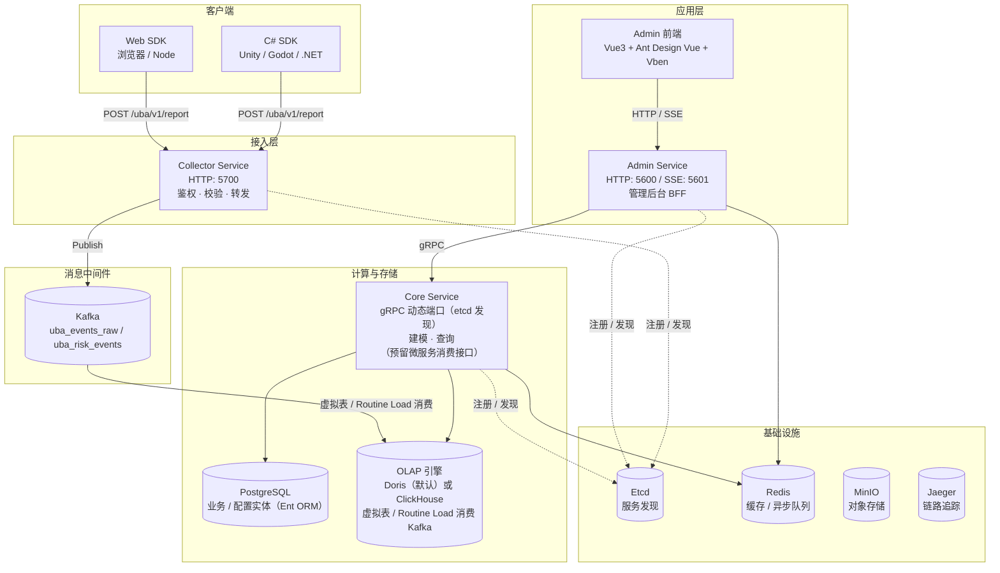

# GoWind UBA 产品介绍

GoWind UBA（User Behavior Analytics，用户行为分析）是一个开箱即用的企业级用户行为分析与商业智能平台，基于 **Go（go-kratos 微服务框架）** 后端与 **Vue 3 + Ant Design Vue + Vben Admin** 前端构建。

> 让每一次用户行为都有迹可循，让每一份数据洞察触手可及。

本页是全部 UBA 文档的入口。无论你是二次开发者、运维人员还是数据分析师，都建议先读本页的「读者导航」，找到适合你的阅读路径。

---

## 一、什么是 UBA

UBA（User Behavior Analysis）是一种用于收集、分析和报告用户在网站、App、游戏等数字产品上行为的数据分析技术。它帮助企业了解用户的偏好、习惯与行为模式，从而优化产品体验、提升转化率、实现精准营销，并识别潜在的业务与安全风险。

GoWind UBA 的核心数据链路是一条经典的流式数仓管道：

```
客户端 SDK  →  Collector（采集）  →  Kafka（缓冲）  →  OLAP 引擎（Doris / ClickHouse，Routine Load / Kafka 引擎表消费落库）

                Admin 后台  →  Admin Service（BFF）  →  Core（gRPC：建模/查询）  →  OLAP 引擎 + PostgreSQL（业务实体）
```

> 写入路径上 **Core 默认不经手事件入库**——Collector 把事件发到 Kafka 后，由 OLAP 引擎自身的消费机制（Doris Routine Load / ClickHouse Kafka 引擎表）直接落库。Core 负责的是读侧的建模与查询。详见 [系统架构](./architecture.md)。

---

## 二、真实能力清单

> ⚠️ **请务必阅读**：UBA 是一个持续演进的项目。下列能力按**代码中真实实现的状态**划分。

### 已实现（代码可验证）

| 能力域 | 内容 |
|--------|------|
| **数据采集** | 自研 Web SDK（TypeScript）+ C# SDK（Unity/Godot/.NET），批量上报 + 重试降级 + 卸载兜底；游戏专属维度 `serverId`/`level` |
| **统一上报** | `POST /uba/v1/report`，appId + appSecret 应用级鉴权，混合上报行为/风险事件 |
| **三服务架构** | Collector（采集 BFF）+ Core（核心业务）+ Admin（管理后台 BFF），基于 etcd 服务发现 |
| **双 OLAP 引擎** | Apache Doris 与 ClickHouse 二选一，共用同一份业务模型，编译期常量 `UseClickHouse` 切换 |
| **分析聚合（25 种）** | 覆盖通用 Web/APP 与游戏全场景的分析模型矩阵（见下表），前后端均已贯通 |
| **事实表读取** | 会话 `Session`、用户路径 `EventPath`、用户行为画像 `UserBehaviorProfile` 的 CRUD 查询 |
| **风险与标签** | 风险事件 `RiskEvent`、风险规则 `RiskRule`、标签定义 `TagDefinition`、用户标签 `UserTag`、ID 映射 `IdMapping` |
| **组织与权限** | 多租户、用户/角色/权限/菜单、Casbin/OPA 策略引擎、字典体系、组织/岗位 |
| **系统运维** | 文件存储（MinIO）、缓存管理、站内消息、登录/操作/API/权限审计、定时任务（Asynq）、SSE 实时推送 |
| **前端管理后台** | 基于 Connect-RPC 生成的类型安全 API 层、TanStack Vue Query 数据层，内嵌 25 个分析模型视图 + 实时大屏 |
| **BI 对接** | Apache Superset 容器直连 Doris，基于事实表构建仪表板 |

#### 25 个分析模型矩阵

`AnalyticsService` 共 25 个 RPC，按场景分组（全部已实现，对应 `analytics.proto` 第 11-83 行）：

| 场景 | 模型（RPC） |
|------|------------|
| **基础聚合** | 事件趋势 `EventTrend`、维度分组 `GroupBy`、活跃用户 `ActiveUsers`（DAU/WAU/MAU 滚动窗口真值） |
| **转化与路径** | 漏斗 `Funnel`、留存 `Retention`、转化路径 `PathSankey`、行为序列 `BehaviorSequence` |
| **用户深度** | 归因 `Attribution`、分布 `Distribution`、用户分群 `Segmentation`、点击热力 `Click`、间隔时间 `Interval` |
| **生命周期** | 生命周期 `Lifecycle`、流失与回流 `Churn`、新老对比 `NewVsOld`、矩阵象限 `Matrix` |
| **营收与价值** | 营收 `Revenue`（ARPU/ARPPU/GMV）、付费分层 `WhaleTier`、历史 LTV `LTV` |
| **会话与异常** | 会话分析 `SessionAnalysis`（跳出率/深度）、同比环比异常 `Anomaly` |
| **游戏专属** | 关卡分析 `LevelAnalysis`、滚服留存 `ServerRetention`、同时在线 `OnlineStats`（PCU/ACU）、经济系统 `Economy` |

### 规划中 / 已知缺口（详见 [附录 · 已知限制与路线图](./appendix.md)）

| 项 | 现状 |
|----|------|
| Kafka 消费入库 | 默认由 **OLAP 引擎虚拟表消费**（ClickHouse Kafka 引擎表 / Doris Routine Load），数据可正常落库；Core 侧另预留微服务消费接口，吞吐不够时可启用。详见 [系统架构 · Kafka 消费入库机制](./architecture.md)。 |
| WAU / MAU 小时粒度 | `ActiveUsers` 的日级 WAU/MAU 已基于 HLL 滚动窗口输出真值；仅 HOUR 粒度因无小时级状态，退化为等于 DAU。 |
| 风险检测引擎 | 风险规则与风险事件的**存取**已实现，但「事件匹配规则并自动评分」的检测引擎尚未落地。 |
| 移动端原生 SDK | 当前无 iOS/Android 原生 SDK，仅有 Web 与 C#（游戏）两条线。 |

---

## 三、系统架构



### 三大服务职责

| 服务 | 服务监听端口 | 职责 |
|------|------------|------|
| **Collector Service** | HTTP `5700` | 接收 SDK 上报，应用鉴权、字段校验与补全，转发至 Kafka。**无状态**，可水平扩展。 |
| **Core Service** | gRPC 动态端口（etcd 发现） | 事件入库、分析建模、风险检测、标签管理、用户画像、数据同步——承载所有「重」业务逻辑。 |
| **Admin Service** | HTTP `5600` / SSE `5601` | 管理后台的 HTTP 网关，**薄转发层**，请求转发至 Core，提供 SSE 推送与 Swagger 文档。 |

> 关于端口的说明：上表为**服务实际监听端口**，docker-compose 的宿主机映射已与之统一（admin `5600/5601`、collector `5700`），直接访问即可。完整对照见 [附录 · 端口对照表](./appendix.md)。

---

## 四、技术栈

### 后端

| 层级 | 技术 | 说明 |
|------|------|------|
| 语言 | [Go](https://go.dev/) 1.25+ | 高性能编译型语言 |
| 框架 | [go-kratos](https://go-kratos.dev/) v2 | 微服务框架 |
| 依赖注入 | [Wire](https://github.com/google/wire) | 编译时依赖注入 |
| ORM | [Ent](https://entgo.io/) | Go 实体框架（PostgreSQL） |
| OLAP 引擎 | [Apache Doris](https://doris.apache.org/) / [ClickHouse](https://clickhouse.com/) | 列式存储，二选一 |
| 消息队列 | [Kafka](https://kafka.apache.org/) | 事件数据管道 |
| 缓存 | [Redis](https://redis.io/) | 内存数据库 + 异步任务队列 |
| 对象存储 | [MinIO](https://min.io/) | S3 兼容对象存储 |
| 服务注册 | [Etcd](https://etcd.io/) | 服务发现与配置 |
| 链路追踪 | [Jaeger](https://www.jaegertracing.io/) + OpenTelemetry | 分布式可观测 |
| API 定义 | [Protobuf](https://protobuf.dev/) + [buf.build](https://buf.build/) | 接口契约优先 |
| 权限引擎 | [Casbin](https://casbin.org/) / OPA | 策略驱动鉴权 |
| 异步任务 | [Asynq](https://github.com/hibiken/asynq) | 基于 Redis 的异步任务队列 |
| BI 平台 | [Apache Superset](https://superset.apache.org/) | 数据可视化与报表 |

### 前端（管理后台）

| 技术 | 说明 |
|------|------|
| [Vue 3](https://vuejs.org/) 3.5 | 渐进式前端框架 |
| TypeScript | 类型安全 |
| [Ant Design Vue](https://antdv.com/) | 企业级 UI 组件库 |
| [Vben Admin](https://doc.vben.pro/) 5.4 | 后台管理框架（monorepo） |
| [Pinia](https://pinia.vuejs.org/) | 状态管理 |
| [TanStack Vue Query](https://tanstack.com/query/latest) | 数据获取与缓存层 |
| [Vite](https://vitejs.dev/) | 构建工具 |

### 数据采集 SDK

| SDK | 适用平台 | 包路径 |
|------|---------|--------|
| Web SDK（TypeScript） | 浏览器 / Node | `frontend/sdk/web/uba/`（`@go-wind-uba/uba-sdk`） |
| C# SDK（.NET Standard 2.0） | Unity（原生 + WebGL）/ Godot 4 / .NET | `sdk/csharp/` |

---

## 五、读者导航

本套文档**按角色分栏**组织。请根据你的身份选择阅读路径：

### 🧑‍💻 二次开发者

关心「如何在 UBA 上做二次开发、加接口、加页面、加实体」。

1. 先读 [安装指南](./installation.md) 把三服务跑起来
2. 读 [系统架构](./architecture.md) 和 [后端模块总览](./backend-modules.md) 建立全局观
3. 读 [后端 API 契约](./backend-api.md) 理解 proto 优先的开发模式
4. 跟着教程动手：
   - [代码生成管线](./tutorial-codegen.md)
   - [新增对外服务](./tutorial-new-service.md)
   - [新增业务实体](./tutorial-new-entity.md)
   - [新增前端页面](./tutorial-new-page.md)
5. 接 SDK 时读 [Web SDK 接入](./sdk-web.md) / [C# SDK 接入](./sdk-csharp.md)

### 🛠️ 运维人员

关心「如何部署、配置、监控、保障稳定」。

1. 读 [系统架构](./architecture.md) 了解三服务与依赖
2. 部署：
   - [Docker 部署](./deploy-docker.md)
   - [配置详解](./deploy-config.md)（**含默认口令/密钥安全清单，务必轮换**）
   - [PM2 部署](./deploy-pm2.md)
3. BI 对接：[Superset 部署](./deploy-superset.md)
4. 故障排查与端口对照：[附录](./appendix.md)

### 📊 数据分析师

关心「数据从哪来、存在哪、怎么查、怎么分析」。

1. 读 [数据分析师上手指南](./analyst-getting-started.md)（含 OLAP 表与字段地图）
2. 掌握核心分析能力：
   - [事件趋势分析](./analyst-event-trend.md)
   - [漏斗分析](./analyst-funnel.md)
   - [留存分析](./analyst-retention.md)
3. 进阶查询：[OLAP 查询手册](./analyst-olap-cookbook.md)
4. 与 BI 协作：[Superset 部署](./deploy-superset.md)

---

## 六、相关文档

- 项目源码与 README：[go-wind-uba](https://github.com/tx7do/go-wind-uba)
- 技术基座：[GoWind Admin 文档](/admin/intro.md)（UBA 与 Admin/CMS 共享同一套 kratos + Ent + 权限基座）
- 通用指南：[快速开始](/guide/getting-started.md)

---

## 七、获取帮助

- 🐛 反馈与提问：[GitHub Issues](https://github.com/tx7do/go-wind-uba/issues)
- 💬 讨论：[GitHub Discussions](https://github.com/tx7do/go-wind-uba/discussions)
