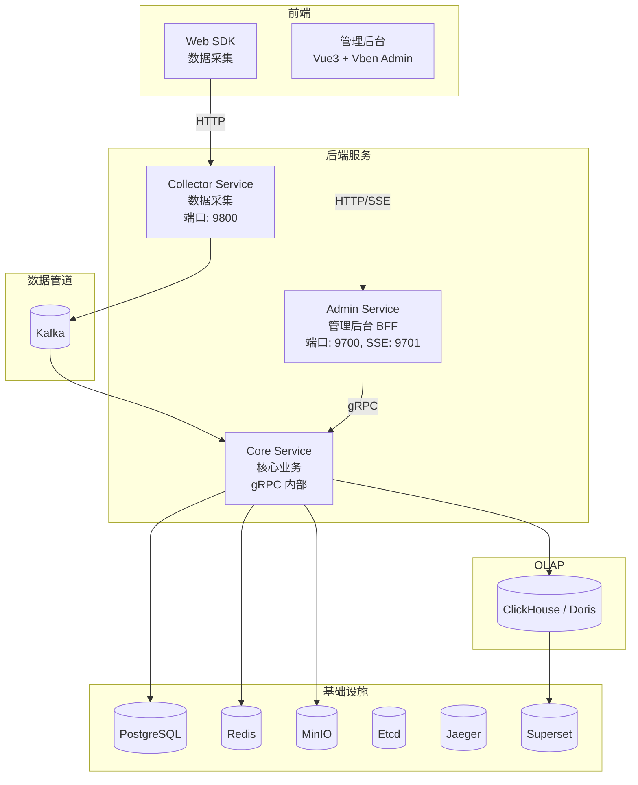

# GoWind UBA 产品介绍

GoWind UBA（User Behavior Analytics）是一个用户行为分析工具，基于 Go 后端和 Vue3
前端构建。提供数据采集、事件分析、用户画像、漏斗分析、对比分析等功能，帮助产品经理和数据分析师理解用户行为，驱动数据化决策。

## 一、核心特性

### 1. 数据采集

- **埋点采集**：灵活的埋点方案，支持自定义事件
- **自动采集**：自动追踪页面浏览、点击等标准事件
- **SDK 集成**：提供多种编程语言的采集 SDK
- **数据验证**：自动验证和清洗采集数据
- **实时处理**：实时数据处理和入库
- **跨域追踪**：支持 Web、App、小程序等多端追踪

### 2. 事件分析

- **事件热力图**：可视化用户交互热点
- **事件漏斗**：分析用户流失环节
- **事件路径**：追踪用户行为路径
- **事件对比**：对比不同时间段、用户群体的事件差异
- **事件趋势**：展示事件发生趋势
- **自定义事件**：灵活定义业务特定事件

### 3. 用户画像

- **用户分群**：基于行为、属性自动分群
- **用户标签**：灵活的用户标签系统
- **用户旅程**：完整的用户生命周期追踪
- **用户留存**：追踪用户留存和流失
- **用户价值**：评估用户生命周期价值（LTV）
- **用户属性**：支持自定义用户属性

### 4. 漏斗分析

```
第一步（用户进入）
    ↓
第二步（用户操作）  ← 流失分析
    ↓
第三步（用户转化）  ← 流失分析
    ↓
目标（最终转化）   ← 转化率
```

- **转化漏斗**：分析销售/注册等关键转化
- **流失分析**：识别用户流失环节
- **转化率优化**：对标行业均值，优化转化漏斗
- **多步骤漏斗**：支持长流程漏斗分析

### 5. 对比分析

- **时间对比**：对比不同时间段的数据差异
- **人群对比**：对比不同用户群体的行为差异
- **版本对比**：对比不同 App 版本的差异
- **渠道对比**：对比不同流量渠道的差异
- **差异显著性检验**：统计学显著性检验

### 6. 报表和仪表板

- **自定义报表**：拖拽式报表构建
- **数据仪表板**：实时数据展示
- **定时报表**：自动生成和分发报表
- **数据导出**：支持多格式导出（CSV、Excel、PDF）
- **数据共享**：报表权限控制和分享
- **告警设置**：关键指标异常告警

### 7. 用户转化追踪

- **购买转化**：电商购买流程追踪
- **注册转化**：新用户注册转化分析
- **订阅转化**：付费订阅转化分析
- **社交转化**：社交分享和邀请转化分析
- **内容消费**：内容阅读和消费转化分析

### 8. 实验和 A/B 测试

- **A/B 测试**：支持运行多个并发 A/B 测试
- **流量分配**：灵活的流量分配和用户分组
- **统计显著性**：自动计算 p-value 和置信度
- **实验结果分析**：完整的实验报告和洞察
- **灰度发布支持**：支持灰度发布和金丝雀部署

## 二、应用场景

### 电商平台

购买转化分析、用户留存分析、商品推荐优化等。

### SaaS 产品

用户注册转化、付费转化、功能采用率、流失预警等。

### 内容平台

内容浏览量、用户粘性、社交分享转化等。

### 游戏产品

新用户留存、等级进度、付费转化、社交互动等。

### 移动应用

应用启动、功能使用、用户留存、版本对比等。

### 金融产品

投资转化、账户活跃度、风险评估等。

## 三、技术架构

### 技术栈

| 层次 | 技术 | 说明 |
|------|------|------|
| 语言 | [Go 1.25+](https://go.dev/) | 高性能编译型语言 |
| 框架 | [go-kratos](https://go-kratos.dev/) v2 | B 站开源微服务框架 |
| 依赖注入 | [Wire](https://github.com/google/wire) | 编译时依赖注入 |
| ORM | [Ent](https://entgo.io/) | Go 实体框架（PostgreSQL） |
| OLAP 引擎 | [ClickHouse](https://clickhouse.com/) / [Apache Doris](https://doris.apache.org/) | 双引擎可切换 |
| 消息队列 | [Kafka](https://kafka.apache.org/) | 事件数据管道 |
| 缓存 | [Redis](https://redis.io/) | 内存数据库 + 任务队列 |
| 对象存储 | [MinIO](https://min.io/) | S3 兼容对象存储 |
| 服务注册 | [Etcd](https://etcd.io/) / Consul | 服务发现 |
| 链路追踪 | [Jaeger](https://www.jaegertracing.io/) | 分布式可观测 |
| API 定义 | [Protobuf](https://protobuf.dev/) + [buf.build](https://buf.build/) | 接口契约优先 |
| 任务调度 | [Asynq](https://github.com/hibiken/asynq) | 基于 Redis 的异步任务 |
| 权限引擎 | [Casbin](https://casbin.org/) / OPA | 策略驱动鉴权 |
| BI 可视化 | [Apache Superset](https://superset.apache.org/) | 开源 BI 平台 |
| 前端 | [Vue 3](https://vuejs.org/) + TypeScript + [Ant Design Vue](https://antdv.com/) + [Vben Admin](https://doc.vben.pro/) | 管理后台前端 |
| 数据可视化 | [ECharts](https://echarts.apache.org/) | 图表库 |

### 系统架构

GoWind UBA 采用 **三服务微服务架构**，基于 go-kratos v2 构建：



### 三服务职责划分

| 服务 | 目录 | 端口 | 职责 |
|------|------|------|------|
| **Collector Service** | `app/collector/service/` | REST: 9800 | 接收 SDK 上报数据，写入 Kafka |
| **Admin Service** | `app/admin/service/` | REST: 9700, SSE: 9701 | 管理后台 BFF，HTTP API + SSE |
| **Core Service** | `app/core/service/` | gRPC（内部） | 核心业务 + 数据层，消费 Kafka |

## 四、核心功能模块

### 1. 数据采集

```javascript
// 初始化 SDK
import {UBAClient} from '@gowind/uba-sdk';

const uba = new UBAClient({
    serverUrl: 'https://uba.example.com',
    appId: 'your_app_id',
    userId: 'current_user_id'
});

// 追踪页面浏览
uba.trackPageView({
    page_name: 'Product List',
    page_url: '/products'
});

// 追踪自定义事件
uba.trackEvent('add_to_cart', {
    product_id: '123',
    product_name: 'Product A',
    price: 99.99
});

// 设置用户属性
uba.setUserProperties({
    email: 'user@example.com',
    vip_level: 'gold',
    signup_date: '2024-01-01'
});
```

### 2. 事件分析

- 事件发生次数和趋势
- 事件用户数
- 人均事件次数
- 事件转化率

### 3. 用户分析

- 活跃用户 (DAU / MAU)
- 新用户和留存用户
- 用户分群和标签
- 用户旅程地图

### 4. 转化漏斗

```
步骤1: 页面浏览 (1000 用户)
    ↓ 90% 转化
步骤2: 添加购物车 (900 用户)
    ↓ 70% 转化
步骤3: 提交订单 (630 用户)
    ↓ 95% 转化
步骤4: 支付成功 (599 用户) ✓

最终转化率: 59.9%
最大流失环节: 步骤2 -> 步骤3 (30%)
```

## 五、快速开始

### 1. 在线演示

敬请期待...

### 2. 环境准备

- Go 1.18+
- Node.js 16+
- ClickHouse（数据存储）
- Kafka（消息队列）
- Redis（缓存）

### 3. 快速启动

```bash
git clone https://github.com/tx7do/go-wind-uba.git
cd go-wind-uba

# 后端启动
cd backend
make init
gow run uba

# 前端启动
cd ../frontend
pnpm install
pnpm dev:antd
```

### 4. 访问地址

- 分析面板：http://localhost:5555
- API 文档：http://localhost:7801/docs/

## 六、API 概览

### 事件追踪 API

```bash
# 上报事件
POST /api/v1/track/event
{
  "app_id": "your_app_id",
  "event_name": "add_to_cart",
  "user_id": "user123",
  "properties": {
    "product_id": "123",
    "product_name": "Product A",
    "price": 99.99
  },
  "timestamp": 1234567890
}

# 设置用户属性
POST /api/v1/track/user
{
  "app_id": "your_app_id",
  "user_id": "user123",
  "properties": {
    "email": "user@example.com",
    "vip_level": "gold"
  }
}
```

### 数据查询 API

```bash
# 获取事件数据
GET /api/v1/analytics/events
?app_id=your_app_id
&event_name=add_to_cart
&date_from=2024-01-01
&date_to=2024-01-31

# 获取用户数据
GET /api/v1/analytics/users
?app_id=your_app_id
&metric=dau
&date_from=2024-01-01
&date_to=2024-01-31

# 漏斗分析
GET /api/v1/analytics/funnel
?app_id=your_app_id
&funnel_id=checkout_funnel
&date_from=2024-01-01
&date_to=2024-01-31
```

## 七、集成 SDK

### JavaScript SDK

```javascript
import {UBAClient} from '@gowind/uba-sdk';

const uba = new UBAClient({
    serverUrl: 'https://uba.example.com',
    appId: 'your_app_id'
});

// 自动追踪页面浏览
uba.enableAutoPageView();

// 自动追踪用户点击
uba.enableAutoClickTracking();

// 追踪转化事件
uba.trackEvent('purchase', {
    order_id: 'ORDER123',
    amount: 99.99,
    currency: 'USD'
});
```

### iOS SDK

```swift
import GoWindUBA

let uba = UBAClient(serverUrl: "https://uba.example.com", appId: "your_app_id")

// 追踪事件
uba.trackEvent("app_launch", properties: [
  "version": "1.0.0",
  "device": "iPhone"
])
```

### Android SDK

```kotlin
import com.gowind.uba.UBAClient

val uba = UBAClient("https://uba.example.com", "your_app_id")

uba.trackEvent("app_launch", mapOf(
  "version" to "1.0.0",
  "device" to "Android"
))
```

## 八、部署指南

### Docker 部署

```bash
docker build -t gowind-uba:latest .
docker run -d \
  -p 7801:7801 \
  -e CLICKHOUSE_DSN="your-clickhouse-dsn" \
  -e KAFKA_BROKERS="your-kafka-brokers" \
  -e REDIS_ADDR="your-redis-addr" \
  gowind-uba:latest
```

### Kubernetes 部署

```yaml
apiVersion: apps/v1
kind: Deployment
metadata:
  name: gowind-uba
spec:
  replicas: 3
  selector:
    matchLabels:
      app: gowind-uba
  template:
    metadata:
      labels:
        app: gowind-uba
    spec:
      containers:
        - name: uba
          image: gowind-uba:latest
          ports:
            - containerPort: 7801
          env:
            - name: CLICKHOUSE_DSN
              valueFrom:
                secretKeyRef:
                  name: uba-secrets
                  key: clickhouse-dsn
          resources:
            requests:
              memory: "512Mi"
              cpu: "250m"
            limits:
              memory: "1Gi"
              cpu: "500m"
```

## 九、常见问题

### Q: UBA 能处理多大的数据量？

A: 通过 ClickHouse 和分布式处理，可处理数十亿级别的事件数据。

### Q: 数据延迟是多少？

A: 实时处理延迟通常在秒级以内。

### Q: 如何保护用户隐私？

A: 支持数据匿名化、GDPR 合规等隐私保护功能。

### Q: 是否支持自定义事件？

A: 完全支持，可定义业务特定事件。

### Q: 数据保存多久？

A: 默认保存 90 天，可自定义配置。

### Q: 是否支持实时告警？

A: 是的，支持设置关键指标告警和通知。

## 十、相关文档

### 基础文档

- [UBA 安装指南](./installation.md)
- [UBA 后端架构总览](./backend-architecture.md)
- [UBA Protobuf API 定义](./backend-api.md)
- [UBA 配置与部署指南](./backend-config-deploy.md)
- [UBA 后端模块总览](./backend-modules.md)
- [UBA 后端扩展机制](./backend-extension.md)
- [UBA 前端架构](./frontend-architecture.md)
- [UBA 前端模块总览](./frontend-modules.md)
- [GoWind Admin 文档](/admin/intro.md) — 共享技术基座的详细说明

### 循序渐进教程

| 阶段 | 教程 | 说明 |
|------|------|------|
| 入门 | [Web SDK 集成实战](./tutorial-sdk-integration.md) | 数据采集 SDK 集成与事件埋点 |
| 入门 | [数据采集管道实战](./tutorial-data-pipeline.md) | SDK → Collector → Kafka → Core → OLAP |
| 入门 | [API 客户端代码生成](./tutorial-codegen.md) | Buf 工具链生成 TS/OpenAPI |
| 核心 | [事件分析实战](./tutorial-event-analysis.md) | BehaviorEvent 模型与查询统计 |
| 核心 | [漏斗与转化分析](./tutorial-funnel-analysis.md) | 多步骤转化漏斗分析 |
| 核心 | [会话分析实战](./tutorial-session-analysis.md) | 会话切分与行为序列 |
| 核心 | [用户路径分析实战](./tutorial-path-analysis.md) | 行为路径与桑基图 |
| 核心 | [用户行为画像实战](./tutorial-user-profile.md) | 用户维度数据与画像构建 |
| 核心 | [留存分析实战](./tutorial-retention-analysis.md) | N 日留存矩阵与趋势 |
| 进阶 | [用户分群与标签系统](./tutorial-user-segmentation.md) | 标签定义、规则计算与分群 |
| 进阶 | [风控检测引擎实战](./tutorial-risk-detection.md) | 规则引擎、实时检测与自动响应 |
| 进阶 | [双 OLAP 引擎实战](./tutorial-olap-engine.md) | ClickHouse/Doris 切换 |
| 进阶 | [跨平台 ID 映射实战](./tutorial-id-mapping.md) | 多端用户身份关联 |
| 进阶 | [Webhook 告警实战](./tutorial-webhook-alert.md) | 事件推送与外部系统集成 |
| 进阶 | [Superset BI 集成](./tutorial-superset-integration.md) | 开源 BI 仪表板 |
| 高阶 | [任务调度实战](./tutorial-task-scheduling.md) | Asynq 异步任务（留存/标签/清理） |
| 高阶 | [实时 SSE 推送实战](./tutorial-sse-push.md) | 风险告警/站内信实时推送 |
| 高阶 | [权限系统实战](./tutorial-permission-system.md) | RBAC + Casbin 三级权限 |
| 高阶 | [登录安全实战](./tutorial-login-security.md) | JWT 双 Token + 登录策略 |
| 综合 | [全栈集成实战](./tutorial-fullstack-integration.md) | 电商购买转化分析完整案例 |
| 综合 | [三服务部署实战](./tutorial-deploy.md) | Docker + Nginx 部署 |

## 十一、获取帮助

- 📖 [快速开始指南](./installation.md)
- 📧 邮件：<yanglinbo@gmail.com>
- 💬 讨论：[GitHub Discussions](https://github.com/tx7do/go-wind-uba/discussions)
- 🐛 反馈：[GitHub Issues](https://github.com/tx7do/go-wind-uba/issues)

---

更详细的安装和使用说明，请参考 [UBA 安装指南](/uba/installation.md)。
