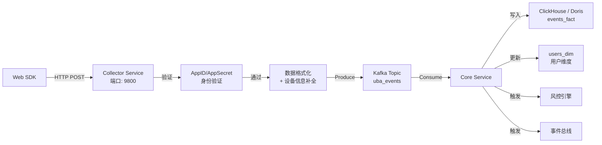

# 数据采集管道实战教程

GoWind UBA 的数据采集管道从 SDK 到 OLAP 引擎，经过 Collector → Kafka → Core 的完整链路。本教程讲解管道各环节的实现和调优。

## 前置条件

- 已阅读 [UBA 后端架构总览](./backend-architecture.md)
- 建议先阅读 [Web SDK 集成实战](./tutorial-sdk-integration.md)

## 一、管道全景



## 二、SDK → Collector

### 2.1 SDK 发送

```javascript
// SDK 通过 XMLHttpRequest 发送数据
uba.track('purchase', { order_id: 'O001', amount: 99.99 });

// 底层发送：
// POST http://localhost:9800/uba/v1/report
// Body:
{
  "app_id": "your_app_id",
  "app_secret": "your_app_secret",
  "events": [{
    "event_type": "BEHAVIOR",
    "behavior": {
      "event_name": "purchase",
      "event_time": 1719000000000,
      "distinct_id": "uuid-xxx",
      "properties": {
        "order_id": "O001",
        "amount": 99.99
      },
      "os": "Windows",
      "browser": "Chrome",
      "screen_width": 1920,
      "screen_height": 1080
    }
  }],
  "client": {
    "user_agent": "Mozilla/5.0...",
    "referer": "https://yoursite.com"
  }
}
```

### 2.2 批量上报

SDK 支持批量上报，减少 HTTP 请求次数：

```javascript
// 批量追踪（SDK 内部自动积累后发送）
uba.track('view_product', { id: 'P001' });
uba.track('view_product', { id: 'P002' });
uba.track('view_product', { id: 'P003' });
// SDK 批量发送 3 个事件
```

## 三、Collector 数据处理

### 3.1 接收和验证

```go
// app/collector/service/internal/service/report_service.go
func (s *ReportService) PostReport(ctx context.Context, req *collectorV1.PostReportRequest) (*collectorV1.PostReportResponse, error) {
    // 1. 验证应用身份
    app, err := s.coreClient.GetApplication(ctx, &ubaV1.GetApplicationRequest{
        AppId:     req.AppId,
        AppSecret: req.AppSecret,
    })
    if err != nil {
        return nil, errors.NotFound("APP_NOT_FOUND", "应用不存在或密钥错误")
    }

    // 2. 补全服务端信息
    for _, event := range req.Events {
        s.enrichEvent(ctx, event, req.Client, app)
    }

    // 3. 写入 Kafka
    if err := s.kafkaProducer.Write(ctx, req.Events); err != nil {
        return nil, errors.InternalServer("KAFKA_ERROR", "写入消息队列失败")
    }

    // 4. 返回结果（含实时风控决策）
    return &collectorV1.PostReportResponse{
        Success:      true,
        SuccessCount: uint32(len(req.Events)),
    }, nil
}
```

### 3.2 服务端信息补全

```go
func (s *ReportService) enrichEvent(ctx context.Context, event *collectorV1.ReportEvent, client *collectorV1.ClientInfo, app *ubaV1.Application) {
    if behavior := event.GetBehavior(); behavior != nil {
        // 补全服务端时间
        behavior.ServerTime = timestamppb.Now()

        // 补全 IP 地理位置
        if ip := transport.RemoteIP(ctx); ip != "" {
            behavior.Ip = ip
            geo := s.geoResolver.Resolve(ip)
            behavior.Country = geo.Country
            behavior.City = geo.City
        }

        // 补全租户 ID
        behavior.TenantId = app.TenantId

        // 补全会话信息
        if behavior.SessionId == "" {
            behavior.SessionId = s.generateSessionId(behavior)
        }
    }
}
```

## 四、Kafka 消息管道

### 4.1 Topic 设计

| Topic | 说明 | 分区策略 |
|-------|------|---------|
| `uba_events` | 行为事件主 Topic | 按 app_id + distinct_id 分区 |
| `uba_risk_events` | 风险事件 Topic | 按 app_id 分区 |

### 4.2 消息格式

```json
{
  "topic": "uba_events",
  "key": "app_001:uuid-xxx",
  "value": {
    "event_type": "BEHAVIOR",
    "behavior": {
      "event_name": "purchase",
      "distinct_id": "uuid-xxx",
      "account_id": "user@example.com",
      "event_time": "2024-06-22T10:00:00Z",
      "server_time": "2024-06-22T10:00:00.123Z",
      "tenant_id": 1,
      "app_id": "app_001",
      "properties": { "order_id": "O001", "amount": 99.99 },
      "os": "Windows",
      "browser": "Chrome"
    }
  }
}
```

## 五、Core Service 消费

### 5.1 Kafka 消费者

```go
// app/core/service/internal/data/kafka_consumer.go
func (d *Data) StartEventConsumer(ctx context.Context) error {
    consumer, err := kafka.NewConsumer(&kafka.ConfigMap{
        "bootstrap.servers":  d.conf.Kafka.Brokers,
        "group.id":           "core-service",
        "auto.offset.reset":  "earliest",
    })

    consumer.SubscribeTopics([]string{"uba_events"}, nil)

    go func() {
        for {
            msg, err := consumer.ReadMessage(ctx)
            if err != nil {
                log.Error(err)
                continue
            }
            d.processEvent(ctx, msg.Value)
        }
    }()

    return nil
}
```

### 5.2 事件处理流程

```go
func (d *Data) processEvent(ctx context.Context, raw []byte) {
    var event ubaV1.BehaviorEvent
    if err := json.Unmarshal(raw, &event); err != nil {
        log.Error(err)
        return
    }

    // 1. 写入 OLAP 事实表
    if err := d.eventsFactRepo.Create(ctx, &event); err != nil {
        log.Error(err)
    }

    // 2. 更新用户维度表
    d.userDimRepo.Upsert(ctx, &ubaV1.UserBehaviorProfile{
        DistinctId:    event.DistinctId,
        LastActiveAt:  event.ServerTime,
        TotalEvents:   1,  // 原子递增
    })

    // 3. 触发风控检测
    d.riskEngine.Evaluate(ctx, &event)

    // 4. 发布事件总线
    d.eventBus.Publish(ctx, "behavior_event.received", &event)

    // 5. 更新会话
    d.sessionRepo.UpdateSession(ctx, &event)
}
```

## 六、OLAP 写入优化

### 6.1 ClickHouse 批量写入

```go
// ClickHouse 使用批量 INSERT 提升写入性能
func (r *EventsFactRepo) BatchCreate(ctx context.Context, events []*ubaV1.BehaviorEvent) error {
    batch, err := r.conn.PrepareBatch(ctx, `
        INSERT INTO events_fact (
            event_id, event_name, distinct_id, account_id,
            event_time, server_time, tenant_id, app_id,
            os, browser, properties
        ) VALUES (?, ?, ?, ?, ?, ?, ?, ?, ?, ?, ?)
    `)

    for _, e := range events {
        batch.Append(
            e.EventId, e.EventName, e.DistinctId, e.AccountId,
            e.EventTime.AsTime(), e.ServerTime.AsTime(),
            e.TenantId, e.AppId,
            e.Os, e.Browser,
            e.Properties,
        )
    }

    return batch.Send()
}
```

### 6.2 Doris Stream Load

```go
// Doris 使用 Stream Load API 进行批量写入
func (r *EventsFactRepo) BatchCreate(ctx context.Context, events []*ubaV1.BehaviorEvent) error {
    // 构造 JSON 数组
    var rows []map[string]interface{}
    for _, e := range events {
        rows = append(rows, map[string]interface{}{
            "event_id":    e.EventId,
            "event_name":  e.EventName,
            "distinct_id": e.DistinctId,
            "account_id":  e.AccountId,
            "event_time":  e.EventTime.AsTime(),
            "server_time": e.ServerTime.AsTime(),
            "tenant_id":   e.TenantId,
            "app_id":      e.AppId,
            "properties":  e.Properties,
        })
    }

    body, _ := json.Marshal(rows)

    // Stream Load HTTP 请求
    resp, err := http.Post(
        fmt.Sprintf("%s/api/%s/events_fact/_load", r.streamLoadURL, r.database),
        "application/json",
        bytes.NewReader(body),
    )
    return err
}
```

## 七、数据验证

### 7.1 SDK 调试模式

```javascript
// 使用 debugMode = 2 验证数据格式
const uba = new EventReport({
  serverUrl: 'http://localhost:9800',
  appId: 'test_app',
  debugMode: 2,  // 仅打印日志
});

uba.track('test_event', { foo: 'bar' });
// 控制台输出: [UBA DEBUG] { event_name: "test_event", properties: { foo: "bar" }, ... }
```

### 7.2 Kafka 数据验证

```bash
# 消费 Kafka Topic 查看数据
kafka-console-consumer.sh \
  --bootstrap-server localhost:9092 \
  --topic uba_events \
  --from-beginning | jq .
```

### 7.3 OLAP 数据验证

```sql
-- ClickHouse
SELECT event_name, count(), min(server_time), max(server_time)
FROM events_fact
WHERE server_time >= today() - 1
GROUP BY event_name
ORDER BY count() DESC;

-- Doris
SELECT event_name, count(*), min(server_time), max(server_time)
FROM events_fact
WHERE server_time >= DATE_SUB(CURDATE(), INTERVAL 1 DAY)
GROUP BY event_name
ORDER BY count(*) DESC;
```

## 八、性能优化

| 优化点 | 说明 |
|--------|------|
| SDK 批量上报 | 减少 HTTP 请求频率 |
| Kafka 分区 | 按 app_id + distinct_id 分区，保证顺序 |
| Core 批量消费 | 批量读取 Kafka 消息后批量写入 OLAP |
| ClickHouse 批量 INSERT | 使用 PrepareBatch 减少网络往返 |
| Doris Stream Load | 使用 HTTP 流式写入，减少连接开销 |
| Redis 缓存 | 应用信息缓存，减少 gRPC 调用 |

## 九、检查清单

| 检查项 | 说明 |
|--------|------|
| SDK 初始化 | 正确配置 serverUrl + appId |
| Collector 验证 | AppID/AppSecret 验证通过 |
| Kafka 连通 | Collector 可写入 Kafka |
| Core 消费 | Core Service 成功消费 Kafka |
| OLAP 写入 | 事件数据成功写入 ClickHouse/Doris |
| 用户维度更新 | users_dim 表正确更新 |
| 设备信息补全 | OS/Browser/IP/Geo 正确填充 |
| 调试模式 | 开发环境使用调试模式验证 |

## 相关文档

- [Web SDK 集成实战](./tutorial-sdk-integration.md)
- [UBA 后端架构总览](./backend-architecture.md)
- [双 OLAP 引擎实战](./tutorial-olap-engine.md)
- [事件分析实战](./tutorial-event-analysis.md)
