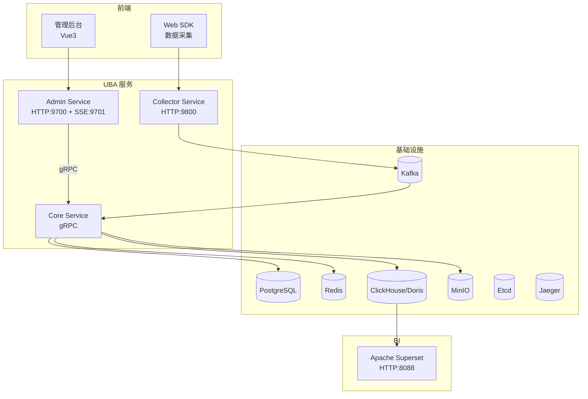

# 三服务部署实战教程

本教程介绍 GoWind UBA 三个服务（Core Service、Admin Service、Collector Service）的完整部署流程。

## 前置条件

- 已阅读 [UBA 配置与部署指南](./backend-config-deploy.md)

## 一、部署架构



## 二、Docker Compose 部署

### 2.1 完整 docker-compose.yml

```yaml
version: '3.8'

networks:
  uba-net:
    driver: bridge

services:
  # === 基础设施 ===
  postgres:
    image: postgres:16
    container_name: uba-postgres
    networks: [uba-net]
    ports: ["5432:5432"]
    environment:
      POSTGRES_DB: gw_uba
      POSTGRES_USER: postgres
      POSTGRES_PASSWORD: postgres123
    volumes:
      - pg_data:/var/lib/postgresql/data

  redis:
    image: redis:7
    container_name: uba-redis
    networks: [uba-net]
    ports: ["6379:6379"]
    command: redis-server --requirepass redis123

  kafka:
    image: bitnami/kafka:3.7
    container_name: uba-kafka
    networks: [uba-net]
    ports: ["9092:9092"]
    environment:
      KAFKA_CFG_NODE_ID: 0
      KAFKA_CFG_PROCESS_ROLES: controller,broker
      KAFKA_CFG_LISTENERS: PLAINTEXT://:9092,CONTROLLER://:9093
      KAFKA_CFG_ADVERTISED_LISTENERS: PLAINTEXT://kafka:9092
      KAFKA_CFG_CONTROLLER_LISTENER_NAMES: CONTROLLER
      KAFKA_CFG_CONTROLLER_QUORUM_VOTERS: 0@kafka:9093

  clickhouse:
    image: clickhouse/clickhouse-server:latest
    container_name: uba-clickhouse
    networks: [uba-net]
    ports: ["8123:8123", "9000:9000"]
    volumes:
      - ch_data:/var/lib/clickhouse

  minio:
    image: minio/minio:latest
    container_name: uba-minio
    networks: [uba-net]
    ports: ["9001:9000", "9002:9001"]
    command: server /data --console-address ":9001"
    environment:
      MINIO_ROOT_USER: minioadmin
      MINIO_ROOT_PASSWORD: minioadmin123
    volumes:
      - minio_data:/data

  etcd:
    image: bitnami/etcd:latest
    container_name: uba-etcd
    networks: [uba-net]
    ports: ["2379:2379"]
    environment:
      ALLOW_NONE_AUTHENTICATION: "yes"

  jaeger:
    image: jaegertracing/all-in-one:latest
    container_name: uba-jaeger
    networks: [uba-net]
    ports: ["16686:16686", "4317:4317"]

  # === UBA 服务 ===
  core-service:
    build:
      context: ./backend
      dockerfile: Dockerfile.core
    container_name: uba-core
    networks: [uba-net]
    depends_on: [postgres, redis, kafka, clickhouse]
    environment:
      DB_SOURCE: "host=postgres port=5432 user=postgres password=postgres123 dbname=gw_uba sslmode=disable"
      REDIS_ADDR: "redis:6379"
      REDIS_PASSWORD: "redis123"
      KAFKA_BROKERS: "kafka:9092"
      CLICKHOUSE_ADDR: "clickhouse:9000"
      ETCD_ENDPOINTS: "etcd:2379"
      JAEGER_ENDPOINT: "jaeger:4317"

  admin-service:
    build:
      context: ./backend
      dockerfile: Dockerfile.admin
    container_name: uba-admin
    networks: [uba-net]
    ports: ["9700:9700", "9701:9701"]
    depends_on: [core-service]
    environment:
      CORE_GRPC_ADDR: "discovery:///gowind-uba-core"

  collector-service:
    build:
      context: ./backend
      dockerfile: Dockerfile.collector
    container_name: uba-collector
    networks: [uba-net]
    ports: ["9800:9800"]
    depends_on: [core-service, kafka]
    environment:
      CORE_GRPC_ADDR: "discovery:///gowind-uba-core"
      KAFKA_BROKERS: "kafka:9092"

  # === BI ===
  superset:
    image: apache/superset:latest
    container_name: uba-superset
    networks: [uba-net]
    ports: ["8088:8088"]
    environment:
      SUPERSET_SECRET_KEY: "uba-superset-secret"
    user: root

volumes:
  pg_data:
  ch_data:
  minio_data:
```

### 2.2 启动

```bash
# 启动全部服务
docker compose up -d

# 查看状态
docker compose ps

# 查看日志
docker compose logs -f core-service
```

## 三、数据初始化

### 3.1 OLAP 初始化

```bash
# ClickHouse
docker exec -i uba-clickhouse clickhouse-client --multiquery < backend/sql/clickhouse/01_create_database.sql
docker exec -i uba-clickhouse clickhouse-client --multiquery < backend/sql/clickhouse/02_create_events_fact.sql
docker exec -i uba-clickhouse clickhouse-client --multiquery < backend/sql/clickhouse/03_create_sessions_fact.sql
docker exec -i uba-clickhouse clickhouse-client --multiquery < backend/sql/clickhouse/04_create_users_dim.sql
docker exec -i uba-clickhouse clickhouse-client --multiquery < backend/sql/clickhouse/05_create_objects_dim.sql
docker exec -i uba-clickhouse clickhouse-client --multiquery < backend/sql/clickhouse/06_create_id_mapping.sql
docker exec -i uba-clickhouse clickhouse-client --multiquery < backend/sql/clickhouse/07_create_kafka_tables.sql
docker exec -i uba-clickhouse clickhouse-client --multiquery < backend/sql/clickhouse/08_create_mv.sql
docker exec -i uba-clickhouse clickhouse-client --multiquery < backend/sql/clickhouse/09_create_risk_events.sql
```

### 3.2 Kafka Topic 创建

```bash
docker exec uba-kafka kafka-topics.sh \
  --create --topic uba_events \
  --bootstrap-server localhost:9092 \
  --partitions 6 --replication-factor 1

docker exec uba-kafka kafka-topics.sh \
  --create --topic uba_risk_events \
  --bootstrap-server localhost:9092 \
  --partitions 3 --replication-factor 1
```

### 3.3 Superset 初始化

```bash
docker exec -it uba-superset superset db upgrade
docker exec -it uba-superset superset fab create-admin \
  --username admin --password admin \
  --firstname Admin --lastname Admin \
  --email admin@superset.com
docker exec -it uba-superset superset init
```

## 四、本地开发部署

### 4.1 启动依赖

```bash
cd backend

# 仅启动基础设施
docker compose -f scripts/docker/libs_only.yml up -d
```

### 4.2 启动服务

```bash
# Core Service（gRPC）
gow run core

# Admin Service（HTTP + SSE）
gow run admin

# Collector Service（HTTP）
gow run collector
```

## 五、验证

### 5.1 健康检查

```bash
# Collector 健康检查
curl http://localhost:9800/uba/v1/health

# Admin Swagger
open http://localhost:9700/docs/

# Collector Swagger
open http://localhost:9800/docs/
```

### 5.2 数据验证

```javascript
// 使用 SDK 测试上报
const uba = new EventReport({
  serverUrl: 'http://localhost:9800',
  appId: 'test_app',
  debugMode: 1,
});

uba.track('test_event', { foo: 'bar' });
```

```sql
-- 验证数据入库
SELECT count() FROM events_fact WHERE event_name = 'test_event';
```

## 六、Nginx 反向代理

```nginx
upstream uba_admin {
    server 127.0.0.1:9700;
}

upstream uba_collector {
    server 127.0.0.1:9800;
}

upstream uba_sse {
    server 127.0.0.1:9701;
}

server {
    listen 443 ssl;
    server_name admin.uba.your-domain.com;

    ssl_certificate /path/to/cert.pem;
    ssl_certificate_key /path/to/key.pem;

    location / {
        proxy_pass http://uba_admin;
        proxy_set_header Host $host;
        proxy_set_header X-Real-IP $remote_addr;
    }

    location /events {
        proxy_pass http://uba_sse;
        proxy_set_header Connection '';
        proxy_http_version 1.1;
        proxy_buffering off;
        proxy_cache off;
        chunked_transfer_encoding on;
    }
}

server {
    listen 443 ssl;
    server_name collector.uba.your-domain.com;

    ssl_certificate /path/to/cert.pem;
    ssl_certificate_key /path/to/key.pem;

    location / {
        proxy_pass http://uba_collector;
        proxy_set_header Host $host;
        proxy_set_header X-Real-IP $remote_addr;
    }
}
```

## 七、检查清单

| 检查项 | 说明 |
|--------|------|
| 基础设施 | PG/Redis/Kafka/CH/MinIO/Etcd/Jaeger |
| Core Service | gRPC 服务正常 |
| Admin Service | HTTP + SSE 正常 |
| Collector Service | 数据接收正常 |
| OLAP 初始化 | 表和物化视图创建 |
| Kafka Topic | uba_events 创建 |
| Superset | 初始化并可连接 OLAP |
| Nginx | 反向代理配置（含 SSE） |
| SSL | HTTPS 证书配置 |
| 日志 | 服务日志可查看 |

## 相关文档

- [UBA 配置与部署指南](./backend-config-deploy.md)
- [Superset BI 集成](./tutorial-superset-integration.md)
- [数据采集管道实战](./tutorial-data-pipeline.md)
- [双 OLAP 引擎实战](./tutorial-olap-engine.md)
