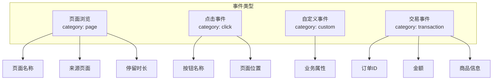

# 事件分析实战教程

事件分析是 GoWind UBA 的核心分析能力，基于 BehaviorEvent 模型对用户行为事件进行多维度查询和统计。本教程讲解事件数据模型、查询 API 和前端可视化实现。

## 前置条件

- 已阅读 [UBA 后端架构总览](./backend-architecture.md)
- 建议先阅读 [Web SDK 集成实战](./tutorial-sdk-integration.md)

## 一、BehaviorEvent 数据模型

### 1.1 模型结构

```protobuf
// uba/service/v1/behavior_event.proto
message BehaviorEvent {
  optional uint32 id = 1;

  // --- Who（谁）---
  optional string user_id = 10 [json_name = "user_id"];
  optional string device_id = 11 [json_name = "device_id"];
  optional string account_id = 12 [json_name = "account_id"];
  optional string global_user_id = 13 [json_name = "global_user_id"];

  // --- What（做了什么）---
  optional string event_category = 20 [json_name = "event_category"];
  optional string event_name = 21 [json_name = "event_name"];
  optional string event_action = 22 [json_name = "event_action"];

  // --- Object（操作对象）---
  optional string object_type = 30 [json_name = "object_type"];
  optional string object_id = 31 [json_name = "object_id"];
  optional string object_name = 32 [json_name = "object_name"];

  // --- Context（上下文）---
  optional string session_id = 40 [json_name = "session_id"];
  optional uint32 session_seq = 41 [json_name = "session_seq"];
  optional string platform = 42;
  optional string os = 43;
  optional string channel = 44;

  // --- Environment（环境）---
  optional string ip = 50;
  optional string country = 51;
  optional string city = 52;
  optional string network = 53;

  // --- Metrics（指标）---
  optional double duration_ms = 60 [json_name = "duration_ms"];
  optional double amount = 61 [json_name = "amount"];
  optional uint32 quantity = 62;
  optional double score = 63;
  map<string, string> metrics = 64;

  // --- Properties（自定义属性）---
  map<string, string> properties = 70;

  // --- Enterprise（企业级）---
  optional string op_result = 80 [json_name = "op_result"];
  optional string error_code = 81 [json_name = "error_code"];
  optional string risk_level = 82 [json_name = "risk_level"];
  optional string trace_id = 83 [json_name = "trace_id"];

  // --- Time ---
  optional google.protobuf.Timestamp event_time = 90 [json_name = "event_time"];
  optional google.protobuf.Timestamp server_time = 91 [json_name = "server_time"];

  // --- Tenant ---
  optional uint32 tenant_id = 100 [json_name = "tenant_id"];
  optional string app_id = 101 [json_name = "app_id"];
}
```

### 1.2 事件分类



## 二、Admin API 查询

### 2.1 事件列表查询

```http
GET /admin/v1/behavior-events?
  appId=app_001&
  eventName=purchase&
  dateFrom=2024-06-01&
  dateTo=2024-06-30&
  page=1&
  pageSize=20
```

### 2.2 事件统计

```http
GET /admin/v1/behavior-events/stats?
  appId=app_001&
  eventName=purchase&
  groupBy=event_name&
  dateFrom=2024-06-01&
  dateTo=2024-06-30&
  granularity=day
```

### 2.3 响应格式

```json
{
  "items": [
    {
      "date": "2024-06-15",
      "eventName": "purchase",
      "eventCount": 1234,
      "uniqueUsers": 456,
      "avgPerUser": 2.71,
      "totalAmount": 98765.43
    }
  ],
  "total": 30
}
```

## 三、OLAP 查询实现

### 3.1 ClickHouse 查询

```go
// internal/data/clickhouse/events_fact_repo.go
func (r *EventsFactRepo) GetEventTrend(ctx context.Context, req *ubaV1.GetEventTrendRequest) ([]*ubaV1.EventTrendItem, error) {
    query := `
        SELECT
            toDate(server_time) AS date,
            event_name,
            count() AS event_count,
            uniqExact(distinct_id) AS unique_users,
            count() / uniqExact(distinct_id) AS avg_per_user,
            sum(toFloat64OrDefault(properties['amount'], 0)) AS total_amount
        FROM events_fact
        WHERE app_id = ?
          AND server_time BETWEEN ? AND ?
          AND event_name IN (?)
        GROUP BY date, event_name
        ORDER BY date ASC
    `

    rows, err := r.conn.Query(ctx, query,
        req.AppId,
        req.DateFrom.AsTime(),
        req.DateTo.AsTime(),
        req.EventNames,
    )
    // ...
    return results, nil
}
```

### 3.2 Doris 查询

```go
// internal/data/doris/events_fact_repo.go
func (r *EventsFactRepo) GetEventTrend(ctx context.Context, req *ubaV1.GetEventTrendRequest) ([]*ubaV1.EventTrendItem, error) {
    query := `
        SELECT
            DATE(server_time) AS date,
            event_name,
            COUNT(*) AS event_count,
            COUNT(DISTINCT distinct_id) AS unique_users,
            COUNT(*) / COUNT(DISTINCT distinct_id) AS avg_per_user,
            SUM(CAST(properties->>'$.amount' AS DOUBLE)) AS total_amount
        FROM events_fact
        WHERE app_id = ?
          AND server_time BETWEEN ? AND ?
          AND event_name IN (?)
        GROUP BY DATE(server_time), event_name
        ORDER BY date ASC
    `

    rows, err := r.dorisDB.QueryContext(ctx, query,
        req.AppId,
        req.DateFrom.AsTime(),
        req.DateTo.AsTime(),
        req.EventNames,
    )
    // ...
    return results, nil
}
```

## 四、前端可视化

### 4.1 事件趋势图

```vue
<!-- views/analytics/event/TrendChart.vue -->
<script setup lang="ts">
import VChart from 'vue-echarts';
import { useEventTrend } from '@/api/composables/event';

const props = defineProps<{
  appId: string;
  eventNames: string[];
  dateRange: [string, string];
}>();

const { data, isLoading } = useEventTrend(
  computed(() => ({
    appId: props.appId,
    eventNames: props.eventNames,
    dateFrom: props.dateRange[0],
    dateTo: props.dateRange[1],
    granularity: 'day',
  }))
);

const chartOption = computed(() => ({
  tooltip: { trigger: 'axis' },
  legend: { data: props.eventNames },
  xAxis: {
    type: 'category',
    data: data.value?.dates ?? [],
  },
  yAxis: { type: 'value' },
  series: props.eventNames.map(name => ({
    name,
    type: 'line',
    smooth: true,
    data: data.value?.series[name] ?? [],
  })),
}));
</script>

<template>
  <ACard title="事件趋势" :loading="isLoading">
    <VChart :option="chartOption" autoresize style="height: 400px" />
  </ACard>
</template>
```

### 4.2 事件对比表格

```vue
<template>
  <ATable :data-source="data?.items" :pagination="{ pageSize: 20 }">
    <AColumn title="事件名称" data-index="eventName" />
    <AColumn title="发生次数" data-index="eventCount" sortable />
    <AColumn title="触发用户数" data-index="uniqueUsers" sortable />
    <AColumn title="人均次数" data-index="avgPerUser" :custom-render="renderDecimal" />
    <AColumn title="总金额" data-index="totalAmount" :custom-render="renderCurrency" />
  </ATable>
</template>
```

### 4.3 Vue Query Composable

```typescript
// api/composables/event.ts
export function useEventTrend(query: Ref<EventTrendQuery>) {
  return useQuery({
    queryKey: ['eventTrend', query],
    queryFn: () => apiClient.behaviorEventService.GetTrend(query.value),
    staleTime: 60 * 1000,  // 1 分钟缓存
  });
}

export function useEventList(query: Ref<EventListQuery>) {
  return useQuery({
    queryKey: ['eventList', query],
    queryFn: () => apiClient.behaviorEventService.List(query.value),
    staleTime: 30 * 1000,
  });
}
```

## 五、常见分析场景

### 5.1 DAU 分析

```sql
-- 每日活跃用户
SELECT
    toDate(server_time) AS date,
    uniqExact(distinct_id) AS dau
FROM events_fact
WHERE app_id = 'app_001'
  AND server_time >= today() - 30
GROUP BY date
ORDER BY date ASC;
```

### 5.2 事件漏斗

```sql
-- 简单漏斗：浏览 → 加购 → 下单 → 支付
WITH step1 AS (
    SELECT distinct_id, min(server_time) AS t1
    FROM events_fact WHERE event_name = 'page_view' AND server_time >= today() - 7
    GROUP BY distinct_id
),
step2 AS (
    SELECT distinct_id, min(server_time) AS t2
    FROM events_fact WHERE event_name = 'add_to_cart' AND server_time >= today() - 7
    GROUP BY distinct_id
)
SELECT
    count(DISTINCT step1.distinct_id) AS step1_count,
    count(DISTINCT step2.distinct_id) AS step2_count
FROM step1
LEFT JOIN step2 ON step1.distinct_id = step2.distinct_id AND step2.t2 >= step1.t1;
```

### 5.3 热门事件排行

```sql
SELECT
    event_name,
    count() AS total_count,
    uniqExact(distinct_id) AS unique_users,
    count() / uniqExact(distinct_id) AS avg_per_user
FROM events_fact
WHERE app_id = 'app_001'
  AND server_time >= today() - 7
GROUP BY event_name
ORDER BY total_count DESC
LIMIT 20;
```

## 六、指标体系

| 指标 | 计算方式 | 说明 |
|------|---------|------|
| 事件次数 | `count()` | 事件总发生次数 |
| 触发用户数 | `uniqExact(distinct_id)` | 去重用户数 |
| 人均次数 | `count() / uniqExact(distinct_id)` | 平均每人触发次数 |
| 转化率 | `步骤N用户 / 步骤1用户` | 漏斗转化率 |
| 平均时长 | `avg(duration_ms)` | 事件平均耗时 |
| 总金额 | `sum(amount)` | 交易类事件总金额 |

## 七、检查清单

| 检查项 | 说明 |
|--------|------|
| 事件模型 | BehaviorEvent 字段完整 |
| OLAP 写入 | 事件成功写入 events_fact |
| 查询接口 | Admin API 正确返回统计 |
| 趋势图 | 前端 ECharts 趋势图渲染正常 |
| 指标计算 | 事件次数/用户数/人均次数正确 |
| 性能 | 大数据量下查询性能可接受 |

## 相关文档

- [Web SDK 集成实战](./tutorial-sdk-integration.md)
- [数据采集管道实战](./tutorial-data-pipeline.md)
- [漏斗分析实战](./tutorial-funnel-analysis.md)
- [会话分析实战](./tutorial-session-analysis.md)
