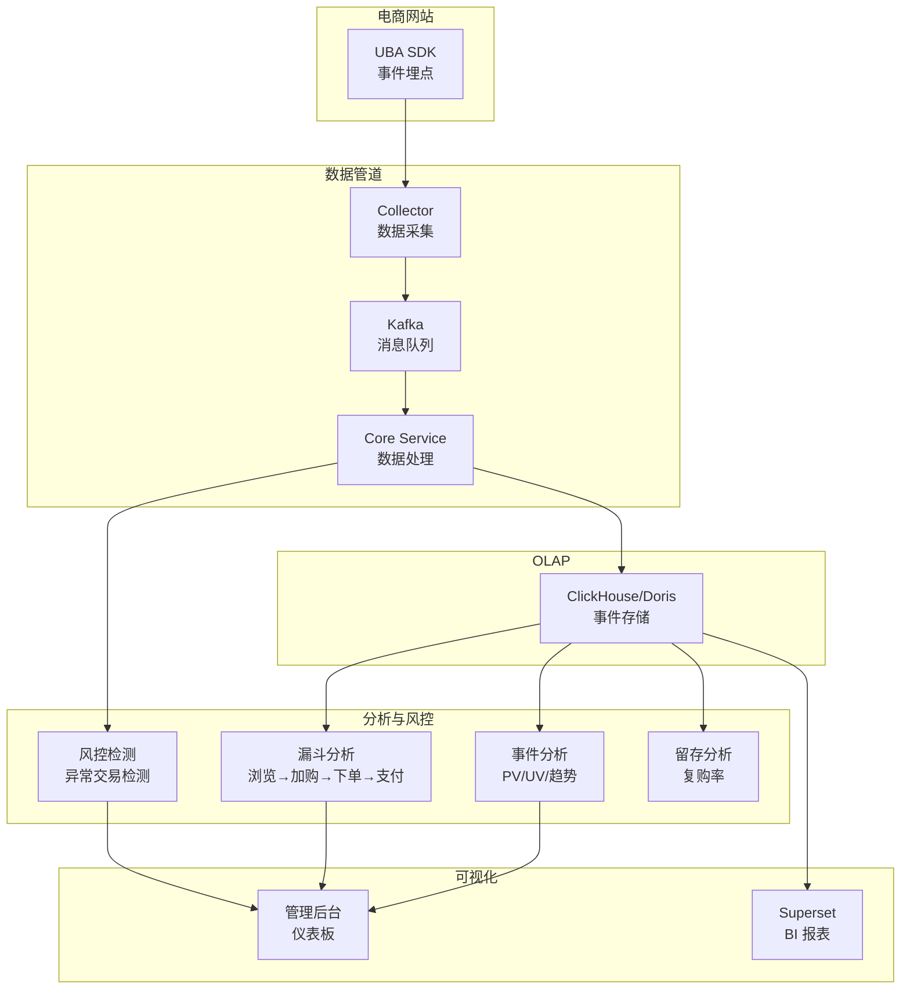

# 全栈集成实战教程

本教程以电商购买转化分析为案例，串联 SDK 集成、数据采集、事件分析、漏斗分析和风控检测的完整流程。

## 前置条件

- 已阅读 [Web SDK 集成实战](./tutorial-sdk-integration.md)
- 建议先阅读 [事件分析实战](./tutorial-event-analysis.md) 和 [漏斗与转化分析](./tutorial-funnel-analysis.md)

## 一、案例概览



## 二、SDK 埋点

### 2.1 初始化

```javascript
// uba-config.js
import { EventReport } from './report_sdk.js';

const uba = new EventReport({
  serverUrl: 'https://uba.your-domain.com',
  appId: 'ecom_app_001',
  debugMode: 0,
});

uba.setSuperProperties({
  platform: 'web',
  site_version: '3.0.0',
  channel: 'official',
});

export default uba;
```

### 2.2 核心事件埋点

```javascript
import uba from './uba-config';
import router from './router';

// 页面浏览
router.afterEach((to) => {
  uba.track('page_view', {
    page_name: to.meta.title,
    page_url: to.fullPath,
    referrer: document.referrer,
  });
});

// 商品浏览
export function trackProductView(product) {
  uba.track('view_product', {
    product_id: product.id,
    product_name: product.name,
    category: product.category,
    price: product.price,
  });
}

// 搜索
export function trackSearch(keyword, resultCount) {
  uba.track('search', {
    keyword,
    result_count: resultCount,
  });
}

// 加入购物车
export function trackAddToCart(product, quantity) {
  uba.track('add_to_cart', {
    product_id: product.id,
    product_name: product.name,
    category: product.category,
    price: product.price,
    quantity,
  });
}

// 提交订单
export function trackSubmitOrder(order) {
  uba.track('submit_order', {
    order_id: order.id,
    order_amount: order.totalAmount,
    item_count: order.items.length,
    payment_method: order.paymentMethod,
  });
}

// 支付成功
export function trackPaymentSuccess(order) {
  uba.track('payment_success', {
    order_id: order.id,
    order_amount: order.totalAmount,
    payment_method: order.paymentMethod,
    payment_channel: order.paymentChannel,
  });

  // 更新用户属性
  uba.userAdd('total_purchase', order.totalAmount).trackUserData();
  uba.userAdd('order_count', 1).trackUserData();
}

// 用户登录
export function trackLogin(user) {
  uba.login(user.id);
  uba.userSet({
    name: user.name,
    email: user.email,
    vip_level: user.vipLevel,
    register_date: user.createdAt,
  }).trackUserData();
}

// 用户注册
export function trackRegister(user) {
  uba.login(user.id);
  uba.userSetOnce({
    register_date: new Date().toISOString(),
    register_source: 'web',
  }).trackUserData();
  uba.track('register', { method: 'email' });
}
```

## 三、分析查询

### 3.1 购买转化漏斗

```sql
-- 浏览 → 搜索 → 加购 → 下单 → 支付
SELECT
    windowFunnel(3600)(  -- 1小时窗口
        server_time,
        event_name = 'view_product',
        event_name = 'add_to_cart',
        event_name = 'submit_order',
        event_name = 'payment_success'
    ) AS step_reached,
    count() AS user_count
FROM events_fact
WHERE app_id = 'ecom_app_001'
  AND server_time >= today() - 7
  AND event_name IN ('view_product', 'add_to_cart', 'submit_order', 'payment_success')
GROUP BY distinct_id;
```

### 3.2 商品热度排行

```sql
SELECT
    properties['product_id'] AS product_id,
    properties['product_name'] AS product_name,
    properties['category'] AS category,
    countIf(event_name = 'view_product') AS views,
    countIf(event_name = 'add_to_cart') AS cart_adds,
    countIf(event_name = 'payment_success') AS purchases,
    countIf(event_name = 'add_to_cart') / countIf(event_name = 'view_product') * 100 AS cart_rate,
    countIf(event_name = 'payment_success') / countIf(event_name = 'add_to_cart') * 100 AS buy_rate
FROM events_fact
WHERE app_id = 'ecom_app_001'
  AND server_time >= today() - 7
  AND event_name IN ('view_product', 'add_to_cart', 'payment_success')
GROUP BY product_id, product_name, category
ORDER BY purchases DESC
LIMIT 20;
```

### 3.3 复购率分析

```sql
-- 7日内复购用户
WITH buyers AS (
    SELECT DISTINCT distinct_id, toDate(server_time) AS buy_date
    FROM events_fact
    WHERE app_id = 'ecom_app_001'
      AND event_name = 'payment_success'
      AND server_time >= today() - 14
)
SELECT
    buy_date,
    count(DISTINCT distinct_id) AS buyers,
    countIf(
        distinct_id IN (
            SELECT DISTINCT distinct_id FROM buyers b2
            WHERE b2.buy_date BETWEEN buy_date AND buy_date + 7
        )
    ) AS repeat_buyers,
    repeat_buyers / buyers * 100 AS repurchase_rate
FROM buyers
GROUP BY buy_date
ORDER BY buy_date;
```

## 四、风控规则

### 4.1 异常交易检测

```json
[
  {
    "name": "新用户大额交易",
    "conditionExpression": "event_name == 'payment_success' && amount > 10000 && user_register_days < 1",
    "actions": ["REQUIRE_MFA", "NOTIFY_ADMIN"],
    "priority": 90,
    "riskScore": 80
  },
  {
    "name": "批量注册检测",
    "conditionExpression": "event_name == 'register' && count_in_window('1h', group_by='ip') > 10",
    "actions": ["BLOCK_DEVICE", "NOTIFY_ADMIN"],
    "priority": 85,
    "riskScore": 90
  },
  {
    "name": "高频下单检测",
    "conditionExpression": "event_name == 'submit_order' && count_in_window('5m') > 20",
    "actions": ["LIMIT_RATE", "NOTIFY_ADMIN"],
    "priority": 75,
    "riskScore": 65
  }
]
```

## 五、Superset 仪表板

### 5.1 电商核心仪表板

| 图表 | 数据源 | 说明 |
|------|--------|------|
| GMV 趋势 | events_fact | 每日交易总额趋势 |
| 转化漏斗 | events_fact | 浏览→加购→下单→支付 |
| 热销商品 TOP 20 | events_fact | 按销售额排序 |
| DAU/MAU | events_fact | 日活/月活用户数 |
| 新用户趋势 | users_dim | 每日新注册用户数 |
| 复购率 | events_fact | 7/14/30 日复购率 |
| 地域分布 | events_fact | 用户地理分布地图 |

## 六、检查清单

| 检查项 | 说明 |
|--------|------|
| SDK 埋点 | 核心事件全部埋点 |
| 超级属性 | 全局属性配置 |
| 用户属性 | 登录后设置用户属性 |
| 漏斗分析 | 转化漏斗配置正确 |
| 风控规则 | 异常交易检测规则 |
| Superset | 电商仪表板创建 |
| 复购分析 | 留存/复购查询 |

## 相关文档

- [Web SDK 集成实战](./tutorial-sdk-integration.md)
- [事件分析实战](./tutorial-event-analysis.md)
- [漏斗与转化分析](./tutorial-funnel-analysis.md)
- [风控检测引擎实战](./tutorial-risk-detection.md)
- [Superset BI 集成](./tutorial-superset-integration.md)
