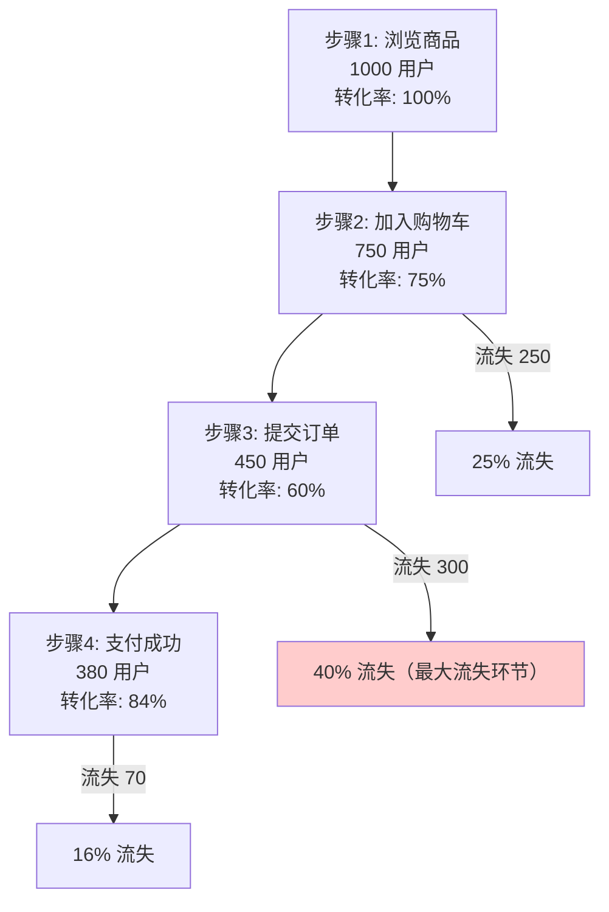

# 漏斗与转化分析实战教程

漏斗分析是用户行为分析的核心功能，用于分析用户在关键转化路径中各步骤的转化率和流失率。本教程讲解漏斗分析的数据模型、实现原理和使用方法。

## 前置条件

- 已阅读 [事件分析实战](./tutorial-event-analysis.md)
- 了解 BehaviorEvent 数据模型

## 一、漏斗分析原理



### 关键指标

| 指标 | 说明 |
|------|------|
| 步骤用户数 | 该步骤的唯一用户数 |
| 步骤转化率 | 当前步骤 / 上一步骤 |
| 总体转化率 | 最终步骤 / 第一步骤 |
| 流失率 | 1 - 步骤转化率 |
| 平均耗时 | 步骤间平均时间间隔 |

## 二、OLAP 漏斗查询

### 2.1 ClickHouse 实现

```sql
-- 窗口函数法：查找每个用户在限定时间窗口内完成所有步骤的记录
WITH funnel_steps AS (
    SELECT
        distinct_id,
        windowFunnel(3600)(  -- 1小时窗口
            server_time,
            event_name = 'view_product',
            event_name = 'add_to_cart',
            event_name = 'submit_order',
            event_name = 'payment_success'
        ) AS step_reached
    FROM events_fact
    WHERE app_id = 'app_001'
      AND server_time BETWEEN '2024-06-01' AND '2024-06-30'
      AND event_name IN ('view_product', 'add_to_cart', 'submit_order', 'payment_success')
    GROUP BY distinct_id
)
SELECT
    step_reached,
    count() AS user_count
FROM funnel_steps
GROUP BY step_reached
ORDER BY step_reached;
```

### 2.2 Doris 实现

```sql
-- Doris 使用多步骤 JOIN 实现
WITH step1 AS (
    SELECT distinct_id, min(server_time) AS t1
    FROM events_fact
    WHERE app_id = 'app_001' AND event_name = 'view_product'
      AND server_time BETWEEN '2024-06-01' AND '2024-06-30'
    GROUP BY distinct_id
),
step2 AS (
    SELECT s1.distinct_id, min(s2.server_time) AS t2
    FROM step1 s1
    JOIN events_fact s2 ON s1.distinct_id = s2.distinct_id
    WHERE s2.event_name = 'add_to_cart'
      AND s2.server_time >= s1.t1
      AND s2.server_time <= DATE_ADD(s1.t1, INTERVAL 1 HOUR)
    GROUP BY s1.distinct_id
),
step3 AS (
    SELECT s2.distinct_id, min(s3.server_time) AS t3
    FROM step2 s2
    JOIN events_fact s3 ON s2.distinct_id = s3.distinct_id
    WHERE s3.event_name = 'submit_order'
      AND s3.server_time >= s2.t2
      AND s3.server_time <= DATE_ADD(s2.t2, INTERVAL 1 HOUR)
    GROUP BY s2.distinct_id
)
SELECT
    (SELECT count(*) FROM step1) AS step1_users,
    (SELECT count(*) FROM step2) AS step2_users,
    (SELECT count(*) FROM step3) AS step3_users;
```

### 2.3 Go 实现

```go
// internal/data/clickhouse/events_fact_repo.go
func (r *EventsFactRepo) GetFunnelAnalysis(ctx context.Context, req *ubaV1.FunnelAnalysisRequest) (*ubaV1.FunnelAnalysisResponse, error) {
    steps := make([]*ubaV1.FunnelStep, len(req.Steps))

    for i, step := range req.Steps {
        query := `
            SELECT uniqExact(distinct_id) AS user_count,
                   avg(if(i > 0, date_diff('second', lag(server_time), server_time), 0)) AS avg_duration
            FROM (
                SELECT distinct_id, server_time,
                       row_number() OVER (PARTITION BY distinct_id ORDER BY server_time) AS i
                FROM events_fact
                WHERE app_id = ? AND event_name = ?
                  AND server_time BETWEEN ? AND ?
                  AND distinct_id IN (?)
            )
        `
        // 查询每一步的用户数
        rows, err := r.conn.Query(ctx, query,
            req.AppId, step.EventName,
            req.DateFrom.AsTime(), req.DateTo.AsTime(),
            getUserIdsFromPrevStep(),
        )
        // ...
        steps[i] = &ubaV1.FunnelStep{
            StepIndex:   uint32(i + 1),
            EventName:   step.EventName,
            UserCount:   userCount,
            Conversion:  calculateConversion(i, userCount, steps),
        }
    }

    return &ubaV1.FunnelAnalysisResponse{
        Steps: steps,
        OverallConversion: steps[len(steps)-1].UserCount / steps[0].UserCount * 100,
    }, nil
}
```

## 三、Admin API

### 3.1 漏斗分析请求

```http
POST /admin/v1/behavior-events/funnel-analysis
{
  "appId": "app_001",
  "dateFrom": "2024-06-01",
  "dateTo": "2024-06-30",
  "windowSeconds": 3600,
  "steps": [
    { "eventName": "view_product", "stepIndex": 1 },
    { "eventName": "add_to_cart", "stepIndex": 2 },
    { "eventName": "submit_order", "stepIndex": 3 },
    { "eventName": "payment_success", "stepIndex": 4 }
  ]
}
```

### 3.2 漏斗分析响应

```json
{
  "steps": [
    {
      "stepIndex": 1,
      "eventName": "view_product",
      "userCount": 10000,
      "conversionRate": 100.0,
      "dropOffRate": 0.0,
      "avgDuration": 0
    },
    {
      "stepIndex": 2,
      "eventName": "add_to_cart",
      "userCount": 7500,
      "conversionRate": 75.0,
      "dropOffRate": 25.0,
      "avgDuration": 120
    },
    {
      "stepIndex": 3,
      "eventName": "submit_order",
      "userCount": 4500,
      "conversionRate": 60.0,
      "dropOffRate": 40.0,
      "avgDuration": 85
    },
    {
      "stepIndex": 4,
      "eventName": "payment_success",
      "userCount": 3800,
      "conversionRate": 84.4,
      "dropOffRate": 15.6,
      "avgDuration": 45
    }
  ],
  "overallConversionRate": 38.0
}
```

## 四、前端可视化

### 4.1 漏斗图组件

```vue
<!-- views/analytics/funnel/FunnelChart.vue -->
<script setup lang="ts">
import VChart from 'vue-echarts';
import { useFunnelAnalysis } from '@/api/composables/funnel';

const props = defineProps<{
  appId: string;
  steps: FunnelStep[];
  dateRange: [string, string];
}>();

const { data, isLoading } = useFunnelAnalysis(
  computed(() => ({
    appId: props.appId,
    dateFrom: props.dateRange[0],
    dateTo: props.dateRange[1],
    steps: props.steps,
  }))
);

const chartOption = computed(() => ({
  tooltip: {
    trigger: 'item',
    formatter: (params) => {
      const step = data.value?.steps[params.dataIndex];
      return `${step.eventName}<br/>
              用户: ${step.userCount}<br/>
              转化率: ${step.conversionRate.toFixed(1)}%<br/>
              流失率: ${step.dropOffRate.toFixed(1)}%`;
    },
  },
  series: [{
    type: 'funnel',
    data: data.value?.steps.map(s => ({
      name: s.eventName,
      value: s.userCount,
    })),
    sort: 'descending',
    label: { show: true, position: 'inside' },
  }],
}));
</script>

<template>
  <ACard title="转化漏斗" :loading="isLoading">
    <VChart :option="chartOption" autoresize style="height: 450px" />
  </ACard>
</template>
```

### 4.2 漏斗步骤配置

```vue
<template>
  <ACard title="漏斗步骤配置">
    <a-form-item
      v-for="(step, index) in steps"
      :key="index"
      :label="`步骤 ${index + 1}`"
    >
      <ASelect v-model:value="step.eventName" :options="eventOptions" />
      <AButton v-if="steps.length > 2" @click="removeStep(index)">删除</AButton>
    </a-form-item>
    <AButton type="dashed" @click="addStep">+ 添加步骤</AButton>
  </ACard>
</template>
```

## 五、高级漏斗

### 5.1 按用户群细分

```sql
-- 按用户等级细分漏斗
WITH funnel_by_level AS (
    SELECT
        u.user_level,
        windowFunnel(3600)(
            e.server_time,
            e.event_name = 'view_product',
            e.event_name = 'add_to_cart',
            e.event_name = 'payment_success'
        ) AS step_reached
    FROM events_fact e
    ANY LEFT JOIN users_dim u ON e.distinct_id = u.distinct_id
    WHERE e.app_id = 'app_001'
    GROUP BY u.user_level, e.distinct_id
)
SELECT
    user_level,
    step_reached,
    count() AS user_count
FROM funnel_by_level
GROUP BY user_level, step_reached
ORDER BY user_level, step_reached;
```

### 5.2 时间窗口配置

| 窗口 | 说明 | 适用场景 |
|------|------|---------|
| 30 分钟 | 短窗口 | 快速决策（闪购） |
| 1 小时 | 中窗口 | 电商购物流程 |
| 24 小时 | 长窗口 | 考虑期长的购买 |
| 7 天 | 超长窗口 | B2B 线索转化 |

## 六、检查清单

| 检查项 | 说明 |
|--------|------|
| 漏斗步骤 | 事件名称配置正确 |
| 时间窗口 | 窗口大小合理 |
| OLAP 查询 | ClickHouse windowFunnel 或 Doris JOIN |
| 前端渲染 | 漏斗图正确显示 |
| 指标计算 | 转化率/流失率计算正确 |
| 细分分析 | 支持按用户群细分 |

## 相关文档

- [事件分析实战](./tutorial-event-analysis.md)
- [会话分析实战](./tutorial-session-analysis.md)
- [留存分析实战](./tutorial-retention-analysis.md)
- [用户行为画像](./tutorial-user-profile.md)
