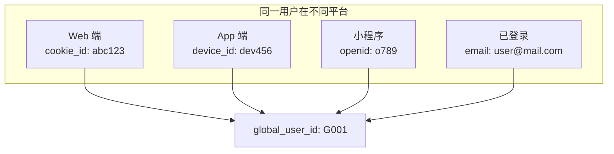

# 跨平台 ID 映射实战教程

GoWind UBA 的 ID Mapping 系统用于将用户在不同平台、不同设备上的多个身份标识关联到同一全局用户，实现跨端用户追踪。

## 前置条件

- 已阅读 [Web SDK 集成实战](./tutorial-sdk-integration.md)

## 一、ID Mapping 问题



## 二、IDMapping 模型

```protobuf
// uba/service/v1/id_mapping.proto
message IDMapping {
  optional uint32 id = 1;

  // --- 全局用户 ID ---
  optional string global_user_id = 10 [json_name = "global_user_id"];

  // --- 各平台标识 ---
  optional string id_type = 20 [json_name = "id_type"];  // ID 类型
  optional string id_value = 21 [json_name = "id_value"];  // ID 值

  // --- 置信度 ---
  optional double confidence = 30;  // 0-1

  // --- 来源 ---
  optional string link_source = 40 [json_name = "link_source"];

  // --- 时间 ---
  optional google.protobuf.Timestamp first_linked = 50 [json_name = "first_linked"];
  optional google.protobuf.Timestamp last_seen = 51 [json_name = "last_seen"];

  // --- 租户 ---
  optional uint32 tenant_id = 60 [json_name = "tenant_id"];
  optional string app_id = 61 [json_name = "app_id"];
}
```

### ID 类型

| id_type | 说明 | 来源 |
|---------|------|------|
| `device_id` | 设备唯一标识 | SDK 自动生成 |
| `cookie_id` | Cookie 标识 | Web SDK |
| `user_id` | 业务用户 ID | 业务系统 |
| `account_id` | 登录账号 | 登录事件 |
| `openid` | 微信 OpenID | 小程序 |
| `email` | 邮箱 | 注册/登录 |
| `phone` | 手机号 | 注册/登录 |

## 三、映射流程

### 3.1 SDK 端

```javascript
// 匿名用户：SDK 生成 UUID 作为 distinct_id（device_id）
uba.identify('uuid-device-xxx');

// 用户登录：将 account_id 关联到当前 distinct_id
uba.login('user@example.com');
// SDK 发送事件时同时携带 distinct_id + account_id

// 用户登出
uba.logout();
// 恢复为匿名状态
```

### 3.2 Core Service 映射

```go
func (s *IDMappingService) ResolveIdentity(ctx context.Context, event *ubaV1.BehaviorEvent) (string, error) {
    // 1. 检查是否已有全局 ID
    if event.GlobalUserId != "" {
        return event.GlobalUserId, nil
    }

    // 2. 尝试通过 account_id 查找
    if event.AccountId != "" {
        globalId, err := s.repo.FindByID(ctx, "account_id", event.AccountId)
        if err == nil {
            // 找到已有映射
            s.repo.UpdateLastSeen(ctx, globalId, "account_id", event.AccountId)
            return globalId, nil
        }

        // 用户首次登录，创建新映射
        globalId := s.generateGlobalId()
        s.repo.Create(ctx, &ubaV1.IDMapping{
            GlobalUserId: globalId,
            IdType:       "account_id",
            IdValue:      event.AccountId,
            Confidence:   1.0,
            LinkSource:   "login",
        })

        // 如果同时有 distinct_id（device_id），关联到同一全局 ID
        if event.DistinctId != "" && event.DistinctId != event.AccountId {
            s.repo.Create(ctx, &ubaV1.IDMapping{
                GlobalUserId: globalId,
                IdType:       "device_id",
                IdValue:      event.DistinctId,
                Confidence:   0.9,
                LinkSource:   "login_association",
            })
        }

        return globalId, nil
    }

    // 3. 尝试通过 distinct_id（device_id）查找
    globalId, err := s.repo.FindByID(ctx, "device_id", event.DistinctId)
    if err == nil {
        return globalId, nil
    }

    // 4. 全新匿名用户，创建新的全局 ID
    globalId := s.generateGlobalId()
    s.repo.Create(ctx, &ubaV1.IDMapping{
        GlobalUserId: globalId,
        IdType:       "device_id",
        IdValue:      event.DistinctId,
        Confidence:   0.5,
        LinkSource:   "first_seen",
    })

    return globalId, nil
}
```

## 四、Admin API

```http
# 查询全局用户的全部 ID 映射
GET /admin/v1/id-mappings?globalUserId=G001

# 按 ID 类型查询
GET /admin/v1/id-mappings?idType=device_id&idValue=dev456

# 手动关联
POST /admin/v1/id-mappings
{
  "globalUserId": "G001",
  "idType": "openid",
  "idValue": "o789xyz",
  "confidence": 0.95,
  "linkSource": "manual"
}

# 解除关联
DELETE /admin/v1/id-mappings/123
```

## 五、置信度模型

| 来源 | 置信度 | 说明 |
|------|--------|------|
| 登录关联 | 1.0 | 用户主动登录，完全可信 |
| 设备关联 | 0.9 | 同设备登录，高可信 |
| 自动推断 | 0.7 | IP+UA 匹配，中可信 |
| 首次匿名 | 0.5 | 仅设备 ID，低可信 |

## 六、合并冲突处理

当两个全局用户 ID 被发现实际是同一用户时：

```go
func (s *IDMappingService) MergeUsers(ctx context.Context, sourceGlobalId, targetGlobalId string) error {
    // 1. 将源用户的所有 ID 映射迁移到目标用户
    mappings, _ := s.repo.ListByGlobalId(ctx, sourceGlobalId)
    for _, m := range mappings {
        s.repo.UpdateGlobalId(ctx, m.Id, targetGlobalId)
    }

    // 2. 合并用户维度数据
    s.userProfileRepo.Merge(ctx, sourceGlobalId, targetGlobalId)

    // 3. 更新事件事实表的 global_user_id
    s.eventsRepo.UpdateGlobalUserId(ctx, sourceGlobalId, targetGlobalId)

    return nil
}
```

## 七、检查清单

| 检查项 | 说明 |
|--------|------|
| ID 类型 | 支持 device_id/account_id/openid/email/phone |
| 映射创建 | 事件触发时自动创建映射 |
| 全局 ID | 所有事件关联到 global_user_id |
| 置信度 | 不同来源的置信度设置 |
| 合并处理 | 用户合并时正确迁移 |
| Admin API | ID 映射查询和管理 |

## 相关文档

- [Web SDK 集成实战](./tutorial-sdk-integration.md)
- [用户行为画像](./tutorial-user-profile.md)
- [事件分析实战](./tutorial-event-analysis.md)
