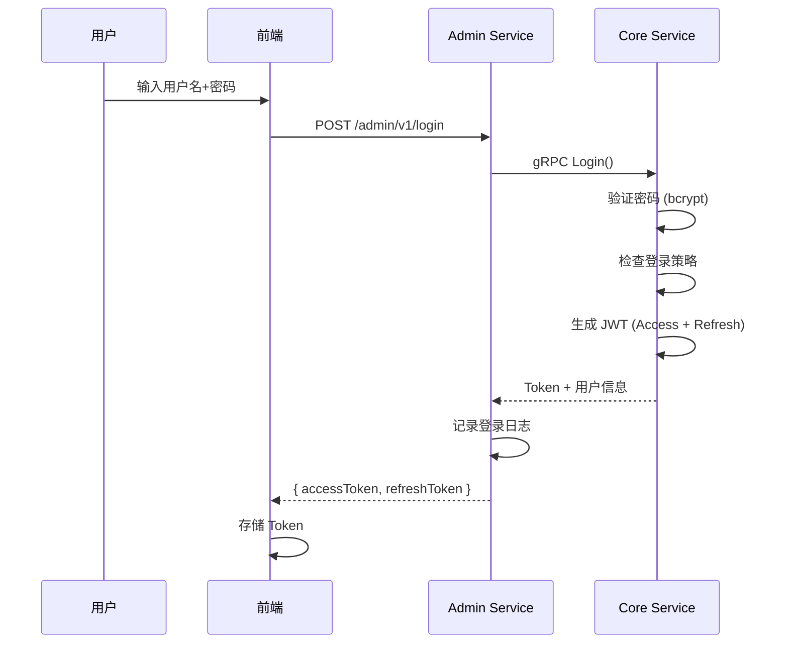

# 登录安全实战教程

GoWind UBA 的登录系统共享 GoWind Admin 的安全基座，提供 JWT 认证、密码安全、登录策略和审计日志。

## 前置条件

- 已阅读 [权限系统实战](./tutorial-permission-system.md)

## 一、认证流程



## 二、JWT Token

```go
// 双 Token 机制
type TokenPair struct {
    AccessToken  string // 短期 Token（2 小时）
    RefreshToken string // 长期 Token（7 天）
    ExpiresIn    int64  // Access Token 过期时间
}

func (s *AuthService) Login(ctx context.Context, req *authV1.LoginRequest) (*authV1.LoginResponse, error) {
    // 1. 查找用户
    user, err := s.userRepo.GetByUsername(ctx, req.Username)
    if err != nil {
        s.logFailedLogin(ctx, req.Username, "用户不存在")
        return nil, errors.NotFound("USER_NOT_FOUND", "用户不存在")
    }

    // 2. 验证密码
    if !bcrypt.CompareHashAndPassword(user.Password, req.Password) {
        s.logFailedLogin(ctx, req.Username, "密码错误")
        return nil, errors.Unauthorized("PASSWORD_ERROR", "密码错误")
    }

    // 3. 检查登录策略
    if err := s.loginPolicy.Check(ctx, user, ctx.ClientIP()); err != nil {
        return nil, err
    }

    // 4. 生成 Token
    accessToken, _ := s.jwtManager.Generate(user.Id, user.TenantId, 2*time.Hour)
    refreshToken, _ := s.jwtManager.Generate(user.Id, user.TenantId, 7*24*time.Hour)

    // 5. 记录成功登录
    s.logSuccessfulLogin(ctx, user)

    return &authV1.LoginResponse{
        AccessToken:  accessToken,
        RefreshToken: refreshToken,
        ExpiresIn:    7200,
        UserInfo:     user,
    }, nil
}
```

## 三、登录策略

```protobuf
message LoginPolicy {
  optional uint32 id = 1;
  optional uint32 tenant_id = 2 [json_name = "tenant_id"];

  // --- 密码策略 ---
  optional uint32 min_password_length = 10 [json_name = "min_password_length"];
  optional bool require_uppercase = 11 [json_name = "require_uppercase"];
  optional bool require_lowercase = 12 [json_name = "require_lowercase"];
  optional bool require_digit = 13 [json_name = "require_digit"];
  optional bool require_special = 14 [json_name = "require_special"];
  optional uint32 password_expire_days = 15 [json_name = "password_expire_days"];

  // --- 登录限制 ---
  optional uint32 max_login_attempts = 20 [json_name = "max_login_attempts"];
  optional uint32 lock_duration_minutes = 21 [json_name = "lock_duration_minutes"];
  optional bool enable_captcha = 22 [json_name = "enable_captcha"];
  optional bool enable_mfa = 23 [json_name = "enable_mfa"];

  // --- 会话 ---
  optional uint32 max_concurrent_sessions = 30 [json_name = "max_concurrent_sessions"];
  optional bool allow_remember_me = 31 [json_name = "allow_remember_me"];

  // --- IP 限制 ---
  repeated string allowed_ips = 40 [json_name = "allowed_ips"];
  repeated string blocked_ips = 41 [json_name = "blocked_ips"];
}
```

## 四、审计日志

```http
# 登录日志
GET /admin/v1/login-audit-logs?username=admin&status=success&page=1&pageSize=20

# 登录日志字段
{
  "id": 1,
  "username": "admin",
  "status": "success",     // success / failed
  "ip": "192.168.1.1",
  "location": "北京",
  "device": "Chrome 125 / Windows",
  "loginTime": "2024-06-22T10:00:00Z",
  "message": "登录成功"
}
```

## 五、Admin API

```http
# 登录
POST /admin/v1/login
{ "username": "admin", "password": "admin" }

# 刷新 Token
POST /admin/v1/refresh-token
{ "refreshToken": "xxx" }

# 登出
POST /admin/v1/logout

# 修改密码
PUT /admin/v1/profile/password
{ "oldPassword": "xxx", "newPassword": "yyy" }
```

## 六、检查清单

| 检查项 | 说明 |
|--------|------|
| JWT 认证 | 双 Token 机制 |
| 密码哈希 | bcrypt（cost=12） |
| 登录策略 | 密码复杂度 + 尝试次数限制 |
| 审计日志 | 登录成功/失败记录 |
| IP 限制 | 白名单/黑名单 |
| 会话管理 | 并发会话控制 |

## 相关文档

- [权限系统实战](./tutorial-permission-system.md)
- [UBA 后端架构总览](./backend-architecture.md)
- [GoWind Admin 登录安全](/admin/tutorial-login-security.md)
