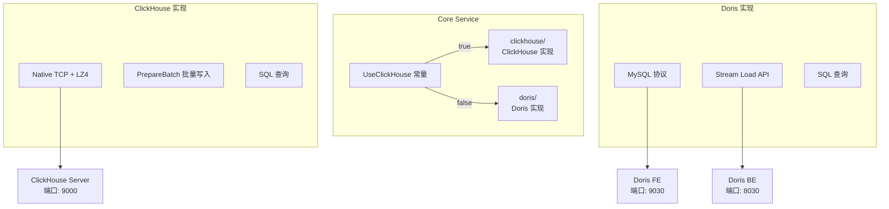

# 双 OLAP 引擎实战教程

GoWind UBA 支持 ClickHouse 和 Apache Doris 双 OLAP 引擎切换，通过编译时常量控制，无需修改业务代码。

## 前置条件

- 已阅读 [UBA 后端架构总览](./backend-architecture.md)

## 一、双引擎架构



## 二、引擎对比

| 对比项 | ClickHouse | Apache Doris |
|--------|-----------|--------------|
| 写入方式 | 批量 INSERT（PrepareBatch） | Stream Load API（HTTP） |
| 查询协议 | Native TCP | MySQL 协议 |
| 压缩 | LZ4 压缩 | 列式压缩 |
| 高频写入 | 合并树引擎，小批量写入有合并压力 | 适合实时写入 |
| 生态 | 丰富（Materialized View, Kafka Engine） | MySQL 兼容，BI 友好 |
| Superset | 原生支持 | MySQL 驱动 / pydoris |
| 适用场景 | 超大规模离线分析 | 实时分析 + BI 报表 |

## 三、切换机制

### 3.1 编译时常量

```go
// app/core/service/internal/data/data.go
const UseClickHouse bool = false  // true=ClickHouse, false=Doris
```

### 3.2 Repo 选择

```go
func (d *Data) NewEventsFactRepo() biz.EventsFactRepo {
    if UseClickHouse {
        return clickhouse.NewEventsFactRepo(d.chConn)
    }
    return doris.NewEventsFactRepo(d.dorisDB, d.dorisStreamURL)
}
```

### 3.3 Wire 注入

```go
// internal/data/wire.go
func ProvideData(/* ... */) (*Data, func(), error) {
    d := &Data{...}

    if UseClickHouse {
        // 初始化 ClickHouse 连接
        chConn, err := clickhouse.Open(&clickhouse.Options{
            Addr: []string{d.conf.ClickHouse.Addr},
            Auth: clickhouse.Auth{
                Database: d.conf.ClickHouse.Database,
                Username: d.conf.ClickHouse.Username,
                Password: d.conf.ClickHouse.Password,
            },
            Compression: &clickhouse.Compression{
                Method: clickhouse.CompressionLZ4,
            },
        })
        d.chConn = chConn
    } else {
        // 初始化 Doris 连接
        dorisDB, err := sql.Open("mysql", fmt.Sprintf(
            "%s:%s@tcp(%s:%d)/%s",
            d.conf.Doris.User, d.conf.Doris.Password,
            d.conf.Doris.Host, d.conf.Doris.Port,
            d.conf.Doris.Database,
        ))
        d.dorisDB = dorisDB
        d.dorisStreamURL = d.conf.Doris.StreamLoadUrl
    }

    return d, func() { /* cleanup */ }, nil
}
```

## 四、Schema 对比

### 4.1 events_fact 表

**ClickHouse：**

```sql
CREATE TABLE events_fact (
    event_id String,
    event_name String,
    distinct_id String,
    account_id String,
    event_time DateTime64(3),
    server_time DateTime64(3),
    tenant_id UInt32,
    app_id String,
    os String,
    browser String,
    country String,
    city String,
    properties Map(String, String),
    amount Float64
) ENGINE = MergeTree()
PARTITION BY toYYYYMMDD(server_time)
ORDER BY (app_id, distinct_id, server_time)
TTL server_time + INTERVAL 90 DAY;
```

**Doris：**

```sql
CREATE TABLE events_fact (
    event_id VARCHAR(64),
    event_name VARCHAR(128),
    distinct_id VARCHAR(128),
    account_id VARCHAR(128),
    event_time DATETIME(3),
    server_time DATETIME(3),
    tenant_id INT,
    app_id VARCHAR(64),
    os VARCHAR(32),
    browser VARCHAR(64),
    country VARCHAR(64),
    city VARCHAR(64),
    properties JSON,
    amount DOUBLE
) ENGINE=OLAP
DUPLICATE KEY(event_id, server_time)
PARTITION BY RANGE(server_time) ()
DISTRIBUTED BY HASH(distinct_id) BUCKETS 10
PROPERTIES ("dynamic_partition.enable" = "true");
```

### 4.2 Kafka 消费表（仅 ClickHouse）

```sql
-- ClickHouse Kafka Engine 自动消费
CREATE TABLE events_fact_kafka (
    event_id String,
    event_name String,
    distinct_id String,
    ...
) ENGINE = Kafka()
SETTINGS
    kafka_broker_list = 'localhost:9092',
    kafka_topic_list = 'uba_events',
    kafka_group_name = 'clickhouse_consumer',
    kafka_format = 'JSONEachRow';

-- 物化视图写入事实表
CREATE MATERIALIZED VIEW events_fact_mv TO events_fact AS
SELECT * FROM events_fact_kafka;
```

## 五、写入对比

### 5.1 ClickHouse 批量写入

```go
func (r *EventsFactRepo) BatchCreate(ctx context.Context, events []*ubaV1.BehaviorEvent) error {
    batch, err := r.conn.PrepareBatch(ctx, `
        INSERT INTO events_fact (
            event_id, event_name, distinct_id, account_id,
            event_time, server_time, tenant_id, app_id,
            properties, amount
        ) VALUES (?, ?, ?, ?, ?, ?, ?, ?, ?, ?)
    `)
    if err != nil {
        return err
    }

    for _, e := range events {
        batch.Append(
            e.EventId, e.EventName, e.DistinctId, e.AccountId,
            e.EventTime.AsTime(), e.ServerTime.AsTime(),
            e.TenantId, e.AppId,
            convertMap(e.Properties),
            e.GetAmount(),
        )
    }

    return batch.Send()
}
```

### 5.2 Doris Stream Load

```go
func (r *EventsFactRepo) BatchCreate(ctx context.Context, events []*ubaV1.BehaviorEvent) error {
    // 构造 JSON 数据
    var rows []map[string]interface{}
    for _, e := range events {
        rows = append(rows, map[string]interface{}{
            "event_id":    e.EventId,
            "event_name":  e.EventName,
            "distinct_id": e.DistinctId,
            "account_id":  e.AccountId,
            "event_time":  e.EventTime.AsTime().Format("2006-01-02 15:04:05.000"),
            "server_time": e.ServerTime.AsTime().Format("2006-01-02 15:04:05.000"),
            "tenant_id":   e.TenantId,
            "app_id":      e.AppId,
            "properties":  e.Properties,
            "amount":      e.GetAmount(),
        })
    }

    body, _ := json.Marshal(rows)

    // Stream Load HTTP 请求
    url := fmt.Sprintf("%s/api/%s/events_fact/_load", r.streamLoadURL, r.database)
    req, _ := http.NewRequest("POST", url, bytes.NewReader(body))
    req.Header.Set("format", "json")
    req.Header.Set("Expect", "100-continue")

    resp, err := http.DefaultClient.Do(req)
    if err != nil {
        return err
    }
    defer resp.Body.Close()

    return nil
}
```

## 六、查询对比

### 6.1 事件趋势

```sql
-- ClickHouse
SELECT
    toDate(server_time) AS date,
    event_name,
    count() AS cnt,
    uniqExact(distinct_id) AS users
FROM events_fact
WHERE app_id = 'app_001'
  AND server_time >= today() - 7
GROUP BY date, event_name;

-- Doris
SELECT
    DATE(server_time) AS date,
    event_name,
    COUNT(*) AS cnt,
    COUNT(DISTINCT distinct_id) AS users
FROM events_fact
WHERE app_id = 'app_001'
  AND server_time >= DATE_SUB(CURDATE(), INTERVAL 7 DAY)
GROUP BY DATE(server_time), event_name;
```

### 6.2 关键差异

| 函数 | ClickHouse | Doris |
|------|-----------|-------|
| 去重计数 | `uniqExact()` / `uniq()` | `COUNT(DISTINCT)` |
| 日期截取 | `toDate()` | `DATE()` |
| 日期加减 | `today() - 7` | `DATE_SUB(CURDATE(), INTERVAL 7 DAY)` |
| 条件聚合 | `sumIf()` | `SUM(IF())` 或 `SUM(CASE WHEN)` |
| Map 访问 | `properties['key']` | `properties->>'$.key'` |
| 窗口函数 | `windowFunnel()` | 需 JOIN 实现 |

## 七、SQL Schema 初始化

### 7.1 ClickHouse

```bash
cd backend/sql/clickhouse
clickhouse-client --multiquery < 01_create_database.sql
clickhouse-client --multiquery < 02_create_events_fact.sql
clickhouse-client --multiquery < 07_create_kafka_tables.sql
clickhouse-client --multiquery < 08_create_mv.sql
```

### 7.2 Doris

```bash
cd backend/sql/doris
mysql -h localhost -P 9030 -u root < 01_create_database.sql
mysql -h localhost -P 9030 -u root < 02_create_events_fact.sql
```

## 八、引擎选型建议

| 场景 | 推荐引擎 | 原因 |
|------|---------|------|
| 日均事件 > 10 亿 | ClickHouse | 写入性能和压缩率更优 |
| 实时 BI 报表 | Doris | MySQL 协议兼容，Superset 集成简单 |
| 小团队快速启动 | Doris | MySQL 协议更熟悉，运维更简单 |
| 需要 Kafka Engine 自动消费 | ClickHouse | 内置 Kafka Engine 消费 |
| 需要 Materialized View | ClickHouse | 自动聚合能力更强 |
| 需要 Stream Load 高频写入 | Doris | Stream Load 更适合高频小批量 |

## 九、检查清单

| 检查项 | 说明 |
|--------|------|
| UseClickHouse 常量 | 正确设置引擎选择 |
| ClickHouse Repo | clickhouse/ 目录下全部 Repo |
| Doris Repo | doris/ 目录下全部 Repo |
| Schema 初始化 | 对应引擎的 SQL 脚本 |
| 写入验证 | 数据正确写入 OLAP |
| 查询验证 | 查询结果正确 |
| Superset 集成 | BI 连接到正确的引擎 |

## 相关文档

- [UBA 后端架构总览](./backend-architecture.md)
- [数据采集管道实战](./tutorial-data-pipeline.md)
- [Superset BI 集成](./tutorial-superset-integration.md)
- [UBA 配置与部署指南](./backend-config-deploy.md)
