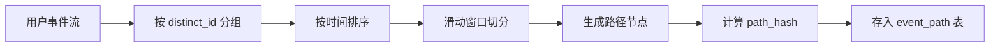

# 用户路径分析实战教程

路径分析用于追踪用户在应用中的行为路径，理解用户是如何浏览和交互的。本教程讲解 EventPath 模型、路径分析和桑基图可视化。

## 前置条件

- 已阅读 [事件分析实战](./tutorial-event-analysis.md)
- 建议先阅读 [会话分析实战](./tutorial-session-analysis.md)

## 一、EventPath 模型

```protobuf
// uba/service/v1/event_path.proto
message EventPath {
  optional uint32 id = 1;

  // --- 路径标识 ---
  optional string path_id = 2 [json_name = "path_id"];
  optional string path_hash = 3 [json_name = "path_hash"];  // 去重哈希

  // --- 用户 ---
  optional string distinct_id = 10 [json_name = "distinct_id"];
  optional string account_id = 11 [json_name = "account_id"];

  // --- 路径节点 ---
  repeated PathNode nodes = 20;

  // --- 统计 ---
  optional uint32 step_count = 30 [json_name = "step_count"];
  optional uint64 total_duration_ms = 31 [json_name = "total_duration_ms"];
  optional string first_event = 32 [json_name = "first_event"];
  optional string last_event = 33 [json_name = "last_event"];
  repeated string first_3_events = 34 [json_name = "first_3_events"];
  repeated string last_3_events = 35 [json_name = "last_3_events"];

  // --- 转化 ---
  optional bool is_converted = 40 [json_name = "is_converted"];
  optional string conversion_event = 41 [json_name = "conversion_event"];

  // --- 时间 ---
  optional google.protobuf.Timestamp start_time = 50 [json_name = "start_time"];
  optional google.protobuf.Timestamp end_time = 51 [json_name = "end_time"];

  // --- 租户 ---
  optional uint32 tenant_id = 60 [json_name = "tenant_id"];
  optional string app_id = 61 [json_name = "app_id"];
}

message PathNode {
  optional uint32 seq = 1;         // 序号
  optional string event_name = 2 [json_name = "event_name"];
  optional google.protobuf.Timestamp timestamp = 3;
  optional uint32 duration_to_next_ms = 4 [json_name = "duration_to_next_ms"];
  map<string, string> properties = 5;
}
```

## 二、路径构建流程



### 2.1 路径生成

```go
func (s *EventPathService) BuildPath(ctx context.Context, events []*ubaV1.BehaviorEvent) *ubaV1.EventPath {
    path := &ubaV1.EventPath{
        DistinctId: events[0].DistinctId,
        StepCount:  uint32(len(events)),
    }

    // 构建路径节点
    for i, event := range events {
        node := &ubaV1.PathNode{
            Seq:       uint32(i + 1),
            EventName: event.EventName,
            Timestamp: event.ServerTime,
            Properties: event.Properties,
        }

        // 计算到下一步的耗时
        if i < len(events)-1 {
            next := events[i+1]
            node.DurationToNextMs = uint64(next.ServerTime.AsTime().Sub(event.ServerTime.AsTime()).Milliseconds())
        }

        path.Nodes = append(path.Nodes, node)
    }

    // 计算路径特征
    path.FirstEvent = events[0].EventName
    path.LastEvent = events[len(events)-1].EventName
    path.TotalDurationMs = uint64(events[len(events)-1].ServerTime.AsTime().Sub(events[0].ServerTime.AsTime()).Milliseconds())

    // 前三个 / 后三个事件
    for i := 0; i < min(3, len(events)); i++ {
        path.First3Events = append(path.First3Events, events[i].EventName)
    }
    for i := max(0, len(events)-3); i < len(events); i++ {
        path.Last3Events = append(path.Last3Events, events[i].EventName)
    }

    // 计算去重哈希
    path.PathHash = computePathHash(path.Nodes)

    return path
}
```

## 三、路径分析查询

### 3.1 热门路径排行

```sql
-- TOP 20 最常见的用户路径（前 5 步）
SELECT
    arrayStringConcat(
        arrayResize(
            groupArray(event_name),
            5
        ),
        ' → '
    ) AS path_pattern,
    count() AS user_count,
    countIf(is_converted) AS converted_count,
    countIf(is_converted) / count() * 100 AS conversion_rate
FROM event_path
WHERE app_id = 'app_001'
  AND start_time >= today() - 7
GROUP BY path_pattern
ORDER BY user_count DESC
LIMIT 20;
```

### 3.2 桑基图数据

```sql
-- 路径流转矩阵（每一步到下一步的流向）
SELECT
    step_from,
    step_to,
    count() AS flow_count
FROM (
    SELECT
        arrayJoin(
            arrayZip(
                arrayResize(groupArray(event_name), -1),
                arraySlice(groupArray(event_name), 2)
            )
        ) AS step_pair,
        step_pair.1 AS step_from,
        step_pair.2 AS step_to
    FROM event_path
    WHERE app_id = 'app_001'
      AND start_time >= today() - 7
    GROUP BY distinct_id, path_id
)
GROUP BY step_from, step_to
ORDER BY flow_count DESC
LIMIT 50;
```

### 3.3 转化路径分析

```sql
-- 从指定起点到转化目标的路径
SELECT
    first_3_events,
    count() AS path_count,
    sumIf(1, is_converted) AS conversions,
    avg(total_duration_ms) AS avg_duration
FROM event_path
WHERE app_id = 'app_001'
  AND first_event = 'app_launch'
  AND conversion_event = 'purchase'
  AND start_time >= today() - 30
GROUP BY first_3_events
ORDER BY conversions DESC
LIMIT 10;
```

## 四、Admin API

```http
# 路径列表
GET /admin/v1/event-paths?appId=app_001&dateFrom=2024-06-01&dateTo=2024-06-30

# 路径分析（桑基图）
GET /admin/v1/event-paths/sankey?
  appId=app_001&
  startEvent=app_launch&
  maxSteps=8&
  dateFrom=2024-06-01&
  dateTo=2024-06-30

# 路径转化分析
GET /admin/v1/event-paths/conversion?
  appId=app_001&
  startEvent=app_launch&
  conversionEvent=purchase&
  dateFrom=2024-06-01&
  dateTo=2024-06-30
```

## 五、前端桑基图

```vue
<!-- views/analytics/path/SankeyChart.vue -->
<script setup lang="ts">
import VChart from 'vue-echarts';
import { usePathSankey } from '@/api/composables/path';

const props = defineProps<{
  appId: string;
  startEvent: string;
  maxSteps: number;
  dateRange: [string, string];
}>();

const { data, isLoading } = usePathSankey(
  computed(() => ({
    appId: props.appId,
    startEvent: props.startEvent,
    maxSteps: props.maxSteps,
    dateFrom: props.dateRange[0],
    dateTo: props.dateRange[1],
  }))
);

const chartOption = computed(() => ({
  tooltip: {
    trigger: 'item',
    formatter: (params) => {
      if (params.dataType === 'edge') {
        return `${params.data.source} → ${params.data.target}<br/>用户数: ${params.data.value}`;
      }
      return params.name;
    },
  },
  series: [{
    type: 'sankey',
    data: data.value?.nodes ?? [],
    links: data.value?.links ?? [],
    emphasis: { focus: 'adjacency' },
    lineStyle: { color: 'gradient', curveness: 0.5 },
  }],
}));
</script>

<template>
  <ACard title="用户行为路径" :loading="isLoading">
    <VChart :option="chartOption" autoresize style="height: 600px" />
  </ACard>
</template>
```

## 六、典型应用场景

### 6.1 用户流失路径分析

找出用户最容易流失的路径节点，针对性优化。

### 6.2 最优转化路径

识别转化率最高的路径，引导更多用户走这条路径。

### 6.3 异常路径检测

识别异常路径模式（如刷量用户的路径特征），为风控提供依据。

## 七、检查清单

| 检查项 | 说明 |
|--------|------|
| 路径构建 | 从事件流正确构建路径 |
| 去重哈希 | path_hash 计算正确 |
| 桑基图 | 前端桑基图正确渲染 |
| 路径排行 | 热门路径排行正确 |
| 转化路径 | 转化路径分析准确 |

## 相关文档

- [事件分析实战](./tutorial-event-analysis.md)
- [会话分析实战](./tutorial-session-analysis.md)
- [漏斗与转化分析](./tutorial-funnel-analysis.md)
- [风控检测引擎](./tutorial-risk-detection.md)
