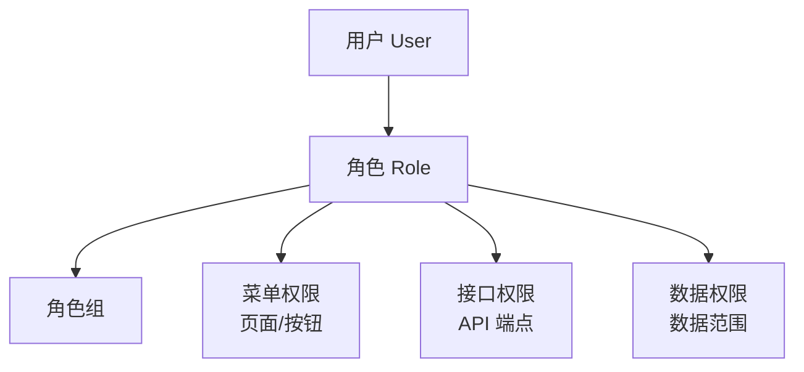

# 权限系统实战教程

GoWind UBA 共享 GoWind Admin 的权限体系，采用 RBAC + Casbin/OPA 策略引擎，支持菜单权限、接口权限和数据权限三级控制。

## 前置条件

- 已阅读 [UBA 后端架构总览](./backend-architecture.md)

## 一、权限模型



## 二、三级权限

### 2.1 菜单权限

```protobuf
message Menu {
  optional uint32 id = 1;
  optional string name = 2;
  optional string path = 3;
  optional string component = 4;
  optional MenuType type = 5;       // 目录/页面/按钮
  optional string permission = 6;    // 权限标识
  optional uint32 parent_id = 7;
  optional uint32 sort = 8;
  optional bool visible = 9;

  enum MenuType {
    DIRECTORY = 0;
    MENU = 1;
    BUTTON = 2;
  }
}
```

### 2.2 接口权限

```protobuf
message Permission {
  optional uint32 id = 1;
  optional string name = 2;
  optional string code = 3;         // 权限编码
  optional string api_path = 4;     // API 路径
  optional string method = 5;       // HTTP 方法
  optional uint32 group_id = 6;
}
```

### 2.3 数据权限

```protobuf
message DataPermission {
  optional uint32 id = 1;
  optional uint32 role_id = 2;
  optional DataScope scope = 3;     // 数据范围
  repeated uint32 dept_ids = 4;     // 自定义部门

  enum DataScope {
    ALL = 0;          // 全部数据
    DEPT = 1;         // 本部门
    DEPT_AND_SUB = 2; // 本部门及子部门
    CUSTOM = 3;       // 自定义部门
    SELF = 4;         // 仅本人
  }
}
```

## 三、Casbin 策略

```go
// 权限策略模型
// pkg/authz/casbin_model.conf
[request_definition]
r = sub, obj, act

[policy_definition]
p = sub, obj, act

[role_definition]
g = _, _

[policy_effect]
e = some(where, (p.eft == allow))

[matchers]
m = g(r.sub, p.sub) && keyMatch2(r.obj, p.obj) && r.act == p.act
```

## 四、Admin API

```http
# 获取当前用户导航和权限
GET /admin/v1/portal/navigation
GET /admin/v1/portal/permission-codes
GET /admin/v1/portal/initial-context

# 权限管理
GET /admin/v1/permissions
POST /admin/v1/permissions
PUT /admin/v1/permissions/1

# 角色权限分配
PUT /admin/v1/roles/1/permissions
{ "permissionIds": [1, 2, 3, 4, 5] }

# 数据权限配置
PUT /admin/v1/roles/1/data-permission
{ "scope": "DEPT", "deptIds": [1, 2] }
```

## 五、前端权限控制

```vue
<!-- 菜单级权限：自动从后端获取导航 -->
<router-view />

<!-- 按钮级权限 -->
<a-button v-access:code="'risk:event:handle'">处理</a-button>
<a-button v-access:code="'risk:rule:create'">新建规则</a-button>
```

## 六、检查清单

| 检查项 | 说明 |
|--------|------|
| 菜单权限 | 页面/按钮级控制 |
| 接口权限 | API 路径 + 方法匹配 |
| 数据权限 | 5 种数据范围 |
| Casbin 策略 | RBAC 模型配置 |
| 前端控制 | 路由守卫 + 按钮指令 |

## 相关文档

- [UBA 后端架构总览](./backend-architecture.md)
- [登录安全实战](./tutorial-login-security.md)
- [GoWind Admin 权限系统](/admin/tutorial-permission-system.md)
