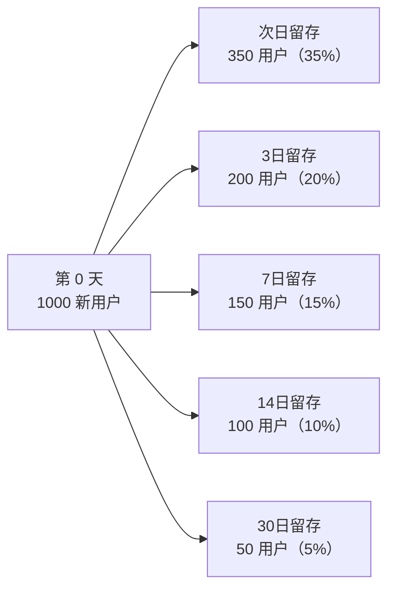

# 留存分析实战教程

留存分析用于衡量用户的回访率和粘性，是评估产品健康度的关键指标。本教程讲解留存分析的计算方法、OLAP 查询实现和可视化。

## 前置条件

- 已阅读 [事件分析实战](./tutorial-event-analysis.md)
- 建议先阅读 [用户行为画像](./tutorial-user-profile.md)

## 一、留存分析概念

### 1.1 什么是留存



### 1.2 留存类型

| 类型 | 说明 | 计算方式 |
|------|------|---------|
| 次日留存 | 新用户次日回访 | Day0 新用户 ∩ Day1 活跃用户 |
| N 日留存 | 新用户第 N 日回访 | Day0 新用户 ∩ DayN 活跃用户 |
| 周留存 | 新用户第 N 周回访 | 按周聚合 |
| 区间留存 | N 日内任意天回访 | Day0 新用户 ∩ [Day1, DayN] 活跃用户 |

## 二、留存矩阵

### 2.1 矩阵结构

```
              Day1    Day2    Day3    Day4    Day5    Day6    Day7
06-01 新用户   35%     28%     22%     18%     16%     15%     14%
06-02 新用户   38%     30%     25%     20%     18%     16%     --
06-03 新用户   36%     29%     24%     19%     17%     --      --
06-04 新用户   40%     32%     26%     21%     --      --      --
```

### 2.2 ClickHouse 留存查询

```sql
-- N 日留存矩阵
SELECT
    toDate(first_seen) AS cohort_date,
    count(DISTINCT distinct_id) AS cohort_size,
    -- 次日留存
    uniqExactIf(
        distinct_id,
        dateDiff('day', first_seen, last_active_on_day) = 1
    ) AS day1_retention,
    -- 7日留存
    uniqExactIf(
        distinct_id,
        dateDiff('day', first_seen, last_active_on_day) = 7
    ) AS day7_retention,
    -- 30日留存
    uniqExactIf(
        distinct_id,
        dateDiff('day', first_seen, last_active_on_day) = 30
    ) AS day30_retention
FROM (
    SELECT
        u.distinct_id,
        u.first_seen,
        e.server_time AS last_active_on_day
    FROM users_dim u
    JOIN events_fact e ON u.distinct_id = e.distinct_id
    WHERE u.app_id = 'app_001'
      AND u.first_seen >= today() - 30
      AND e.app_id = 'app_001'
)
GROUP BY cohort_date
ORDER BY cohort_date;
```

### 2.3 Doris 留存查询

```sql
-- 使用 Retention 函数（Doris 2.x+）
SELECT
    cohort_date,
    cohort_size,
    day1,
    day3,
    day7,
    day14,
    day30
FROM (
    SELECT
        DATE(first_seen) AS cohort_date,
        COUNT(DISTINCT distinct_id) AS cohort_size,
        BITMAP_COUNT(
            BITMAP_AND(
                cohort_bitmap,
                active_bitmap_day1
            )
        ) / COUNT(DISTINCT distinct_id) * 100 AS day1,
        BITMAP_COUNT(
            BITMAP_AND(
                cohort_bitmap,
                active_bitmap_day3
            )
        ) / COUNT(DISTINCT distinct_id) * 100 AS day3,
        BITMAP_COUNT(
            BITMAP_AND(
                cohort_bitmap,
                active_bitmap_day7
            )
        ) / COUNT(DISTINCT distinct_id) * 100 AS day7
    FROM retention_analysis
    WHERE app_id = 'app_001'
    GROUP BY cohort_date
) t
ORDER BY cohort_date;
```

## 三、Go 实现

### 3.1 留存计算服务

```go
// internal/biz/retention_analysis.go
type RetentionAnalysis struct {
    eventsRepo EventsFactRepo
    userRepo   UserDimRepo
}

func (r *RetentionAnalysis) ComputeRetention(ctx context.Context, req *ubaV1.RetentionRequest) (*ubaV1.RetentionResponse, error) {
    // 获取注册日期范围内的新用户
    cohorts, err := r.userRepo.GetNewUsersByDate(ctx, req.AppId, req.DateFrom, req.DateTo)
    if err != nil {
        return nil, err
    }

    // 对每个注册日期计算留存
    matrix := make([]*ubaV1.RetentionRow, 0, len(cohorts))
    for _, cohort := range cohorts {
        // 获取该批用户在后续各天的活跃情况
        activeUsers, err := r.eventsRepo.GetActiveUserSets(
            ctx, req.AppId, cohort.DistinctIds, cohort.Date, req.MaxDays,
        )
        if err != nil {
            continue
        }

        row := &ubaV1.RetentionRow{
            CohortDate:  cohort.Date,
            CohortSize:  uint32(len(cohort.DistinctIds)),
            Retentions:  make(map[uint32]float64),
        }

        for day := 1; day <= req.MaxDays; day++ {
            active := activeUsers[day]
            if len(active) > 0 {
                row.Retentions[uint32(day)] = float64(len(active)) / float64(len(cohort.DistinctIds)) * 100
            }
        }

        matrix = append(matrix, row)
    }

    return &ubaV1.RetentionResponse{
        Matrix:      matrix,
        RetentionType: req.RetentionType,
    }, nil
}
```

### 3.2 定时留存计算

```go
// 定时任务：每日凌晨计算昨日留存
func RegisterRetentionTasks(scheduler *asynq.Scheduler) {
    scheduler.Register("0 2 * * *", asynq.NewTask(
        task.TypeComputeRetention,
        jsonMustMarshal(task.RetentionPayload{
            Date:     time.Now().AddDate(0, 0, -1),
            AppIds:   []string{"app_001"},
            MaxDays:  30,
        }),
    ))
}
```

## 四、Admin API

```http
# 留存分析
POST /admin/v1/behavior-events/retention-analysis
{
  "appId": "app_001",
  "dateFrom": "2024-06-01",
  "dateTo": "2024-06-30",
  "retentionType": "N_DAY",
  "maxDays": 30,
  "retentionEvent": "app_launch"
}

# 留存趋势
GET /admin/v1/behavior-events/retention-trend?
  appId=app_001&
  day=7&
  dateFrom=2024-06-01&
  dateTo=2024-06-30
```

## 五、前端可视化

### 5.1 留存矩阵热力图

```vue
<!-- views/analytics/retention/RetentionMatrix.vue -->
<script setup lang="ts">
import VChart from 'vue-echarts';
import { useRetentionAnalysis } from '@/api/composables/retention';

const props = defineProps<{
  appId: string;
  dateRange: [string, string];
  maxDays: number;
}>();

const { data, isLoading } = useRetentionAnalysis(
  computed(() => ({
    appId: props.appId,
    dateFrom: props.dateRange[0],
    dateTo: props.dateRange[1],
    maxDays: props.maxDays,
  }))
);

const chartOption = computed(() => {
  const rows = data.value?.matrix ?? [];
  const days = Array.from({ length: props.maxDays }, (_, i) => `Day ${i + 1}`);

  return {
    tooltip: {
      position: 'top',
      formatter: (params) => {
        const row = rows[params.value[1]];
        const day = params.value[0] + 1;
        const rate = row.retentions[day] ?? 0;
        return `${row.cohortDate} → Day ${day}<br/>留存率: ${rate.toFixed(1)}%`;
      },
    },
    xAxis: { type: 'category', data: days, splitArea: { show: true } },
    yAxis: {
      type: 'category',
      data: rows.map(r => r.cohortDate),
      splitArea: { show: true },
    },
    visualMap: {
      min: 0, max: 100,
      calculable: true,
      orient: 'horizontal',
      inRange: { color: ['#ff4d4f', '#faad14', '#52c41a'] },
    },
    series: [{
      type: 'heatmap',
      data: generateHeatmapData(rows, props.maxDays),
      label: { show: true, formatter: (p) => `${p.value[2].toFixed(0)}%` },
    }],
  };
});
</script>

<template>
  <ACard title="留存矩阵" :loading="isLoading">
    <VChart :option="chartOption" autoresize style="height: 500px" />
  </ACard>
</template>
```

### 5.2 留存趋势曲线

```vue
<template>
  <ACard title="留存趋势">
    <VChart :option="trendOption" autoresize style="height: 400px" />
  </ACard>
</template>

<script setup>
const trendOption = computed(() => ({
  xAxis: { type: 'category', data: ['Day1', 'Day3', 'Day7', 'Day14', 'Day30'] },
  yAxis: { type: 'value', axisLabel: { formatter: '{value}%' } },
  series: [{
    type: 'line',
    smooth: true,
    data: [35, 22, 15, 10, 5],
    areaStyle: { opacity: 0.3 },
  }],
}));
</script>
```

## 六、留存优化建议

| 指标 | 健康范围 | 优化方向 |
|------|---------|---------|
| 次日留存 | > 30% | 新用户体验优化 |
| 7日留存 | > 15% | 核心功能引导 |
| 30日留存 | > 5% | 用户激励体系 |
| 留存曲线 | 下降趋于平缓 | 如果持续下降说明产品有问题 |

## 七、检查清单

| 检查项 | 说明 |
|--------|------|
| 新用户标记 | users_dim.first_seen 正确 |
| 留存计算 | N 日留存矩阵计算正确 |
| 定时任务 | 每日留存定时计算 |
| 前端热力图 | 留存矩阵热力图渲染 |
| 趋势曲线 | 留存趋势曲线渲染 |

## 相关文档

- [事件分析实战](./tutorial-event-analysis.md)
- [用户行为画像](./tutorial-user-profile.md)
- [用户分群与标签系统](./tutorial-user-segmentation.md)
