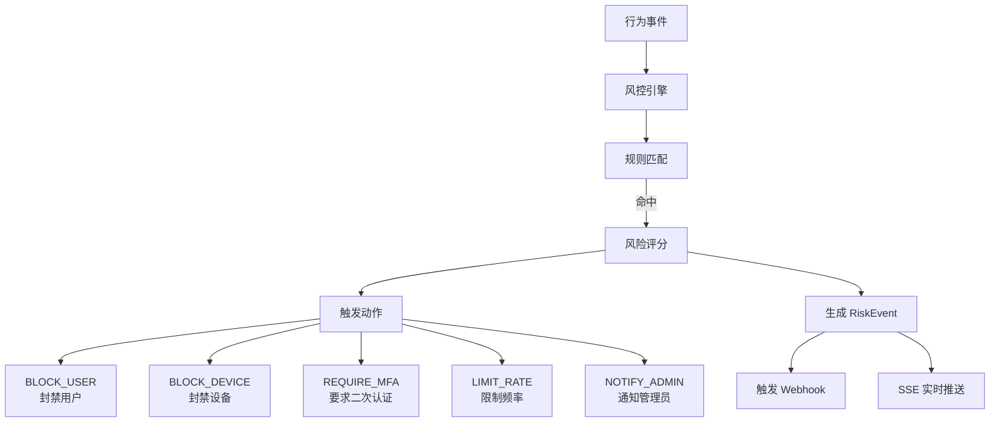
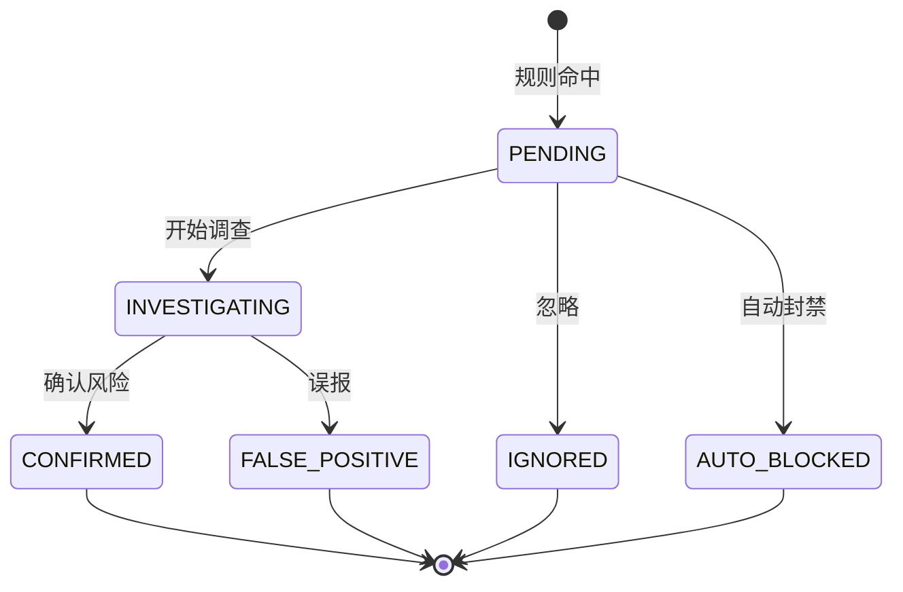
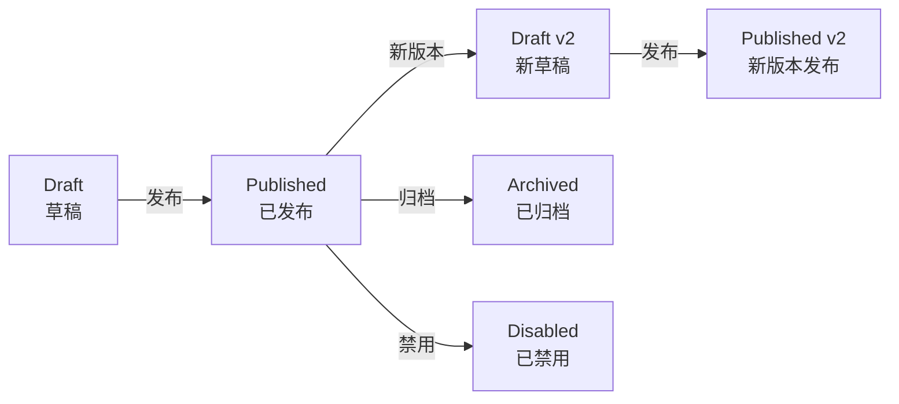

# 风控检测引擎实战教程

GoWind UBA 内置完整的风控检测引擎，支持规则配置、实时检测、风险事件管理和自动响应。本教程讲解风控引擎的架构和使用。

## 前置条件

- 已阅读 [UBA 后端架构总览](./backend-architecture.md)
- 建议先阅读 [数据采集管道实战](./tutorial-data-pipeline.md)

## 一、风控架构



## 二、风控规则模型

### 2.1 RiskRule

```protobuf
// uba/service/v1/risk_rule.proto
message RiskRule {
  optional uint32 id = 1;
  optional string name = 2;
  optional string description = 3;

  // --- 匹配条件 ---
  optional string condition_expression = 10 [json_name = "condition_expression"];
    // CEL 或 JSON Schema 条件表达式

  // --- 动作 ---
  repeated RiskActionType actions = 20;

  // --- 优先级 ---
  optional uint32 priority = 30;  // 数值越大优先级越高

  // --- 风险评分 ---
  optional uint32 risk_score = 40 [json_name = "risk_score"];  // 0-100

  // --- 状态 ---
  optional Status status = 50;

  // --- 版本 ---
  optional uint32 current_version = 60 [json_name = "current_version"];

  enum RiskActionType {
    BLOCK_USER = 0;
    BLOCK_DEVICE = 1;
    REQUIRE_MFA = 2;
    LIMIT_RATE = 3;
    NOTIFY_ADMIN = 4;
  }

  enum Status {
    DRAFT = 0;
    PUBLISHED = 1;
    DISABLED = 2;
  }
}
```

### 2.2 RiskEvent

```protobuf
// uba/service/v1/risk_event.proto
message RiskEvent {
  optional uint32 id = 1;

  // --- 关联 ---
  optional string rule_id = 10 [json_name = "rule_id"];
  optional string rule_name = 11 [json_name = "rule_name"];
  optional string behavior_event_id = 12 [json_name = "behavior_event_id"];

  // --- 用户 ---
  optional string distinct_id = 20 [json_name = "distinct_id"];
  optional string account_id = 21 [json_name = "account_id"];
  optional string device_id = 22 [json_name = "device_id"];

  // --- 风险信息 ---
  optional uint32 risk_score = 30 [json_name = "risk_score"];
  optional string risk_level = 31 [json_name = "risk_level"];
  optional string risk_type = 32 [json_name = "risk_type"];
  map<string, string> evidence = 33;

  // --- 状态 ---
  optional Status status = 40;

  // --- 处理 ---
  optional string handler_id = 50 [json_name = "handler_id"];
  optional string handle_remark = 51 [json_name = "handle_remark"];
  optional google.protobuf.Timestamp handled_at = 52 [json_name = "handled_at"];

  enum Status {
    PENDING = 0;
    INVESTIGATING = 1;
    CONFIRMED = 2;
    FALSE_POSITIVE = 3;
    IGNORED = 4;
    AUTO_BLOCKED = 5;
  }
}
```

## 三、规则配置

### 3.1 常见风控规则

```json
[
  {
    "name": "高频登录失败",
    "conditionExpression": "event_name == 'login' && op_result == 'failed' && count_in_window('5m') > 10",
    "actions": ["BLOCK_DEVICE", "NOTIFY_ADMIN"],
    "priority": 80,
    "riskScore": 75
  },
  {
    "name": "异常注册行为",
    "conditionExpression": "event_name == 'register' && count_in_window('1h', group_by='ip') > 20",
    "actions": ["BLOCK_DEVICE", "LIMIT_RATE"],
    "priority": 90,
    "riskScore": 85
  },
  {
    "name": "大额异常交易",
    "conditionExpression": "event_name == 'purchase' && amount > 50000 && user_register_days < 1",
    "actions": ["REQUIRE_MFA", "NOTIFY_ADMIN"],
    "priority": 70,
    "riskScore": 60
  },
  {
    "name": "设备多账号切换",
    "conditionExpression": "distinct_account_count_on_device('1h') > 5",
    "actions": ["REQUIRE_MFA", "NOTIFY_ADMIN"],
    "priority": 75,
    "riskScore": 65
  }
]
```

### 3.2 Admin API

```http
# 创建风控规则
POST /admin/v1/risk-rules
{
  "name": "高频登录失败检测",
  "description": "同一设备 5 分钟内登录失败超过 10 次",
  "conditionExpression": "event_name == 'login' && op_result == 'failed' && count_in_window('5m') > 10",
  "actions": ["BLOCK_DEVICE", "NOTIFY_ADMIN"],
  "priority": 80,
  "riskScore": 75,
  "status": "PUBLISHED"
}

# 发布规则版本
POST /admin/v1/risk-rules/1/publish

# 查询规则列表
GET /admin/v1/risk-rules?status=PUBLISHED&page=1&pageSize=20
```

## 四、实时检测

### 4.1 检测流程

```go
// internal/biz/risk_engine.go
type RiskEngine struct {
    ruleRepo   RiskRuleRepo
    eventRepo  RiskEventRepo
    bus        *eventbus.Bus
}

func (e *RiskEngine) Evaluate(ctx context.Context, event *ubaV1.BehaviorEvent) (*ubaV1.RiskAction, error) {
    // 1. 获取已发布的规则（按优先级排序）
    rules, err := e.ruleRepo.ListPublished(ctx, event.AppId)
    if err != nil {
        return nil, err
    }

    var matchedRules []*ubaV1.RiskRule
    var maxRiskScore uint32

    for _, rule := range rules {
        // 2. 条件匹配
        if e.matchCondition(ctx, rule, event) {
            matchedRules = append(matchedRules, rule)
            if rule.RiskScore > maxRiskScore {
                maxRiskScore = rule.RiskScore
            }
        }
    }

    if len(matchedRules) == 0 {
        return nil, nil  // 无风险
    }

    // 3. 生成风险事件
    riskEvent := e.createRiskEvent(ctx, matchedRules, event, maxRiskScore)
    e.eventRepo.Create(ctx, riskEvent)

    // 4. 发布事件总线
    e.bus.Publish(ctx, "risk_event.detected", riskEvent)

    // 5. 收集动作
    actions := e.collectActions(matchedRules)

    // 6. 自动执行动作
    e.executeActions(ctx, actions, event)

    return &ubaV1.RiskAction{
        Actions:    actions,
        RiskScore:  maxRiskScore,
        RiskEventId: riskEvent.Id,
    }, nil
}
```

### 4.2 条件匹配

```go
func (e *RiskEngine) matchCondition(ctx context.Context, rule *ubaV1.RiskRule, event *ubaV1.BehaviorEvent) bool {
    // 解析 CEL 表达式
    env, _ := cel.NewEnv(
        cel.Variable("event_name", cel.StringType),
        cel.Variable("op_result", cel.StringType),
        cel.Variable("amount", cel.DoubleType),
        cel.Variable("user_register_days", cel.IntType),
        cel.Variable("count_in_window", cel.IntType),
    )

    ast, err := env.Compile(rule.ConditionExpression)
    if err != nil {
        return false
    }

    prg, _ := env.Program(ast)

    // 查询窗口内的事件计数
    windowCount := e.eventRepo.CountInWindow(ctx, event.DistinctId, event.AppId, "5m")

    result, _, _ := prg.Eval(map[string]interface{}{
        "event_name":          event.EventName,
        "op_result":           event.OpResult,
        "amount":              event.Amount,
        "user_register_days":  e.getUserRegisterDays(ctx, event.DistinctId),
        "count_in_window":     windowCount,
    })

    return result.Value().(bool)
}
```

### 4.3 实时响应

Collector 返回的风控决策会被 SDK 用于实时处理：

```json
// Collector 响应中的实时风控决策
{
  "success": true,
  "successCount": 1,
  "riskAction": {
    "actions": ["REQUIRE_MFA"],
    "riskScore": 75,
    "riskEventId": 12345
  }
}
```

```javascript
// SDK 接收风控决策
uba.track('login', { ... }).then(response => {
  if (response.riskAction?.actions?.includes('REQUIRE_MFA')) {
    // 触发 MFA 验证
    showMFADialog();
  }
  if (response.riskAction?.actions?.includes('BLOCK_DEVICE')) {
    // 设备被封禁
    showBlockedMessage();
  }
});
```

## 五、风险事件管理

### 5.1 事件生命周期



### 5.2 处理操作

```http
# 风险事件列表
GET /admin/v1/risk-events?status=PENDING&riskLevel=high&page=1&pageSize=20

# 开始调查
PUT /admin/v1/risk-events/12345/status
{ "status": "INVESTIGATING" }

# 确认风险
PUT /admin/v1/risk-events/12345/status
{ "status": "CONFIRMED", "handleRemark": "确认刷单行为" }

# 标记误报
PUT /admin/v1/risk-events/12345/status
{ "status": "FALSE_POSITIVE", "handleRemark": "用户正常操作" }

# 统计概览
GET /admin/v1/risk-events/summary?dateFrom=2024-06-01&dateTo=2024-06-30
```

## 六、规则版本管理



```protobuf
message RiskRuleVersion {
  optional uint32 id = 1;
  optional uint32 rule_id = 2 [json_name = "rule_id"];
  optional uint32 version = 3;
  optional string condition_expression = 4 [json_name = "condition_expression"];
  repeated RiskRule.RiskActionType actions = 5;
  optional uint32 risk_score = 6 [json_name = "risk_score"];
  optional VersionStatus status = 7;

  enum VersionStatus {
    DRAFT = 0;
    PUBLISHED = 1;
    ARCHIVED = 2;
  }
}
```

## 七、检查清单

| 检查项 | 说明 |
|--------|------|
| 规则定义 | RiskRule CRUD + 版本管理 |
| 条件引擎 | CEL 表达式匹配 |
| 实时检测 | 事件触发时实时评估 |
| 风险事件 | RiskEvent 生命周期管理 |
| 动作执行 | 5 种动作类型自动执行 |
| 实时响应 | Collector 返回风控决策 |
| 前端管理 | 规则配置 + 事件处理界面 |
| 统计概览 | 按级别/类型/状态统计 |

## 相关文档

- [数据采集管道实战](./tutorial-data-pipeline.md)
- [Webhook 告警实战](./tutorial-webhook-alert.md)
- [用户行为画像](./tutorial-user-profile.md)
- [实时 SSE 推送实战](./tutorial-sse-push.md)
