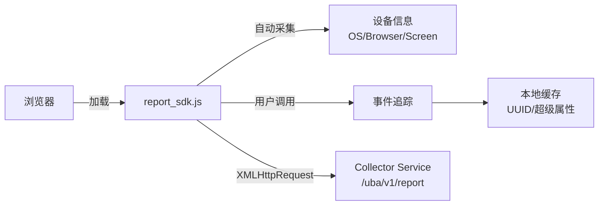

# Web SDK 集成实战教程

GoWind UBA 提供原生 JavaScript 数据采集 SDK，支持自定义事件追踪、用户属性管理、超级属性、身份管理等功能。本教程讲解 SDK 的集成和使用。

## 前置条件

- 已阅读 [UBA 产品介绍](./intro.md)
- 已在管理后台创建应用，获取 AppID 和 AppSecret

## 一、SDK 架构



### SDK 特性

| 特性 | 说明 |
|------|------|
| 零依赖 | 纯原生 JavaScript，无需任何第三方库 |
| 单例模式 | 同一页面多次实例化返回同一对象 |
| 自动采集 | 自动收集 OS、浏览器、屏幕、网络等设备信息 |
| 本地持久化 | 使用 localStorage 保存 UUID 和超级属性 |
| 调试模式 | 支持三种模式：正常、测试存储、测试不存储 |
| 链式调用 | 用户属性 API 支持链式调用 |

## 二、集成 SDK

### 2.1 直接引入

```html
<!-- 在页面中引入 SDK -->
<script src="./report_sdk.js"></script>
<script>
  // 初始化
  const uba = new EventReport({
    serverUrl: 'http://localhost:9800',
    appId: 'your_app_id',
    debugMode: 0,  // 0=正常, 1=测试存储, 2=测试不存储
  });
</script>
```

### 2.2 ES Module 引入

```javascript
import { EventReport } from './report_sdk.js';

const uba = new EventReport({
  serverUrl: 'https://uba.your-domain.com',
  appId: 'your_app_id',
  debugMode: 0,
});

export default uba;
```

## 三、事件追踪

### 3.1 追踪自定义事件

```javascript
// 基础事件
uba.track('page_view', {
  page_name: '首页',
  page_url: '/home',
});

// 电商事件
uba.track('add_to_cart', {
  product_id: 'P001',
  product_name: '商品A',
  price: 99.99,
  quantity: 1,
  category: '电子产品',
});

// 用户交互事件
uba.track('button_click', {
  button_id: 'submit_order',
  button_text: '提交订单',
  page_section: '购物车',
});
```

### 3.2 事件模型

每个事件自动附带以下信息：

```javascript
{
  event_name: "add_to_cart",        // 事件名称（自定义）
  event_time: 1719000000000,        // 客户端时间戳
  server_time: 1719000000123,       // 服务端时间戳
  // --- 自动采集的设备信息 ---
  os: "Windows",
  os_version: "10",
  browser: "Chrome",
  browser_version: "125.0",
  screen_width: 1920,
  screen_height: 1080,
  network_type: "wifi",
  device_model: "PC",
  // --- 身份信息 ---
  distinct_id: "uuid-xxx-xxx",      // 匿名 ID（localStorage UUID）
  account_id: "user@example.com",   // 登录账号（登录后）
  // --- 自定义属性 ---
  properties: {
    product_id: "P001",
    price: 99.99,
  }
}
```

## 四、用户属性管理

### 4.1 设置用户属性

```javascript
// 覆盖式设置
uba.userSet({
  email: 'user@example.com',
  name: '张三',
  vip_level: 'gold',
}).trackUserData();  // 链式调用，发送到服务器

// 仅首次设置（已存在则不覆盖）
uba.userSetOnce({
  register_date: '2024-01-01',
  first_login_source: 'google',
}).trackUserData();

// 数值递增
uba.userAdd('login_count', 1).trackUserData();
uba.userAdd('total_purchase', 99.99).trackUserData();

// 删除属性
uba.userUnset('temp_field').trackUserData();
```

### 4.2 用户属性模型

```javascript
{
  user_id: "uuid-xxx-xxx",
  account_id: "user@example.com",
  properties: {
    email: "user@example.com",
    name: "张三",
    vip_level: "gold",
    login_count: 42,
    total_purchase: 1299.98,
    register_date: "2024-01-01",
  }
}
```

## 五、超级属性

超级属性会附加到每一个事件的 properties 中：

```javascript
// 设置超级属性
uba.setSuperProperties({
  app_version: '2.1.0',
  channel: 'official_website',
  user_type: 'premium',
});

// 之后所有事件自动携带
uba.track('page_view', { page_name: '首页' });
// 实际发送: { ..., properties: { app_version: '2.1.0', channel: 'official_website', user_type: 'premium', page_name: '首页' } }

// 删除单个超级属性
uba.unsetSuperProperties('user_type');

// 清空所有超级属性
uba.clearSuperProperties();
```

## 六、身份管理

### 6.1 匿名用户

SDK 初始化时自动生成 UUID 存入 localStorage 作为匿名 ID：

```javascript
// 获取当前匿名 ID
const distinctId = uba.getDistinctId();
// "550e8400-e29b-41d4-a716-446655440000"
```

### 6.2 用户登录

```javascript
// 用户登录后关联
uba.login('user@example.com');
// 之后所有事件的 account_id = "user@example.com"

// 用户登出
uba.logout();
// account_id 被清除，恢复纯匿名状态
```

### 6.3 手动设置 ID

```javascript
// 手动设置 distinctId
uba.identify('custom_user_123');
```

## 七、调试模式

| 模式 | 值 | 行为 |
|------|---|------|
| 正常模式 | 0 | 数据正常发送到 Kafka |
| 测试模式（存储） | 1 | 数据存储但不进入正式 Kafka 管道 |
| 测试模式（不存储） | 2 | 数据仅打印日志，不存储不发送 |

```javascript
// 开发环境调试
const uba = new EventReport({
  serverUrl: 'http://localhost:9800',
  appId: 'test_app',
  debugMode: 2,  // 仅打印日志
});
```

## 八、完整集成示例

### 8.1 电商网站集成

```javascript
// uba-config.js
import { EventReport } from './report_sdk.js';

const uba = new EventReport({
  serverUrl: 'https://uba.your-domain.com',
  appId: 'ecom_app_001',
  debugMode: 0,
});

// 设置全局超级属性
uba.setSuperProperties({
  platform: 'web',
  site_version: '3.0.0',
});

export default uba;
```

```javascript
// 页面集成
import uba from './uba-config';

// 页面浏览追踪
export function trackPageView(pageName, pageUrl) {
  uba.track('page_view', {
    page_name: pageName,
    page_url: pageUrl,
    referrer: document.referrer,
  });
}

// 商品浏览
export function trackProductView(product) {
  uba.track('product_view', {
    product_id: product.id,
    product_name: product.name,
    category: product.category,
    price: product.price,
  });
}

// 加入购物车
export function trackAddToCart(product, quantity) {
  uba.track('add_to_cart', {
    product_id: product.id,
    product_name: product.name,
    price: product.price,
    quantity: quantity,
  });
}

// 下单
export function trackPurchase(order) {
  uba.track('purchase', {
    order_id: order.id,
    order_amount: order.totalAmount,
    item_count: order.items.length,
    payment_method: order.paymentMethod,
  });

  // 同时更新用户属性
  uba.userAdd('total_purchase', order.totalAmount).trackUserData();
  uba.userAdd('order_count', 1).trackUserData();
}

// 用户登录后
export function onUserLogin(user) {
  uba.login(user.email);
  uba.userSet({
    name: user.name,
    email: user.email,
    vip_level: user.vipLevel,
    register_date: user.registerDate,
  }).trackUserData();
}
```

### 8.2 SPA 路由追踪

```javascript
// Vue Router 集成
import uba from './uba-config';

router.afterEach((to) => {
  uba.track('page_view', {
    page_name: to.meta.title || to.name,
    page_url: to.fullPath,
    referrer: document.referrer,
  });
});
```

## 九、检查清单

| 检查项 | 说明 |
|--------|------|
| SDK 引入 | 正确加载 report_sdk.js |
| 初始化 | 配置 serverUrl + appId |
| 事件追踪 | 核心业务事件已埋点 |
| 用户属性 | 关键用户属性已设置 |
| 超级属性 | 全局属性已配置 |
| 身份管理 | 登录/登出时关联 ID |
| 调试模式 | 开发环境使用 debugMode |
| 生产模式 | 正式环境 debugMode = 0 |

## 相关文档

- [UBA 产品介绍](./intro.md)
- [数据采集管道实战](./tutorial-data-pipeline.md)
- [事件分析实战](./tutorial-event-analysis.md)
- [UBA 后端架构总览](./backend-architecture.md)
