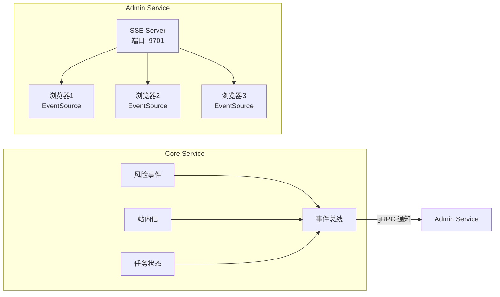

# 实时 SSE 推送实战教程

GoWind UBA Admin Service 提供 SSE（Server-Sent Events）实时推送服务，将风险告警、站内信、任务状态等信息实时推送到管理后台前端。

## 前置条件

- 已阅读 [UBA 后端架构总览](./backend-architecture.md)

## 一、SSE 架构



## 二、SSE Server

### 2.1 配置

```yaml
# app/admin/service/configs/config.yaml
server:
  rest:
    addr: 0.0.0.0:9700
  sse:
    addr: 0.0.0.0:9701
    path: /events
```

### 2.2 SSE Handler

```go
// app/admin/service/internal/server/sse_server.go
func (s *SSEServer) Stream(ctx Context) error {
    // 设置 SSE 响应头
    ctx.Response().Header().Set("Content-Type", "text/event-stream")
    ctx.Response().Header().Set("Cache-Control", "no-cache")
    ctx.Response().Header().Set("Connection", "keep-alive")
    ctx.Response().Header().Set("X-Accel-Buffering", "no")

    // 从 context 获取用户 ID
    userId := ctx.Value(auth.UserIdKey{}).(uint32)
    clientId := fmt.Sprintf("user_%d_%d", userId, time.Now().UnixNano())

    // 创建事件通道
    eventChan := s.manager.Register(clientId, userId)
    defer s.manager.Unregister(clientId)

    // 心跳定时器
    ticker := time.NewTicker(30 * time.Second)
    defer ticker.Stop()

    // 事件循环
    ctx.Stream(func(w io.Writer) bool {
        select {
        case event := <-eventChan:
            data, _ := json.Marshal(event.Data)
            ctx.SSEvent(event.Type, string(data))
            return true
        case <-ticker.C:
            // 心跳保活
            ctx.SSEvent("heartbeat", "")
            return true
        case <-ctx.Request().Context().Done():
            return false
        }
    })

    return nil
}
```

## 三、事件类型

| 事件类型 | 说明 | 触发条件 |
|---------|------|---------|
| `risk_alert` | 风险告警 | 风控规则命中 |
| `internal_message` | 站内信 | 收到新消息 |
| `task_completed` | 任务完成 | 异步任务执行完毕 |
| `data_anomaly` | 数据异常 | 指标异常波动 |
| `heartbeat` | 心跳 | 30 秒间隔 |

## 四、事件推送

### 4.1 风险告警推送

```go
func (s *SSEService) PushRiskAlert(ctx context.Context, event *ubaV1.RiskEvent) {
    // 推送到所有在线管理员
    s.manager.BroadcastToRole("admin", &SSEEvent{
        Type: "risk_alert",
        Data: map[string]interface{}{
            "eventId":    event.Id,
            "ruleName":   event.RuleName,
            "riskLevel":  event.RiskLevel,
            "riskScore":  event.RiskScore,
            "distinctId": event.DistinctId,
            "timestamp":  time.Now(),
        },
    })
}
```

### 4.2 站内信推送

```go
func (s *SSEService) PushInternalMessage(ctx context.Context, msg *ubaV1.InternalMessage) {
    // 推送到指定用户
    s.manager.SendToUser(msg.RecipientId, &SSEEvent{
        Type: "internal_message",
        Data: msg,
    })
}
```

## 五、前端接收

```typescript
// composables/useSSE.ts
export function useSSE() {
  const eventSource = ref<EventSource | null>(null);
  const notifications = useNotificationStore();

  function connect() {
    const token = useAuthStore().token;
    eventSource.value = new EventSource(
      `http://localhost:9701/events?token=${token}`
    );

    // 风险告警
    eventSource.value.addEventListener('risk_alert', (event) => {
      const data = JSON.parse(event.data);
      notification.error({
        message: `风险告警: ${data.ruleName}`,
        description: `风险等级: ${data.riskLevel}, 评分: ${data.riskScore}`,
        duration: 0,  // 不自动关闭
      });
    });

    // 站内信
    eventSource.value.addEventListener('internal_message', (event) => {
      const data = JSON.parse(event.data);
      notification.info({
        message: data.title,
        description: data.content,
      });
      notifications.incrementUnread();
    });

    // 任务完成
    eventSource.value.addEventListener('task_completed', (event) => {
      const data = JSON.parse(event.data);
      notification.success({
        message: '任务完成',
        description: `${data.taskName} 已执行完毕`,
      });
    });

    eventSource.value.onerror = () => {
      // 自动重连
      setTimeout(connect, 5000);
    };
  }

  function disconnect() {
    eventSource.value?.close();
  }

  onMounted(connect);
  onUnmounted(disconnect);

  return { connect, disconnect };
}
```

## 六、连接管理

```go
// 客户端管理器
type ClientManager struct {
    clients     map[string]*Client    // clientId → Client
    userClients map[uint32][]string   // userId → clientIds
    roleClients map[string][]string   // role → clientIds
    mu          sync.RWMutex
}

type Client struct {
    Id     string
    UserId uint32
    Role   string
    Chan   chan *SSEEvent
}

func (m *ClientManager) Register(clientId string, userId uint32) chan *SSEEvent {
    m.mu.Lock()
    defer m.mu.Unlock()

    client := &Client{
        Id:     clientId,
        UserId: userId,
        Chan:   make(chan *SSEEvent, 100),
    }
    m.clients[clientId] = client
    m.userClients[userId] = append(m.userClients[userId], clientId)

    return client.Chan
}

func (m *ClientManager) SendToUser(userId uint32, event *SSEEvent) {
    m.mu.RLock()
    defer m.mu.RUnlock()

    for _, clientId := range m.userClients[userId] {
        if client, ok := m.clients[clientId]; ok {
            select {
            case client.Chan <- event:
            default:
                // 通道满，丢弃
            }
        }
    }
}
```

## 七、检查清单

| 检查项 | 说明 |
|--------|------|
| SSE 端口 | Admin Service SSE 端口可访问 |
| 事件推送 | 风险告警/站内信实时推送 |
| 前端接收 | EventSource 正确接收 |
| 心跳保活 | 30 秒心跳间隔 |
| 自动重连 | 断线后自动重连 |
| 权限验证 | SSE 连接需要 JWT 认证 |

## 相关文档

- [UBA 后端架构总览](./backend-architecture.md)
- [风控检测引擎实战](./tutorial-risk-detection.md)
- [Webhook 告警实战](./tutorial-webhook-alert.md)
