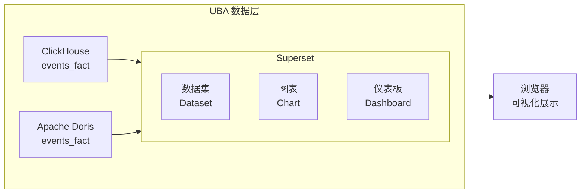

# Superset BI 集成实战教程

Apache Superset 是开源的 BI 可视化平台，GoWind UBA 通过将 OLAP 数据（ClickHouse/Doris）对接到 Superset，实现丰富的报表和仪表板可视化。

## 前置条件

- 已阅读 [双 OLAP 引擎实战](./tutorial-olap-engine.md)
- 已部署 ClickHouse 或 Apache Doris

## 一、集成架构



## 二、部署 Superset

### 2.1 Docker 部署

```bash
docker run -d \
  --name superset \
  --restart always \
  -p 8088:8088 \
  -e TZ=Asia/Shanghai \
  -e SUPERSET_SECRET_KEY='your-secret-key' \
  --user root \
  apache/superset:latest
```

### 2.2 安装数据库驱动

```bash
# 进入容器
docker exec -it superset bash

# 替换 apt 源（国内加速）
sed -i 's/deb.debian.org/mirrors.aliyun.com/g' /etc/apt/sources.list.d/debian.sources
apt-get update

# 安装编译依赖
apt-get install -y gcc python3-dev default-libmysqlclient-dev pkg-config

# 安装 pip
/app/.venv/bin/python -m ensurepip
/app/.venv/bin/python -m pip install --upgrade pip -i https://mirrors.aliyun.com/pypi/simple/

# 安装 Doris + MySQL 驱动
/app/.venv/bin/python -m pip install pymysql pydoris -i https://mirrors.aliyun.com/pypi/simple/

# 验证
/app/.venv/bin/pip list | grep pydoris
```

### 2.3 初始化

```bash
# 数据库迁移
docker exec -it superset superset db upgrade

# 创建管理员账户
docker exec -it superset superset fab create-admin \
  --username admin \
  --password admin \
  --firstname Admin \
  --lastname Admin \
  --email admin@superset.com

# 初始化角色
docker exec -it superset superset init

# 重启
docker restart superset
```

访问 `http://localhost:8088`，使用 `admin/admin` 登录。

## 三、连接数据库

### 3.1 连接 Doris

在 Superset 中：Settings → Database Connectors → 添加 Database

```shell
# 使用 pydoris 驱动
pydoris://root:@host.docker.internal:9030/internal.gw_uba

# 或使用 MySQL 驱动
mysql+pymysql://root:@host.docker.internal:9030/gw_uba
```

### 3.2 连接 ClickHouse

```shell
clickhousedb+native://default:@host.docker.internal:9000/gw_uba
```

### 3.3 Docker Compose 完整配置

```yaml
services:
  superset:
    image: apache/superset:latest
    container_name: superset
    ports:
      - "8088:8088"
    environment:
      TZ: Asia/Shanghai
      SUPERSET_SECRET_KEY: "your-secret-key"
      SUPERSET_ENV: production
    user: root
    volumes:
      - ./superset_data:/app/data
    command: >
      bash -c "
      apt-get update &&
      apt-get install -y gcc python3-dev default-libmysqlclient-dev pkg-config &&
      /app/.venv/bin/python -m ensurepip &&
      /app/.venv/bin/python -m pip install --upgrade pip -i https://mirrors.aliyun.com/pypi/simple/ &&
      /app/.venv/bin/python -m pip install pymysql pydoris -i https://mirrors.aliyun.com/pypi/simple/ &&
      superset db upgrade &&
      superset fab create-admin --username admin --password admin --firstname Admin --lastname Admin --email admin@admin.com || true &&
      superset init &&
      /usr/bin/run-server.sh
      "
```

## 四、创建数据集

### 4.1 核心数据集

| 数据集 | 表名 | 说明 |
|--------|------|------|
| 行为事件 | `events_fact` | 用户行为事件事实表 |
| 会话 | `sessions_fact` | 会话聚合数据 |
| 用户画像 | `users_dim` | 用户维度数据 |
| 风险事件 | `risk_events` | 风险事件记录 |

### 4.2 创建自定义 SQL 数据集

```sql
-- 每日事件统计（Superset 虚拟数据集）
SELECT
    DATE(server_time) AS date,
    event_name,
    COUNT(*) AS event_count,
    COUNT(DISTINCT distinct_id) AS unique_users,
    SUM(CASE WHEN properties->>'$.amount' IS NOT NULL
        THEN CAST(properties->>'$.amount' AS DOUBLE) ELSE 0 END) AS total_amount
FROM events_fact
WHERE app_id = 'app_001'
GROUP BY DATE(server_time), event_name
```

## 五、创建仪表板

### 5.1 UBA 核心仪表板

| 图表 | 类型 | 数据源 | 说明 |
|------|------|--------|------|
| 每日事件趋势 | 折线图 | events_fact | 事件总数趋势 |
| DAU/MAU | 数字大屏 | events_fact | 活跃用户数 |
| 事件分布 | 饼图 | events_fact | 事件类型占比 |
| TOP 10 事件 | 柱状图 | events_fact | 最热门事件 |
| 用户地域分布 | 地图 | events_fact | 用户地理分布 |
| 设备分布 | 饼图 | events_fact | OS/Browser 占比 |
| 风险事件统计 | 柱状图 | risk_events | 按级别统计 |

### 5.2 留存分析仪表板

```sql
-- Superset 留存分析 SQL
WITH user_cohorts AS (
    SELECT
        distinct_id,
        DATE(MIN(server_time)) AS cohort_date
    FROM events_fact
    WHERE app_id = 'app_001'
    GROUP BY distinct_id
),
user_activity AS (
    SELECT
        uc.cohort_date,
        uc.distinct_id,
        DATE_DIFF(DATE(e.server_time), uc.cohort_date) AS day_offset,
        COUNT(*) AS event_count
    FROM user_cohorts uc
    JOIN events_fact e ON uc.distinct_id = e.distinct_id
    WHERE e.app_id = 'app_001'
    GROUP BY uc.cohort_date, uc.distinct_id, DATE(e.server_time)
)
SELECT
    cohort_date,
    day_offset,
    COUNT(DISTINCT distinct_id) AS retained_users
FROM user_activity
WHERE day_offset BETWEEN 0 AND 30
GROUP BY cohort_date, day_offset
ORDER BY cohort_date, day_offset;
```

## 六、定时报表

### 6.1 配置定时报告

在 Superset 中为仪表板配置定时邮件发送：

1. 进入 Dashboard → Edit → Schedule
2. 设置发送频率（每日/每周/每月）
3. 配置收件人
4. 选择格式（HTML 邮件 / PDF 附件）

### 6.2 告警配置

```yaml
# superset_config.py
ALERT_REPORTS = True
SMTP_UMASK = 0o022
SMTP_HOST = "smtp.your-domain.com"
SMTP_PORT = 587
SMTP_USER = "noreply@your-domain.com"
SMTP_PASSWORD = "your-password"
SMTP_MAIL_FROM = "noreply@your-domain.com"
```

## 七、权限管理

| 角色 | 权限 | 说明 |
|------|------|------|
| Admin | 全部 | Superset 管理员 |
| Alpha | 所有数据集 | 数据分析师 |
| Gamma | 指定数据集 | 业务用户 |
| UBA_Viewer | UBA 仪表板只读 | 普通查看者 |

## 八、检查清单

| 检查项 | 说明 |
|--------|------|
| Superset 部署 | Docker 容器正常运行 |
| 数据库驱动 | pydoris / pymysql / clickhouse-driver |
| 数据库连接 | 成功连接到 OLAP 引擎 |
| 数据集 | 核心表注册为数据集 |
| 仪表板 | UBA 核心仪表板创建完成 |
| 定时报告 | 配置定时邮件发送 |
| 权限 | 角色和数据集权限配置 |

## 相关文档

- [双 OLAP 引擎实战](./tutorial-olap-engine.md)
- [UBA 配置与部署指南](./backend-config-deploy.md)
- [事件分析实战](./tutorial-event-analysis.md)
- [三服务部署实战](./tutorial-deploy.md)
