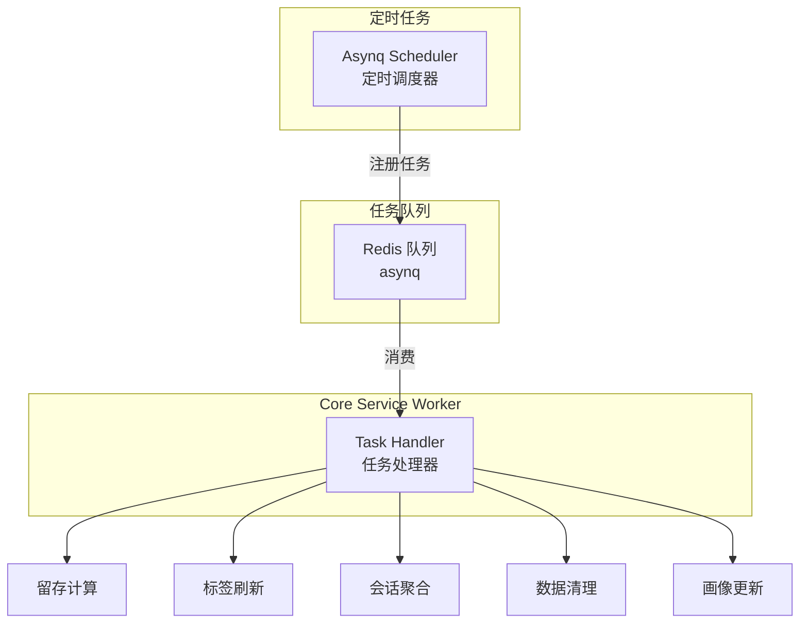

# 任务调度实战教程

GoWind UBA 使用 Asynq（基于 Redis）作为异步任务队列，处理数据聚合、留存计算、标签刷新等周期性任务。

## 前置条件

- 已阅读 [UBA 后端架构总览](./backend-architecture.md)

## 一、任务架构



## 二、任务类型

| 任务 | 类型 | 说明 | 频率 |
|------|------|------|------|
| 留存计算 | 定时 | 计算每日用户留存矩阵 | 每日 02:00 |
| 标签刷新 | 定时 | 刷新动态用户标签 | 每小时 |
| 会话聚合 | 定时 | 从事件聚合生成会话 | 每 15 分钟 |
| 数据清理 | 定时 | 清理过期数据 | 每日 03:00 |
| 画像更新 | 定时 | 更新用户行为统计 | 每小时 |
| Webhook 重试 | 即时 | 失败 Webhook 重试 | 触发式 |
| 风险事件处理 | 即时 | 异步风险检测 | 触发式 |

## 三、任务定义

### 3.1 任务类型常量

```go
// app/core/service/internal/task/types.go
package task

const (
    TypeComputeRetention     = "uba:compute_retention"
    TypeRefreshUserTags      = "uba:refresh_user_tags"
    TypeAggregateSessions    = "uba:aggregate_sessions"
    TypeCleanupExpiredData   = "uba:cleanup_expired_data"
    TypeUpdateUserProfiles   = "uba:update_user_profiles"
    TypeRetryWebhook         = "uba:retry_webhook"
)
```

### 3.2 定时任务注册

```go
// app/core/service/internal/server/asynq_server.go
func RegisterScheduledTasks(scheduler *asynq.Scheduler) {
    // 每日凌晨 2:00 计算昨日留存
    scheduler.Register("0 2 * * *", asynq.NewTask(
        task.TypeComputeRetention,
        jsonMustMarshal(task.RetentionPayload{
            Date:   time.Now().AddDate(0, 0, -1),
            MaxDays: 30,
        }),
    ))

    // 每小时刷新动态标签
    scheduler.Register("0 * * * *", asynq.NewTask(
        task.TypeRefreshUserTags,
        nil,
    ))

    // 每 15 分钟聚合会话
    scheduler.Register("*/15 * * * *", asynq.NewTask(
        task.TypeAggregateSessions,
        jsonMustMarshal(task.SessionPayload{
            Window: 15 * time.Minute,
        }),
    ))

    // 每日凌晨 3:00 清理过期数据
    scheduler.Register("0 3 * * *", asynq.NewTask(
        task.TypeCleanupExpiredData,
        jsonMustMarshal(task.CleanupPayload{
            RetentionDays: 90,
        }),
    ))

    // 每小时更新用户画像
    scheduler.Register("0 * * * *", asynq.NewTask(
        task.TypeUpdateUserProfiles,
        nil,
    ))
}
```

## 四、任务处理器

### 4.1 留存计算

```go
func (h *RetentionHandler) ProcessTask(ctx context.Context, t *asynq.Task) error {
    var payload task.RetentionPayload
    if err := json.Unmarshal(t.Payload(), &payload); err != nil {
        return fmt.Errorf("解析 payload 失败: %w", err)
    }

    log.Infof("开始计算 %s 的留存数据", payload.Date.Format("2006-01-02"))

    // 获取当日新用户
    newUsers, err := h.userRepo.GetNewUsersByDate(ctx, payload.Date)
    if err != nil {
        return err
    }

    // 计算各留存天数
    for day := 1; day <= payload.MaxDays; day++ {
        targetDate := payload.Date.AddDate(0, 0, day)
        activeUsers, err := h.eventRepo.GetActiveUsersOnDate(ctx, targetDate)
        if err != nil {
            continue
        }

        // 计算交集
        retained := intersect(newUsers, activeUsers)
        retentionRate := float64(len(retained)) / float64(len(newUsers)) * 100

        // 写入留存结果
        h.retentionRepo.Save(ctx, &ubaV1.RetentionRecord{
            CohortDate:     payload.Date,
            RetentionDay:   uint32(day),
            CohortSize:     uint32(len(newUsers)),
            RetainedCount:  uint32(len(retained)),
            RetentionRate:  retentionRate,
        })
    }

    log.Infof("留存计算完成")
    return nil
}
```

### 4.2 数据清理

```go
func (h *CleanupHandler) ProcessTask(ctx context.Context, t *asynq.Task) error {
    var payload task.CleanupPayload
    json.Unmarshal(t.Payload(), &payload)

    cutoff := time.Now().AddDate(0, 0, -int(payload.RetentionDays))

    // 清理 OLAP 过期数据
    queries := []string{
        fmt.Sprintf("ALTER TABLE events_fact DELETE WHERE server_time < '%s'", cutoff.Format("2006-01-02")),
        fmt.Sprintf("ALTER TABLE sessions_fact DELETE WHERE start_time < '%s'", cutoff.Format("2006-01-02")),
        fmt.Sprintf("ALTER TABLE risk_events DELETE WHERE created_at < '%s'", cutoff.Format("2006-01-02")),
    }

    for _, q := range queries {
        if err := h.olapDB.Exec(ctx, q); err != nil {
            log.Errorf("清理失败: %s, error: %v", q, err)
        }
    }

    log.Infof("数据清理完成，保留 %d 天", payload.RetentionDays)
    return nil
}
```

## 五、即时任务

```go
// 手动触发任务
func (s *TaskService) TriggerTask(ctx context.Context, taskType string, payload interface{}) error {
    data, _ := json.Marshal(payload)
    return s.client.Enqueue(
        asynq.NewTask(taskType, data),
        asynq.MaxRetry(3),
        asynq.Timeout(30*time.Minute),
    )
}
```

## 六、Admin API

```http
# 任务列表
GET /admin/v1/tasks?page=1&pageSize=20

# 立即执行任务
POST /admin/v1/tasks/trigger
{
  "taskType": "uba:compute_retention",
  "payload": { "date": "2024-06-20", "maxDays": 30 }
}

# 任务运行日志
GET /admin/v1/tasks/uba:compute_retention/logs?page=1&pageSize=20
```

## 七、检查清单

| 检查项 | 说明 |
|--------|------|
| Asynq 配置 | Redis 连接正确 |
| 定时任务 | Cron 表达式正确 |
| 任务处理器 | 各 Handler 注册 |
| 留存计算 | 每日定时执行 |
| 数据清理 | 定期清理过期数据 |
| 日志记录 | 任务执行日志可查 |

## 相关文档

- [UBA 后端架构总览](./backend-architecture.md)
- [留存分析实战](./tutorial-retention-analysis.md)
- [用户分群与标签系统](./tutorial-user-segmentation.md)
