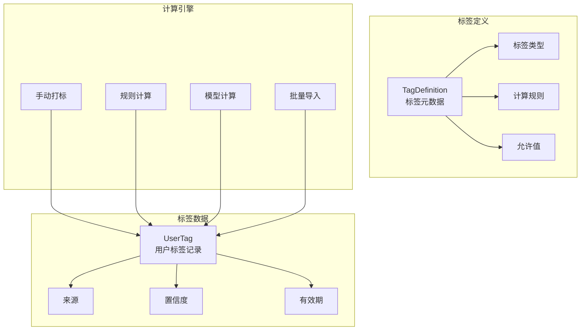

# 用户分群与标签系统实战教程

用户分群和标签系统是 UBA 的重要功能，支持基于行为、属性进行用户分群，并通过标签体系管理用户分类。

## 前置条件

- 已阅读 [用户行为画像](./tutorial-user-profile.md)

## 一、标签体系架构



## 二、TagDefinition 标签定义

### 2.1 数据模型

```protobuf
// uba/service/v1/tag_definition.proto
message TagDefinition {
  optional uint32 id = 1;
  optional string name = 2;            // 标签名称
  optional string code = 3;            // 标签编码（唯一）
  optional TagType tag_type = 4;       // 标签类型
  optional string description = 5;

  // --- 计算规则 ---
  optional string calculation_rule = 10 [json_name = "calculation_rule"];  // CEL/SQL 表达式
  optional bool is_dynamic = 11 [json_name = "is_dynamic"];  // 动态标签
  optional uint32 refresh_interval_hours = 12 [json_name = "refresh_interval_hours"];  // 刷新周期

  // --- 允许值（枚举类型）---
  repeated string allowed_values = 20 [json_name = "allowed_values"];

  // --- 系统标签 ---
  optional bool is_system = 30 [json_name = "is_system"];

  enum TagType {
    TAG_TYPE_BOOLEAN = 0;
    TAG_TYPE_ENUM = 1;
    TAG_TYPE_NUMERIC = 2;
    TAG_TYPE_STRING = 3;
    TAG_TYPE_LIST = 4;
  }
}
```

### 2.2 标签类型

| 类型 | 说明 | 示例 |
|------|------|------|
| BOOLEAN | 布尔标签 | is_vip = true |
| ENUM | 枚举标签 | user_level = gold/silver/bronze |
| NUMERIC | 数值标签 | total_purchase = 1299.99 |
| STRING | 字符串标签 | preferred_category = electronics |
| LIST | 列表标签 | interests = [sports, music, tech] |

## 三、UserTag 用户标签

### 3.1 数据模型

```protobuf
// uba/service/v1/user_tag.proto
message UserTag {
  optional uint32 id = 1;
  optional string distinct_id = 2 [json_name = "distinct_id"];
  optional uint32 tag_definition_id = 3 [json_name = "tag_definition_id"];
  optional string tag_code = 4 [json_name = "tag_code"];

  // --- 标签值 ---
  optional string value = 5;
  optional string value_label = 6 [json_name = "value_label"];  // 显示名称

  // --- 来源 ---
  optional TagSource source = 7;
  optional double confidence = 8;  // 置信度（0-1）

  // --- 有效期 ---
  optional google.protobuf.Timestamp effective_at = 10 [json_name = "effective_at"];
  optional google.protobuf.Timestamp expire_at = 11 [json_name = "expire_at"];

  enum TagSource {
    MANUAL = 0;    // 手动打标
    RULE = 1;      // 规则计算
    MODEL = 2;     // 模型计算
    IMPORT = 3;    // 批量导入
  }
}
```

## 四、Admin API

### 4.1 标签定义管理

```http
# 创建标签定义
POST /admin/v1/tag-definitions
{
  "name": "用户价值等级",
  "code": "user_value_level",
  "tagType": "TAG_TYPE_ENUM",
  "description": "基于消费金额的用户价值分层",
  "calculationRule": "if total_pay_amount > 10000 then 'high' else if total_pay_amount > 1000 then 'medium' else 'low'",
  "isDynamic": true,
  "refreshIntervalHours": 24,
  "allowedValues": ["high", "medium", "low"]
}

# 列表查询
GET /admin/v1/tag-definitions?page=1&pageSize=20
```

### 4.2 用户标签管理

```http
# 查询用户标签
GET /admin/v1/user-tags?distinctId=uuid-xxx

# 手动打标
POST /admin/v1/user-tags
{
  "distinctId": "uuid-xxx",
  "tagCode": "vip_status",
  "value": "true",
  "source": "MANUAL",
  "confidence": 1.0
}

# 批量打标
POST /admin/v1/user-tags/batch
{
  "tagCode": "user_value_level",
  "source": "IMPORT",
  "items": [
    { "distinctId": "uuid-1", "value": "high" },
    { "distinctId": "uuid-2", "value": "medium" }
  ]
}
```

## 五、规则计算引擎

### 5.1 CEL 表达式计算

```go
func (s *TagService) EvaluateRule(ctx context.Context, rule string, profile *ubaV1.UserBehaviorProfile) (string, error) {
    // 使用 CEL 表达式引擎
    env, _ := cel.NewEnv(
        cel.Variable("total_pay_amount", cel.DoubleType),
        cel.Variable("total_events", cel.UintType),
        cel.Variable("last_active_days", cel.IntType),
        cel.Variable("risk_score", cel.DoubleType),
    )

    ast, _ := env.Compile(rule)
    prg, _ := env.Program(ast)

    result, _, _ := prg.Eval(map[string]interface{}{
        "total_pay_amount": profile.TotalPayAmount,
        "total_events":     profile.TotalEvents,
        "last_active_days":  daysSince(profile.LastActive),
        "risk_score":        profile.RiskScore,
    })

    return result.Value().(string), nil
}
```

### 5.2 定时刷新

```go
func (s *TagService) RefreshDynamicTags(ctx context.Context) error {
    // 查找需要刷新的动态标签
    definitions, err := s.tagDefRepo.ListDynamicTags(ctx)
    if err != nil {
        return err
    }

    for _, def := range definitions {
        if s.shouldRefresh(def) {
            go s.refreshTagForAllUsers(ctx, def)
        }
    }
    return nil
}

func (s *TagService) refreshTagForAllUsers(ctx context.Context, def *ubaV1.TagDefinition) {
    // 分页读取所有用户画像
    profiles, _ := s.userProfileRepo.ListAll(ctx, pagination)

    for _, profile := range profiles {
        value, err := s.EvaluateRule(ctx, def.CalculationRule, profile)
        if err != nil {
            continue
        }

        // 写入用户标签
        s.userTagRepo.Upsert(ctx, &ubaV1.UserTag{
            DistinctId:    profile.DistinctId,
            TagCode:       def.Code,
            Value:         value,
            Source:        ubaV1.UserTag_RULE,
            Confidence:    1.0,
            EffectiveAt:   timestamppb.Now(),
            ExpireAt:      calculateExpiry(def.RefreshIntervalHours),
        })
    }
}
```

## 六、用户分群

### 6.1 基于标签的分群

```sql
-- 查询高价值活跃用户群
SELECT DISTINCT ut.distinct_id
FROM user_tags ut
JOIN users_dim u ON ut.distinct_id = u.distinct_id
WHERE ut.tag_code = 'user_value_level' AND ut.value = 'high'
  AND u.last_active >= now() - INTERVAL 7 DAY;
```

### 6.2 基于行为的分群

```sql
-- 过去 7 天内完成购买的用户
SELECT DISTINCT distinct_id
FROM events_fact
WHERE app_id = 'app_001'
  AND event_name = 'purchase'
  AND server_time >= now() - INTERVAL 7 DAY;
```

### 6.3 复合分群

```sql
-- 高价值且高风险的用户
SELECT DISTINCT ut1.distinct_id
FROM user_tags ut1
JOIN user_tags ut2 ON ut1.distinct_id = ut2.distinct_id
WHERE ut1.tag_code = 'user_value_level' AND ut1.value = 'high'
  AND ut2.tag_code = 'risk_level' AND ut2.value = 'critical';
```

## 七、前端标签管理

```vue
<!-- views/tag/definition/TagDefinitionList.vue -->
<script setup lang="ts">
import { useTagDefinitions, useCreateTagDefinition } from '@/api/composables/tag';

const { data, isLoading } = useTagDefinitions();
const createMutation = useCreateTagDefinition();

const columns = [
  { title: '标签名称', dataIndex: 'name' },
  { title: '编码', dataIndex: 'code' },
  { title: '类型', dataIndex: 'tagType', customRender: ({ text }) => tagTypeMap[text] },
  { title: '动态', dataIndex: 'isDynamic', customRender: ({ text }) => text ? '是' : '否' },
  { title: '刷新周期', dataIndex: 'refreshIntervalHours', customRender: ({ text }) => `${text}小时` },
  { title: '操作', key: 'action' },
];
</script>
```

## 八、检查清单

| 检查项 | 说明 |
|--------|------|
| 标签定义 | TagDefinition CRUD |
| 标签类型 | 支持 boolean/enum/numeric/string/list |
| 用户标签 | UserTag CRUD + 批量操作 |
| 规则计算 | CEL 表达式计算正确 |
| 动态刷新 | 定时任务刷新动态标签 |
| 手动打标 | 前端支持手动打标 |
| 分群查询 | 基于标签+行为的复合分群 |

## 相关文档

- [用户行为画像](./tutorial-user-profile.md)
- [留存分析实战](./tutorial-retention-analysis.md)
- [风控检测引擎](./tutorial-risk-detection.md)
