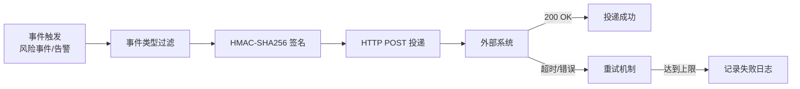

# Webhook 告警实战教程

GoWind UBA 的 Webhook 系统支持将风险事件、分析告警等消息实时推送到外部系统，实现与第三方平台的集成。

## 前置条件

- 已阅读 [风控检测引擎实战](./tutorial-risk-detection.md)

## 一、Webhook 架构



## 二、Webhook 模型

```protobuf
// uba/service/v1/webhook.proto
message Webhook {
  optional uint32 id = 1;
  optional string name = 2;

  // --- 目标 ---
  optional string url = 3;           // 接收 URL
  optional string secret = 4;         // HMAC 签名密钥

  // --- 事件过滤 ---
  repeated string event_types = 10 [json_name = "event_types"];
    // 例: ["risk.high", "risk.critical"]
  repeated string risk_levels = 11 [json_name = "risk_levels"];
  repeated string risk_types = 12 [json_name = "risk_types"];
  map<string, string> property_filters = 13 [json_name = "property_filters"];

  // --- 重试 ---
  optional uint32 retry_count = 20 [json_name = "retry_count"];  // 最大重试次数
  optional uint32 retry_interval = 21 [json_name = "retry_interval"];  // 重试间隔（秒）

  // --- 状态 ---
  optional bool enabled = 30;

  // --- 关联 ---
  optional string app_id = 40 [json_name = "app_id"];
  optional uint32 tenant_id = 41 [json_name = "tenant_id"];
}

message WebhookDeliveryLog {
  optional uint32 id = 1;
  optional uint32 webhook_id = 2 [json_name = "webhook_id"];
  optional string event_type = 3 [json_name = "event_type"];
  optional string payload = 4;        // 请求体
  optional uint32 status_code = 5 [json_name = "status_code"];  // HTTP 状态码
  optional string response = 6;       // 响应体
  optional uint32 attempt = 7;        // 第几次重试
  optional DeliveryStatus status = 8;

  enum DeliveryStatus {
    PENDING = 0;
    SUCCESS = 1;
    FAILED = 2;
    RETRYING = 3;
  }
}
```

## 三、Admin API

### 3.1 Webhook 配置

```http
# 创建 Webhook
POST /admin/v1/webhooks
{
  "name": "风控告警通知",
  "url": "https://your-system.com/api/uba-webhook",
  "secret": "your-webhook-secret-key",
  "eventTypes": ["risk.high", "risk.critical"],
  "riskLevels": ["high", "critical"],
  "retryCount": 3,
  "retryInterval": 30,
  "enabled": true,
  "appId": "app_001"
}

# 查询 Webhook 列表
GET /admin/v1/webhooks?appId=app_001&enabled=true

# 更新 Webhook
PUT /admin/v1/webhooks/1
{
  "enabled": false
}

# 查看投递日志
GET /admin/v1/webhooks/1/logs?status=FAILED&page=1&pageSize=20

# 手动重试
POST /admin/v1/webhooks/1/logs/123/retry
```

## 四、投递实现

### 4.1 事件投递

```go
func (s *WebhookService) Deliver(ctx context.Context, webhook *ubaV1.Webhook, eventType string, payload interface{}) error {
    body, _ := json.Marshal(map[string]interface{}{
        "event_type": eventType,
        "timestamp":  time.Now().Unix(),
        "data":       payload,
    })

    // HMAC-SHA256 签名
    signature := s.signPayload(webhook.Secret, body)

    // 记录投递日志
    logEntry := &ubaV1.WebhookDeliveryLog{
        WebhookId: webhook.Id,
        EventType: eventType,
        Payload:   string(body),
        Status:    ubaV1.WebhookDeliveryLog_PENDING,
        Attempt:   1,
    }
    s.logRepo.Create(ctx, logEntry)

    // HTTP POST 投递
    for attempt := 1; attempt <= int(webhook.RetryCount); attempt++ {
        resp, err := s.httpClient.Post(webhook.Url, body, map[string]string{
            "Content-Type":          "application/json",
            "X-UBA-Signature":       signature,
            "X-UBA-Event-Type":      eventType,
            "X-UBA-Delivery-Id":     fmt.Sprintf("%d", logEntry.Id),
        })

        if err == nil && resp.StatusCode >= 200 && resp.StatusCode < 300 {
            // 成功
            s.logRepo.UpdateStatus(ctx, logEntry.Id, ubaV1.WebhookDeliveryLog_SUCCESS, resp.StatusCode, resp.Body)
            return nil
        }

        // 记录失败
        logEntry.Attempt = uint32(attempt)
        s.logRepo.UpdateStatus(ctx, logEntry.Id, ubaV1.WebhookDeliveryLog_RETRYING, resp.StatusCode, resp.Body)

        // 等待重试
        time.Sleep(time.Duration(webhook.RetryInterval) * time.Second)
    }

    // 所有重试失败
    s.logRepo.UpdateStatus(ctx, logEntry.Id, ubaV1.WebhookDeliveryLog_FAILED, 0, "max retries exceeded")
    return errors.InternalServer("WEBHOOK_DELIVERY_FAILED", "webhook delivery failed after retries")
}
```

### 4.2 签名验证

```go
func (s *WebhookService) signPayload(secret string, body []byte) string {
    h := hmac.New(sha256.New, []byte(secret))
    h.Write(body)
    return "sha256=" + hex.EncodeToString(h.Sum(nil))
}
```

### 4.3 事件触发

```go
// 风控事件触发 Webhook
func (s *RiskEngine) onRiskEventDetected(ctx context.Context, event *ubaV1.RiskEvent) {
    // 查询匹配的 Webhook
    webhooks, err := s.webhookRepo.ListEnabled(ctx, event.AppId)
    if err != nil {
        return
    }

    for _, webhook := range webhooks {
        // 事件类型过滤
        eventType := fmt.Sprintf("risk.%s", event.RiskLevel)
        if !contains(webhook.EventTypes, eventType) {
            continue
        }

        // 异步投递
        go s.webhookService.Deliver(ctx, webhook, eventType, event)
    }
}
```

## 五、接收端实现

### 5.1 接收 Webhook

```go
// 外部系统接收 UBA Webhook 示例
func HandleUBAWebhook(w http.ResponseWriter, r *http.Request) {
    // 1. 读取请求体
    body, _ := io.ReadAll(r.Body)

    // 2. 验证签名
    signature := r.Header.Get("X-UBA-Signature")
    expectedSig := computeHMAC(webhookSecret, body)
    if !hmac.Equal([]byte(signature), []byte(expectedSig)) {
        w.WriteHeader(http.StatusUnauthorized)
        return
    }

    // 3. 解析事件
    var event struct {
        EventType string                 `json:"event_type"`
        Timestamp int64                  `json:"timestamp"`
        Data      map[string]interface{} `json:"data"`
    }
    json.Unmarshal(body, &event)

    // 4. 处理事件
    switch event.EventType {
    case "risk.critical":
        // 严重风险事件处理
        notifySecurityTeam(event.Data)
    case "risk.high":
        // 高风险事件处理
        logHighRiskEvent(event.Data)
    }

    // 5. 返回 200
    w.WriteHeader(http.StatusOK)
    w.Write([]byte(`{"status": "ok"}`))
}
```

### 5.2 Python 接收示例

```python
from flask import Flask, request, abort
import hmac
import hashlib

app = Flask(__name__)

WEBHOOK_SECRET = "your-webhook-secret-key"

@app.route('/api/uba-webhook', methods=['POST'])
def handle_uba_webhook():
    # 验证签名
    signature = request.headers.get('X-UBA-Signature', '')
    body = request.get_data()
    expected = 'sha256=' + hmac.new(
        WEBHOOK_SECRET.encode(),
        body,
        hashlib.sha256
    ).hexdigest()

    if not hmac.compare_digest(signature, expected):
        abort(401)

    # 处理事件
    data = request.json
    event_type = data.get('event_type')
    event_data = data.get('data')

    if event_type == 'risk.critical':
        # 发送告警通知
        send_alert(event_data)
    elif event_type == 'risk.high':
        # 记录日志
        log.warning(f"High risk event: {event_data}")

    return {'status': 'ok'}, 200
```

## 六、前端 Webhook 管理

```vue
<!-- views/risk/webhooks/WebhookList.vue -->
<script setup lang="ts">
import { useWebhooks } from '@/api/composables/webhook';

const { data, isLoading } = useWebhooks();

const columns = [
  { title: '名称', dataIndex: 'name' },
  { title: 'URL', dataIndex: 'url', ellipsis: true },
  { title: '事件类型', dataIndex: 'eventTypes', customRender: ({ text }) => text.join(', ') },
  { title: '状态', dataIndex: 'enabled', customRender: ({ text }) => text ? '启用' : '禁用' },
  { title: '操作', key: 'action' },
];
</script>
```

## 七、检查清单

| 检查项 | 说明 |
|--------|------|
| Webhook CRUD | 配置管理完整 |
| 事件过滤 | 按类型/级别过滤正确 |
| HMAC 签名 | 签名生成和验证正确 |
| 重试机制 | 失败后自动重试 |
| 投递日志 | 记录完整投递日志 |
| 接收端验证 | 外部系统正确验证签名 |
| 前端管理 | Webhook 管理页面 |

## 相关文档

- [风控检测引擎实战](./tutorial-risk-detection.md)
- [实时 SSE 推送实战](./tutorial-sse-push.md)
- [任务调度实战](./tutorial-task-scheduling.md)
